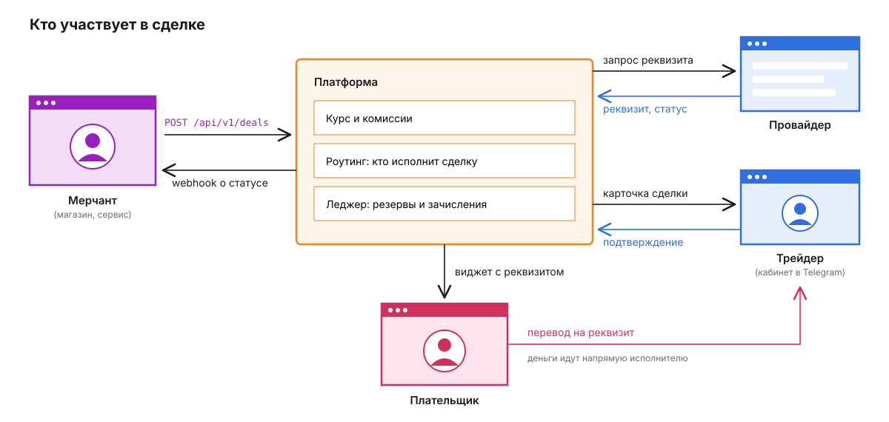
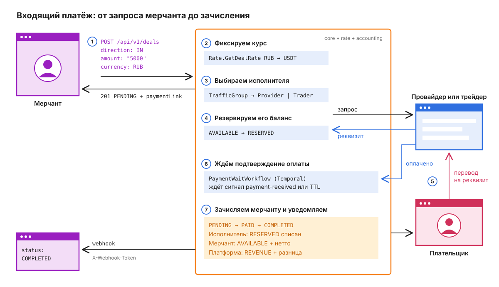
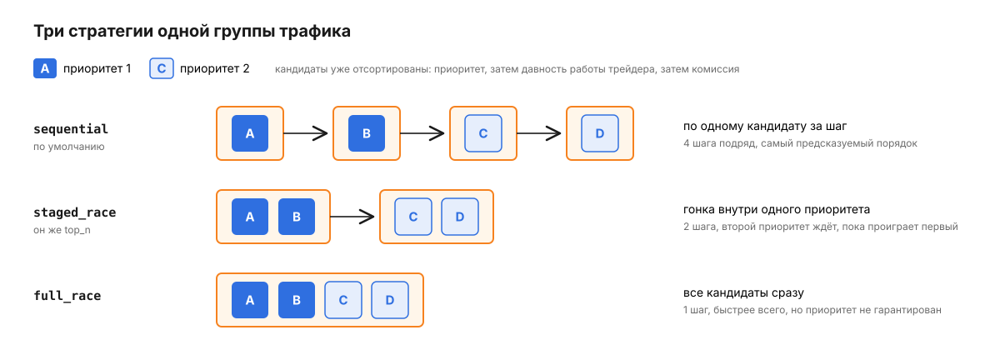
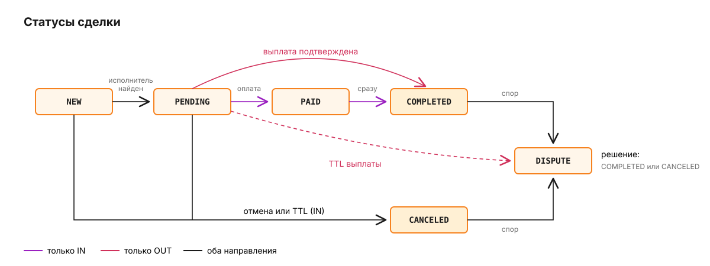
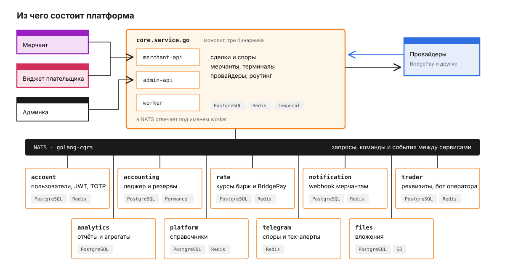

# Payment Platform

Мерчанты приходят к нам, чтобы принимать платежи и отправлять выплаты. Деньги плательщика не проходят через наши счета: он переводит их на реквизит исполнителя - внешнего провайдера или трейдера, у которого есть банковский счёт. Наша работа - выбрать исполнителя, зафиксировать курс и комиссию, провести сделку по статусам и точно посчитать, кто кому сколько должен.



Цвета на всех схемах одни и те же: фиолетовый - мерчант, розовый - плательщик, оранжевый - платформа, синий - исполнители.

## Путь одного платежа

Проще всего понять систему, проследив одну входящую сделку. Магазин хочет принять 5 000 RUB, у него есть терминал - точка интеграции со своим API-ключом, настройками комиссии и курса.



1. Мерчант создаёт сделку. Запрос подписан: `X-Identity` - ключ терминала, `X-Signature` - HMAC-SHA256 от метода, URL и тела. Поле `merchantId` - ключ идемпотентности: повторный запрос с ним же вернёт `200` и уже созданную сделку, но без новой ссылки на виджет. `webhookUrl` принимается только по `https` и только на публичный адрес: localhost, частные и служебные сети отклоняются. Исключение - `APP_ENV=development`, в котором работает локальный стек.

   ```http
   POST /api/v1/deals HTTP/1.1
   X-Identity: <ключ терминала>
   X-Signature: <base64(hmac-sha256)>
   Content-Type: application/json

   {
     "merchantId": "order-1042",
     "direction": "IN",
     "amount": "5000",
     "currency": "RUB",
     "webhookUrl": "https://shop.example/hooks/payment"
   }
   ```

2. `core` фиксирует в сделке курс, который отдаёт rate-service: `Rate.GetDealRate`, RUB -> USDT.
3. Роутинг выбирает исполнителя среди групп трафика терминала. Как именно - в разделе "Кто исполнит сделку".
4. На время сделки баланс исполнителя резервируется в леджере: сумма переходит из `AVAILABLE` в `RESERVED`. Исполнитель выдаёт реквизит, сделка переходит в `PENDING`, мерчант получает `201` и ссылку на виджет `paymentLink`. Шаги 1-4 укладываются в один HTTP-запрос.
5. Плательщик открывает виджет. Тот раз в 3 секунды спрашивает у сервера состояние сделки и показывает реквизит. Плательщик переводит деньги.
6. Исполнитель подтверждает оплату: провайдер присылает webhook на `POST /webhooks/:provider_code`, трейдер нажимает кнопку в Telegram. Оба пути превращаются в один и тот же сигнал `payment-received` для процесса `PaymentWaitWorkflow` в Temporal. Этот процесс запускается вместе со сделкой и ждёт одно из двух: подтверждение оплаты или истечение TTL.
7. Процесс переводит сделку в `PAID` и сразу в `COMPLETED`. Резерв исполнителя списывается, мерчанту зачисляется сумма за вычетом комиссии терминала, разница уходит в выручку платформы. notification-service отправляет мерчанту webhook.

## Сколько зарабатывает платформа

Доход платформы - это разница между тем, что должен нам исполнитель, и тем, что мы зачисляем мерчанту. Считается она в `settlement_calc.go`:

```
списание с исполнителя = фиат / курс исполнителя x (100 - комиссия исполнителя, %) / 100
зачисление мерчанту    = фиат / курс терминала   x (100 - комиссия терминала, %) / 100
доход платформы        = списание с исполнителя - зачисление мерчанту
```

Пример: сумма сделки 5000 RUB, курс единый для обоих - 100 RUB за USDT, комиссия провайдера 3%, комиссия терминала 5%.

```
гросс                  = 5000 / 100 = 50 USDT
списание с исполнителя = 50 x (100 - 3) / 100  = 48,50 USDT
зачисление мерчанту    = 50 x (100 - 5) / 100  = 47,50 USDT
доход платформы        = 48,50 - 47,50 = 1,00 USDT
```

Из формулы видно, где можно потерять деньги: если комиссия терминала ниже комиссии исполнителя, доход уходит в минус. Поэтому роутинг сразу отбрасывает исполнителя с одним курсом, у которого комиссия выше, чем у терминала, а для исполнителей с отдельным курсом проверяет выгодность сделки по обоим курсам.

Комиссия терминала зависит от суммы: у терминала есть диапазоны `[min, max]` для каждой группы трафика, и берётся первый подходящий. Если ни один не подошёл, действует базовая комиссия терминала. У исполнителя тоже есть диапазоны, но строже: если они настроены и сумма ни в один не попала, исполнитель в этой сделке не участвует.

## Кто исполнит сделку

Каждый терминал привязан к нескольким группам трафика (`TrafficGroup`). Группа объединяет провайдеров и трейдеров и задаёт, как между ними выбирать. Группы перебираются по порядку, первая, где нашёлся исполнитель, выигрывает.

Сначала группа отсеивает лишнее: не то направление, не та валюта, сумма вне лимитов. Затем каждый кандидат проходит проверки в фиксированном порядке - активен ли он, поддерживает ли метод оплаты, подходит ли комиссия, хватает ли свободного баланса с учётом страхового остатка. Оставшиеся сортируются: сначала по приоритету, среди трейдеров - тот, кто дольше всех не получал сделок, затем по комиссии.

Как обходить этот список, решает стратегия группы:



В гонке сделку забирает тот, кто первым вернул реквизит и успел зарезервировать баланс. Реквизиты проигравших отменяются. Параметры гонки задаются в группе: `parallel_n` от 1 до 16 и `attempt_ttl_ms` от 100 до 15 000 мс, по умолчанию 1 000.

## Почему у выплаты нет статуса PAID

У входящей сделки и у выплаты общий набор статусов, но пути по ним разные.



Входящая сделка проходит `PAID`, потому что между "деньги пришли исполнителю" и "деньги зачислены мерчанту" есть проводка в леджере. Человек в эту точку не вмешивается: Temporal делает оба перехода подряд.

Выплата устроена иначе. У неё единственный маршрут - BridgePay, без групп трафика. Когда BridgePay подтверждает перевод, сделка переходит из `PENDING` сразу в `COMPLETED`.

Разница заметнее всего, когда истекает TTL. Входящая сделка просто отменяется со статусом `CANCELED` и причиной `EXPIRED`, резерв исполнителя освобождается. Выплату так закрыть нельзя: пока она висит в `PENDING`, мы не знаем, ушли ли деньги получателю. Поэтому по TTL выплата уходит в бессрочный `DISPUTE` без автозакрытия, а резерв мерчанта остаётся на месте, пока спор не разберут вручную.

TTL задаётся в терминале: `deal_ttl_seconds` для входящих сделок, по умолчанию 30 минут, и `payout_config.deal_ttl_seconds` для выплат, где он обязателен. Даже если Temporal-процесс по какой-то причине не сработал, раз в 30 секунд фоновая задача находит просроченные сделки в `NEW` и `PENDING` и закрывает их. Она запущена во всех бинарниках ядра, но проход выполняет один процесс: его защищает advisory-блокировка в PostgreSQL.

Спор открывается из `COMPLETED` или `CANCELED` и заканчивается одним из этих же статусов. Сам `DISPUTE` не финальный.

Мерчант видит не все внутренние статусы. В API и webhook их четыре: `PENDING`, `COMPLETED`, `CANCELED` и `DISPUTE`. `NEW`, `PAID` и служебный `PENDING_REQ`, который сделка проходит внутри одного вызова роутинга, для мерчанта выглядят как `PENDING` (`deal.PublicStatus`).

## Из чего состоит платформа



Ядро - монолит `core.service.go`, собранный в три бинарника: `merchant-api` для мерчантов и виджета, `admin-api` для админки и `worker`. Всё остальное - отдельные сервисы, у каждого своя база в PostgreSQL. Записи леджера хранятся не в базе accounting, а в Formance.

Сервисы общаются через NATS с помощью библиотеки `golang-cqrs`. В ней три вида сообщений: запрос с ответом, команда с подтверждением и событие. Имена обработчиков строятся по схеме `{Service}.{Entity}.{Action}`, например `Accounting.Ledger.Reserve`. Каждый узел раз в 10 секунд сообщает о себе, и вызывающая сторона ищет получателя по имени приложения. Ядро в NATS отвечает бинарником `worker`, и в локальном стеке trader и telegram обращаются к нему по этому имени (`BACKEND_APP_NAME` и `CQRS_PAYMENTS_APP`). Владельцев мерчантов ядро не хранит у себя, а запрашивает у account.

Внутри каждого Go-сервиса одинаковые слои по `go-clean-template`: `controller/nats_rpc` принимает сообщения, `usecase` держит бизнес-логику, `repo` ходит в PostgreSQL и Redis, `entity` описывает модели.

| Сервис | За что отвечает | Подробнее |
|---|---|---|
| `core.service.go` | Сделки, споры, мерчанты и терминалы, провайдеры, роутинг | [README](services/core.service.go/README.md) |
| `account.service.go` | Пользователи и владельцы мерчантов, вход, JWT, TOTP, сессии | [README](services/account.service.go/README.md) |
| `accounting.service.go` | Леджер: резервы, зачисления, освобождение | [README](services/accounting.service.go/README.md) |
| `rate.service.go` | Курсы валют от бирж и BridgePay, статичные курсы | [README](services/rate.service.go/README.md) |
| `analytics.service.go` | Отчёты и агрегаты по сделкам | [README](services/analytics.service.go/README.md) |
| `notification.service.go` | Webhook мерчантам | [README](services/notification.service.go/README.md) |
| `platform.service.go` | Справочники: банки, валюты, методы оплаты | [README](services/platform.service.go/README.md) |
| `trader.service.go` | Реквизиты трейдеров, их Telegram-кабинет, пересылка OTP | [README](services/trader.service.go/README.md) |
| `telegram.service.go` | Споры провайдерам и тех-алерты операторам | [README](services/telegram.service.go/README.md) |
| `files.service.go` | Файлы в S3-совместимом хранилище | [README](services/files.service.go/README.md) |
| `golang-cqrs` | Транспорт поверх NATS и поиск сервисов | [README](services/golang-cqrs/README.md) |
| `admin.service.nuxt` | Админка | [README](services/admin.service.nuxt/README.md) |
| `widget.service.nuxt` | Платёжный виджет | [README](services/widget.service.nuxt/README.md) |
| `docs.service.react` | Документация merchant API | [README](services/docs.service.react/README.md) |

## Что стоит знать заранее

Webhook приходит только на `COMPLETED`, `CANCELED` и `DISPUTE`. Состояние `PENDING` мерчант видит только через API.

Доставка повторяется при сетевой ошибке и ответах `408`, `425`, `429` и `5xx`: пять повторов, всего шесть доставок. Пауза перед повтором - от 5 до 120 с, её задают переменные `WEBHOOK_RETRY_*` notification-service, и повтор не держит воркер: сообщение возвращается в JetStream с задержкой. Если мерчант ответил `429` с `Retry-After`, пауза не короче указанной, но не длиннее 120 с. Остальные ответы `4xx` считаются окончательным отказом. После пяти неудачных попыток подряд хост мерчанта на 60 с выключается, и все доставки на него откладываются. Ответ `4xx`, кроме `408`, `425` и `429`, неудачей для этого счётчика не считается: хост жив, отказал сам мерчант. Когда доставка окончательно не удалась, notification публикует результат с `delivered: false`.

## Структура репозитория

Это публичная копия приватного репозитория `payment-service`: исходный код, docker-compose, Helm-чарты, тесты и `.env`-файлы в ней не участвуют, только документация и схемы.

```
payment-service/
|-- services/            README и схемы каждого сервиса
|-- docs/diagrams/       схемы из этого README
`-- README.md
```

## Что входит в поставку

Полный репозиторий включает исходный код всех сервисов, docker-compose с локальным стеком (PostgreSQL, Redis, NATS, Temporal, Formance) и Helm-чарты для Kubernetes, миграции и тесты - юнит и интеграционные, на каждый сервис. Девять Go-сервисов и ядро поднимаются локально одной командой `docker compose`, у каждого своя база в PostgreSQL, леджер живёт в Formance.
