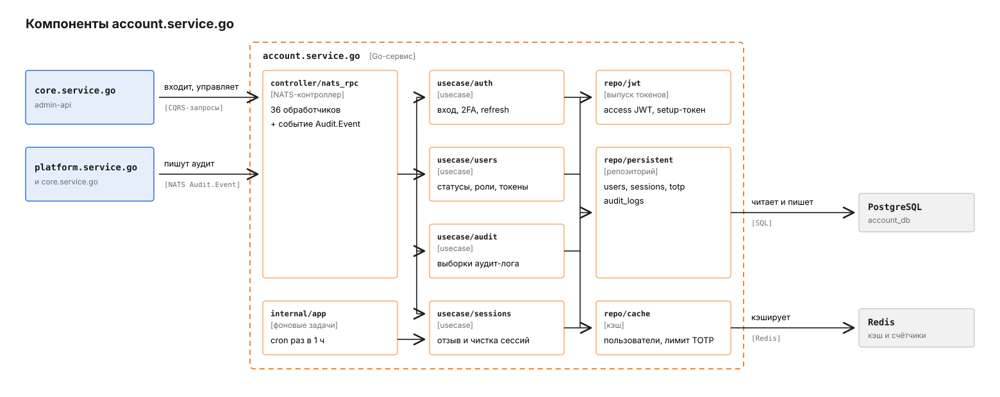
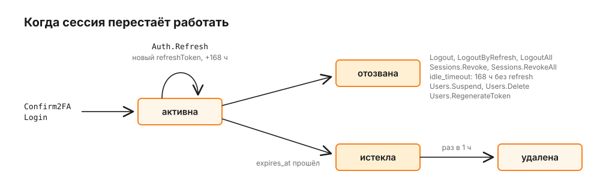

# account.service.go

Сервис знает, кто входит в админку и кабинеты платформы: хранит пользователей и их роли, пускает по токену входа с обязательным TOTP, выпускает JWT и ведёт сессии и аудит-лог. Вызывает его `core.service.go`: `admin-api` проксирует сюда вход и управление пользователями и на каждый запрос спрашивает, жива ли сессия. HTTP-API у сервиса нет, только сообщения NATS; общая картина платформы - в [корневом README](../../README.md).

## Путь первого входа

Администратор создал пользователя через `Users.Create` и получил его токен входа: 32 случайных байта в base64url, 43 символа. Core передаёт в запросе `approveNow: true` и `approverId` администратора, поэтому пользователь из админки сразу получает статус `active`. Без этих полей учётная запись создаётся в `pending` и ждёт `Users.Approve`. Пароля нет, токен и есть "логин + пароль". Проследим, как этот пользователь входит впервые. Серым на схеме показан core, оранжевым - account-service.


1. Админка отправляет токен в core, core - в `Auth.Login`:

   ```json
   {
     "authToken": "<токен входа>",
     "totpCode": "",
     "device": { "fingerprint": "f3a1...", "userAgent": "Mozilla/5.0 ...", "ipAddress": "203.0.113.7" }
   }
   ```

   Сервис ищет кандидатов по первым 10 символам токена (`auth_token_prefix`) и сравнивает SHA-256 от токена с `auth_token_hash` за постоянное время (`login.go`). Войти может только пользователь в статусе `active`: для `pending` и `suspended` ответ - `FORBIDDEN`.
2. У пользователя ещё нет TOTP, а без него входа нет ни для одной роли. Сервис генерирует секрет и возвращает `twoFactorSetup`: QR-код PNG в data URI, тот же секрет текстом (`manualKey`) и `setupToken` - JWT на 10 мин, который связывает пользователя с выданным секретом. Сессии пока нет.
3. Пользователь сканирует QR, вводит код, core вызывает `Auth.Confirm2FA` с `setupToken` и `totpCode`. Сервис проверяет код по секрету из токена, ещё раз убеждается, что пользователь `active`, шифрует секрет ключом `TOTP_ENCRYPTION_KEY` и сохраняет в `totp_secrets`.
4. Сервис открывает сессию, в базе хранится только SHA-256 от refresh-токена, и возвращает `accessToken` (HS256, 15 мин, в claims `uid`, `sid`, `role`, `ak`, `oid`, `mid`, `name`), `refreshToken` (32 случайных байта, 168 ч) и `sessionId`. Аудит-лог получает запись `2fa_enabled`.
5. Дальше core на каждый запрос админки сам проверяет подпись JWT общим секретом `JWT_SECRET` и спрашивает у сервиса `Internal.ValidateSession` по `sid` из токена. Сервис смотрит в PostgreSQL: `revoked_at IS NULL` и `expires_at > now()`, а затем проверяет, что владелец сессии всё ещё `active` (`validate.go`).

Со второго входа шаги 2 и 3 пропускаются: `Auth.Login` сразу ждёт `totpCode` и возвращает токены. Без кода ответ - `TWO_FACTOR_REQUIRED`, с неверным кодом - `UNAUTHORIZED`. На ввод кода действует лимит попыток на пользователя: превышение даёт `RATE_LIMITED`, и core отдаёт админке HTTP 429 с кодом `rate_limited`. Счётчик `totp:attempts:<id>` в Redis общий со step-up-подтверждением, поэтому перебор нельзя растянуть на два обработчика; верный код сбрасывает его (`login.go`).

## Из чего состоит сервис



`controller/nats_rpc` регистрирует 36 обработчиков и одно событие (`router.go`). Бизнес-логика разложена по `usecase/auth`, `usecase/users`, `usecase/totp` (на схеме не показан), `usecase/sessions` и `usecase/audit`: запись лежит в пакетах `command`, чтение - в `query`. `repo/jwt` выпускает access- и setup-токены, `repo/auth` (на схеме не показан) генерирует токены входа и шифрует секреты, `repo/cache` держит кэш пользователей и счётчик попыток TOTP. `internal/app` при старте создаёт первого администратора и запускает две cron-задачи чистки сессий.

## Как сессия живёт и умирает

Access-токен живёт 15 мин и сам по себе не отзывается: это подписанный JWT. Отзыв работает через сессию, которую core проверяет на каждом запросе, так что отозванная сессия перестаёт пускать сразу, без ожидания истечения токена.



`Auth.Refresh` одним `UPDATE` находит неотозванную и неистёкшую сессию по хешу старого refresh-токена, записывает хеш нового и сдвигает `expires_at` на 168 ч вперёд. Два параллельных запроса с одним токеном не пройдут оба: второй не найдёт строку и получит `NOT_FOUND`. Если владелец сессии уже не `active`, новый токен не выдаётся, и сессия становится непригодной.

`Users.Suspend` переводит пользователя в `suspended` и сразу отзывает все его сессии с причиной `user suspended`. Так же поступают `Users.Delete` и `Users.RegenerateToken`. Приостановленного пользователя возвращает `Users.Activate`, но войти ему придётся заново.

Раз в `SESSION_CLEANUP_INTERVAL` работают две задачи. Первая отзывает с причиной `idle_timeout` сессии, у которых `last_active_at` старше `SESSION_IDLE_TIMEOUT`. `last_active_at` обновляется только при refresh, поэтому "простой" здесь значит "ни одного refresh за 168 ч". Вторая удаляет строки с истёкшим `expires_at`.

## Почему у пользователя нет пароля

Токен входа генерирует сервис, и администратор передаёт его пользователю сам. В базе лежат префикс, SHA-256 и зашифрованная копия токена (`auth_token_encrypted`). Копия нужна, чтобы `super_admin` мог снова показать токен через `Users.GetToken`.

`Users.RegenerateToken` выпускает новый токен и отзывает все сессии пользователя. `TOTP.Disable` снимает второй фактор, и при следующем входе пользователь снова проходит шаги 2 и 3. `TOTP.VerifyStepUp` - повторное подтверждение кодом перед опасным действием, на него действует тот же лимит попыток на пользователя, что и на вход.

## Что принимает сервис

Имена обработчиков не следуют общей схеме `{Service}.{Entity}.{Action}`: префикса `Account.` у них нет. Имя приложения в discovery - `account-service`, пространство имён `pay`.

| Сообщение | Тип | Что делает |
|---|---|---|
| `Auth.Login`, `Auth.Confirm2FA`, `Auth.Refresh` | запросы | вход, завершение настройки TOTP, ротация refresh-токена |
| `Auth.Logout`, `Auth.LogoutAll`, `Auth.LogoutByRefresh` | команды | отзыв одной или всех сессий |
| `Auth.Me` | запрос | профиль текущего пользователя |
| `Users.Get`, `List`, `GetStats`, `GetToken` | запросы | чтение пользователей, `GetToken` только для `super_admin` |
| `Users.Create`, `CreateForOwner`, `RegenerateToken` | запросы | создание пользователя и выпуск токена, токен возвращается в ответе |
| `Users.Update`, `Approve`, `Suspend`, `Activate`, `ChangeRole`, `Delete` | команды | изменение пользователя |
| `TOTP.Setup` | запрос | новый секрет TOTP |
| `TOTP.Disable`, `TOTP.VerifyStepUp` | команды | снять второй фактор, подтвердить действие кодом |
| `Sessions.List` | запрос | активные сессии пользователя |
| `Sessions.Revoke`, `Sessions.RevokeAll` | команды | отзыв сессий администратором |
| `Audit.List`, `ListByProvider`, `ListByTrader`, `ListByTerminal`, `ListByMerchant`, `ListByGroup`, `ListBySlug`, `ListByStaticRate`, `ListPlatformSettings` | запросы | выборки аудит-лога |
| `Internal.ValidateSession` | запрос | жива ли сессия |
| `Audit.Event` | событие | запись в аудит-лог от core и platform |

Статусы пользователя: `pending` -> `active` через `Users.Approve`, `active` -> `suspended` через `Users.Suspend`, `pending` или `suspended` -> `active` через `Users.Activate`. `Users.CreateForOwner` создаёт владельца мерчанта или провайдера сразу в `active`.

Роли: `super_admin`, `admin`, `support`, `analyst`, `merchant`, `merchant_owner`, `provider_owner`. Пользователь не может сам себя приостановить, удалить, сменить себе роль, перевыпустить свой токен или отозвать свои сессии через админские команды - на это сервис отвечает `FORBIDDEN`. Удалить последнего `super_admin` или сменить ему роль нельзя: `LAST_SUPER_ADMIN`.

Коды ошибок: `INVALID_REQUEST` (нечитаемый JSON или id), `NOT_FOUND`, `UNAUTHORIZED`, `TWO_FACTOR_REQUIRED`, `RATE_LIMITED`, `FORBIDDEN`, `LAST_SUPER_ADMIN`, `NAME_CONFLICT`, `OWNER_CONFLICT`, `CONFLICT`, `TWO_FACTOR_NOT_ENABLED`, `VALIDATION_ERROR`; всё непредусмотренное - `INTERNAL` с текстом `internal error` (`controller.go`).

Сервис сам никого не вызывает и событий не публикует.

## Где лежат данные

PostgreSQL, таблицы `users`, `totp_secrets`, `sessions`, `audit_logs`, миграция одна - `00001_init`, версии в `schema_migrations_account`. Сессии живут только в базе.

Redis нужен для двух вещей: кэш пользователя по id на 5 мин, который сбрасывается при каждом изменении пользователя, и счётчик попыток ввода TOTP, общий для входа и `TOTP.VerifyStepUp`.

## Конфигурация

| Переменная | По умолчанию | Зачем |
|---|---|---|
| `PG_URL` | обязательна | база сервиса |
| `REDIS_URL` | обязательна | кэш и счётчики |
| `NATS_URL` | обязательна | шина CQRS |
| `JWT_SECRET` | обязательна | подпись access- и setup-токенов, должен совпадать с `AUTH_JWT_SECRET` в core |
| `TOTP_ENCRYPTION_KEY` | обязательна | секретный ключ шифрования, задаётся при деплое; шифрует секреты TOTP и токены входа |
| `JWT_ACCESS_TTL` | `15m` | жизнь access-токена |
| `JWT_REFRESH_TTL` | `168h` | жизнь сессии и refresh-токена |
| `JWT_SETUP_TTL` | `10m` | окно на настройку TOTP |
| `SESSION_IDLE_TIMEOUT` | `168h` | через сколько без refresh сессия отзывается |
| `SESSION_CLEANUP_INTERVAL` | `1h` | период обеих задач чистки |
| `ROOT_ADMIN_TOKEN` | пусто | токен первого `admin`, если в базе нет ни одного |
| `ROOT_ADMIN_NAME` | `Root Admin` | имя этого администратора |

Остальное - `APP_NAME` (`account-service`), `APP_VERSION` (`local`), `HTTP_PORT` (`:8080`, только health-пробы), `PG_POOL_MAX` (10), `CQRS_NAMESPACE` (`pay`), `CQRS_WORKERS_POOL_SIZE` (5), `JWT_ISSUER` (`account-service`), `TOTP_ISSUER` (`PaymentPlatform`, видно в приложении-аутентификаторе), `OTEL_ENABLED`, `OTEL_ENDPOINT`. Если в рабочей директории есть `.env`, конфиг читается из него, и значения из файла перекрывают одноимённые переменные окружения. `LOG_LEVEL` и `APP_ENV` логгер берёт только из окружения процесса: при `APP_ENV=production` логи пишутся JSON.

## Как запустить и проверить

Здесь только документация и схемы: исходный код, миграции, `Makefile` и `.env.example` остаются в приватном репозитории вместе со стеком запуска (docker-compose, Helm). Юнит-тесты покрывают вход, TOTP, сессии и аудит; интеграционные ходят в запущенный сервис по NATS как чёрный ящик.

## Что стоит знать заранее

Параметры подключения, включая `sslmode`, берутся из `PG_URL` как есть: миграция добавляет к строке только имя таблицы версий. Для локального PostgreSQL без TLS указывайте `?sslmode=disable`.
