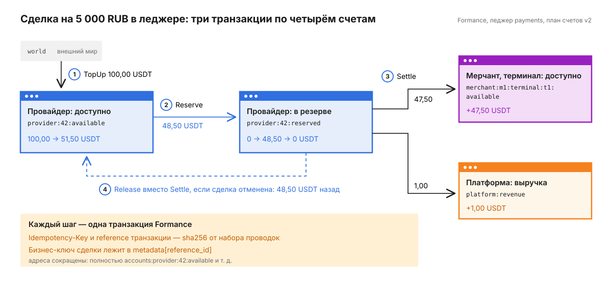
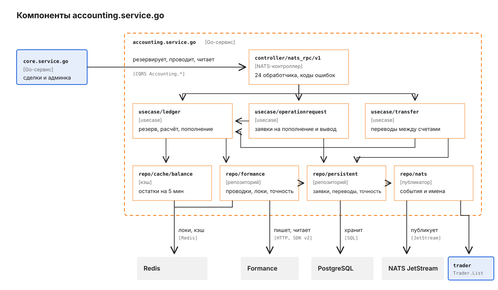
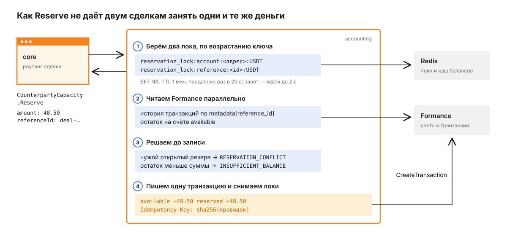

# accounting.service.go

Accounting ведёт леджер платформы: хранит балансы провайдеров, трейдеров, терминалов мерчантов и самой платформы, резервирует деньги под сделку и проводит расчёт, когда сделка закрыта. Остатки и проводки лежат в Formance Ledger, собственная база PostgreSQL хранит только заявки на пополнение и вывод и внутренние переводы. Вызывает сервис почти всегда `core.service.go`, через NATS и `golang-cqrs`. HTTP API нет, на `HTTP_PORT` открыты только `/healthz` и `/readyz`.

Как сделка выглядит целиком и откуда берутся комиссии, рассказано в [корневом README](../../README.md). Здесь - что при этом происходит с деньгами внутри леджера.

## Путь одной сделки через леджер

Возьмём пример из корневого README: плательщик платит 5 000 RUB, курс 100 RUB за USDT, провайдер берёт 3%, терминал 5%. В леджере эта сделка - три транзакции Formance по четырём счетам.



Деньги провайдера сначала замораживаются на его же счёте и только потом делятся между мерчантом и платформой.

1. Провайдер заранее вносит ликвидность. Админ подтверждает пополнение, `Accounting.Ledger.TopUp` переводит 100 USDT со служебного счёта `world` на `accounts:provider:42:available`. `world` - внешний мир, источник и приёмник денег, которые входят в систему и выходят из неё.
2. Роутинг `core` выбрал провайдера и резервирует под сделку 48,50 USDT командой `Accounting.CounterpartyCapacity.Reserve`. Резерв переносит сумму с `available` на `reserved` того же владельца.

   ```json
   {
     "counterpartyId": "42",
     "counterpartyKind": "",
     "currency": "USDT",
     "amount": "48.5",
     "precision": 6,
     "referenceId": "<id сделки>",
     "referenceType": "DEAL"
   }
   ```

   Пустой `counterpartyKind` означает провайдера, `"trader"` - трейдера. Если свободных денег меньше суммы, ответ `INSUFFICIENT_BALANCE`.
3. Оплата подтверждена, `core` вызывает `Accounting.Ledger.Settle`. Одной транзакцией резерв провайдера закрывается целиком: 47,50 USDT уходят на `accounts:merchant:<id>:terminal:<id>:available`, 1,00 - на `accounts:platform:revenue`. Accounting проверяет, что зарезервировано ровно столько, сколько просят закрыть, и что при одном активе 48,50 = 47,50 + 1,00 (`settle.go`). Если провайдер, мерчант и платформа считают в разных активах, разницу по каждому активу балансирует счёт `accounts:platform:clearing`.
4. Если сделка отменена, вместо расчёта приходит `Accounting.Ledger.Release` с тем же `referenceId`. Сумму и точность accounting берёт из исходного резерва, а не из запроса: иначе отмена одной сделки освободила бы деньги соседних.

Выплата устроена так же, только в резерв уходят деньги мерчанта: `Accounting.Ledger.Reserve` резервирует терминал, `Accounting.Ledger.SettlePayout` переносит резерв на счёт провайдера и в выручку, `Accounting.Ledger.ReversePayout` разворачивает уже проведённую выплату по решению поддержки.

## Из чего состоит сервис

Слои те же, что у остальных Go-сервисов платформы: контроллер принимает сообщения NATS, usecase держит правила, репозитории ходят в хранилища. Особенность accounting в том, что главный репозиторий смотрит не в PostgreSQL, а в Formance.



Заявки и переводы не пишут в Formance сами: деньги по ним двигает `usecase/ledger`, поэтому идемпотентность и проверки баланса у всех операций общие.

`controller/nats_rpc/v1` разбирает запрос, ставит таймаут 3-10 с и переводит доменные ошибки в коды. `usecase/ledger` - фасад над командами из `usecase/ledger/command`, по одному файлу на операцию. `repo/formance` строит из проводок транзакцию Formance, держит локи резервов в Redis, считает ключ идемпотентности и следит, чтобы у валюты была одна точность. `repo/cache/balance` кэширует остатки для `Accounting.Balance.Get`. `repo/persistent` хранит через sqlc заявки, переводы и закреплённую точность валют. `repo/nats` публикует события зачислений и спрашивает имена трейдеров у `trader.service.go`.

## Где лежат деньги

Источник истины для остатков - Formance, леджер `FORMANCE_LEDGER` (по умолчанию `payments`). Адрес счёта в Formance - постоянный ключ, поэтому план счетов версионирован (`chart.go`). Новые записи пишутся по плану `v2`:

| Владелец | Адреса счетов |
|---|---|
| Провайдер, трейдер | `accounts:provider:<id>:available`, `:reserved`; то же с `trader` |
| Терминал мерчанта | `accounts:merchant:<id>:terminal:<id>:available`, `:reserved` |
| Платформа | `accounts:platform:revenue`, `accounts:platform:clearing` |
| Внешний мир | `world` |

Баланс ведётся по терминалу, а не по мерчанту: у одного мерчанта столько пар счетов, сколько терминалов. Сумма хранится в минимальных единицах актива вида `USDT/6`, точность приходит в каждом запросе полем `precision` (0-18).

Для Formance `USDT/6` и `USDT/8` - два разных актива, и баланс одной валюты разошёлся бы на два. Поэтому точность закрепляется за валютой при первой записи: `repo/formance` вставляет её в таблицу `currency_precisions` (`INSERT ... ON CONFLICT DO NOTHING`) и читает закреплённое значение обратно (`precision.go`, миграция `00002_currency_precision.up.sql`). Таблица общая для всех инстансов, а в памяти процесса лежит только кэш. Запись, в которой точность валюты отличается от закреплённой или в одном батче встречаются две точности одной валюты, отклоняется до обращения к Formance.

При чтении `v2` сервис заодно смотрит старые адреса `v1` (`counterparties:<id>:...`, `merchants:<id>:<terminal>:...`, `platform:...`), чтобы исторические остатки не пропали. Для трейдеров старый адрес не читается: в `v1` провайдеры и трейдеры делили общий `counterparties:<id>`, а их идентификаторы - независимые последовательности, так что чтение склеило бы чужие деньги (`ledger.go`).

Бизнес-ключ операции (`referenceId` сделки, заявки или перевода) пишется в `metadata[reference_id]` транзакции. Поле `reference` самой транзакции Formance занято хэшем, о нём ниже.

## Как Reserve не даёт двум сделкам занять одни и те же деньги

Резерв - решение "прочитать остаток, потом записать". Formance не умеет сериализовать такие решения, а в гонке маршрутизации (`staged_race`, `full_race`) несколько попыток резервируют деньги одновременно. Без блокировки две сделки прочитали бы одни и те же 50 USDT и обе их заняли бы.



Всё между захватом и снятием локов - одно решение, и чужой резерв в него вклиниться не может.

1. Accounting берёт в Redis два лока: на исходный счёт `available` и на `referenceId`. Лок - `SET NX` с TTL 1 мин, ключи захватываются в отсортированном порядке, чтобы два резерва не заблокировали друг друга. Занятый лок ждём до 2 с, дальше отвечаем `RESERVATION_CONFLICT` (`reservation.go`).
2. Под локом параллельно читаем из Formance все транзакции с этим `referenceId` и текущий остаток. Чтения друг от друга не зависят, а два HTTP-запроса подряд под удерживаемым локом стоили бы резерву лишних сотен миллисекунд (`ledger.go`).
3. Если под этой ссылкой уже открыт резерв другого владельца, ответ `RESERVATION_CONFLICT`. Если остатка не хватает - `INSUFFICIENT_BALANCE`.
4. Пишем одну транзакцию и снимаем локи. Пока запрос к Formance идёт, лок продлевается каждые 20 с. Если продлить не удалось, значит лок достался другому, и запрос к Formance отменяется: безопаснее повторить идемпотентную команду, чем записать резерв после чужой проверки.

Тот же лок на счёт берёт `Accounting.Ledger.Post`, если в плане есть проверка баланса (`check`). Остальные команды - `Release`, `Settle`, `TopUp`, `Correct` - обходятся без лока: от повтора их защищает идемпотентность.

## Почему повтор команды безопасен

`core` повторяет команды: после таймаута и из outbox, который шлёт `Accounting.Ledger.Post` раз в секунду, пока не получит успех. Поэтому каждая запись в Formance идемпотентна по содержимому. Accounting сортирует проводки батча, отбрасывает недетерминированные поля - идентификатор и время - и берёт sha256 от остального (`idempotency.go`). Хэш уходит и в `Idempotency-Key`, и в `reference` транзакции.

```
available|DEBIT|RESERVE|48.5|USDT|<deal>|deal|||provider|42
reserved|CREDIT|RESERVE|48.5|USDT|<deal>|deal|||provider|42
  -> sha256 -> Idempotency-Key и reference транзакции
```

`reference` в Formance уникален навсегда, поэтому второй такой же набор проводок вернёт конфликт. Accounting переводит его в `ErrDuplicateEntry` и отвечает успехом. Бизнес-ключ поэтому и живёт в metadata: иначе нельзя было бы закрыть резерв и открыть новый под той же сделкой.

Поэтому вызывающая сторона даёт каждой операции свой `referenceId`: у пополнений это идентификатор заявки, у переводов - идентификатор перевода.

## Заявки на пополнение и вывод, переводы

Деньги двигаются только после подтверждения человеком, поэтому у пополнений, выводов и переводов между счетами есть свои сущности в PostgreSQL: таблицы `balance_operation_requests` и `transfers` (`00001_init.up.sql`).

Заявка создаётся в `PENDING` с обязательным ключом идемпотентности: повтор с тем же ключом и тем же содержимым вернёт ту же заявку, с другим содержимым - `IDEMPOTENCY_CONFLICT`. Заявка на вывод (`requestType: WITHDRAWAL`) сразу резервирует сумму вместе с комиссией под идентификатором заявки. `Approve` сначала переводит заявку в `APPROVING`, чтобы два админа не провели её дважды, затем проводит `TopUp` или закрывает резерв вывода на `platform:clearing` и `platform:revenue`, и только потом ставит `APPROVED`. `Reject` так же проходит через `REJECTING` и освобождает резерв вывода. `RecordDeposit` лишь меняет `APPROVED` на `DEPOSITED` и деньги не трогает.

Перевод создаётся в `PENDING` без движения денег. `Approve` переводит его в `APPROVING`, строит план проводок и отправляет его через тот же путь, что и `Accounting.Ledger.Post`; если активы источника и получателя разные, конвертацию балансирует `platform:clearing` (`approve.go`). Если проводка не прошла, перевод возвращается в `PENDING`, после успеха становится `APPROVED`. `Cancel` доступен только из `PENDING`.

## Что сервис принимает и публикует

Все обработчики зарегистрированы в `router.go`. Сервис регистрируется в discovery под именем `APP_NAME` (`accounting-service`), `core` вызывает его по этому имени.

| Обработчик | Тип | Что делает |
|---|---|---|
| `Accounting.Balance.Get` | query | остаток одного счёта, с кэшем в Redis на 5 мин |
| `Accounting.Balance.ListByActor` | query | все счета владельца: провайдера, трейдера, мерчанта или платформы |
| `Accounting.Balance.ListCounterparties` | query | счета всех провайдеров и трейдеров, для роутинга |
| `Accounting.Balance.ListMerchants` | query | счета всех терминалов, для админки |
| `Accounting.CounterpartyCapacity.Reserve` | command | резерв денег провайдера или трейдера под сделку |
| `Accounting.Ledger.Reserve` | command | резерв денег терминала мерчанта под выплату |
| `Accounting.Ledger.Release` | command | снятие резерва по `referenceId` |
| `Accounting.Ledger.Settle` | command | расчёт входящей сделки |
| `Accounting.Ledger.SettlePayout` | command | расчёт выплаты |
| `Accounting.Ledger.ReversePayout` | command | разворот проведённой выплаты |
| `Accounting.Ledger.TopUp` | command | зачисление из `world` на доступный счёт |
| `Accounting.Ledger.Correct` | command | ручная корректировка против `world`, сумма со знаком, владелец в `actorType` |
| `Accounting.Ledger.Post` | command | произвольный сбалансированный план проводок с проверкой баланса |
| `Accounting.Ledger.List` | query | история проводок с балансом до и после, с фильтрами |
| `Accounting.Ledger.ListByReference` | query | проводки одной сделки, заявки или перевода |
| `Accounting.OperationRequest.Create` | query | новая заявка, возвращает её `id` |
| `Accounting.OperationRequest.Approve` | command | подтверждение заявки |
| `Accounting.OperationRequest.Reject` | command | отклонение заявки |
| `Accounting.OperationRequest.RecordDeposit` | command | отметка о поступлении денег по заявке |
| `Accounting.OperationRequest.List` | query | список заявок |
| `Accounting.Transfer.New` | query | новый перевод, возвращает его `id` |
| `Accounting.Transfer.Approve` | command | проведение перевода |
| `Accounting.Transfer.Cancel` | command | отмена перевода |
| `Accounting.Transfer.List` | query | список переводов |

Бизнес-ошибки приходят кодами, которые `core` различает: `INSUFFICIENT_BALANCE`, `RESERVATION_CONFLICT`, `RESERVATION_NOT_FOUND`, `IDEMPOTENCY_CONFLICT`, `INVALID_STATUS`, `NOT_FOUND`, `INVALID_ARGUMENT`. Тело, которое не разбирается как JSON, - `INVALID_REQUEST`. Остальные ошибки, включая недоступность Formance, приходят как `INTERNAL`; исключение - `Accounting.Ledger.Post`, который любой отказ плана возвращает как `INVALID_ARGUMENT` и пишет причину в лог.

`Accounting.Ledger.Correct` принимает владельца в поле `actorType`: `provider` (или `counterparty`), `trader`, `merchant`, `platform`. Без него владелец выводится из `accountType`: `REVENUE` и `CLEARING` - счета платформы, остальное считается провайдером. Неизвестный `actorType` отклоняется с кодом `VALIDATION_ERROR`.

```json
{
  "actorType": "trader",
  "counterpartyId": "17",
  "accountType": "AVAILABLE",
  "currency": "USDT",
  "amount": "-2.5",
  "precision": 6,
  "referenceId": "<id корректировки>",
  "performedBy": "<id админа>",
  "comment": "возврат ошибочного зачисления"
}
```

`Accounting.Ledger.List` отдаёт до `limit` проводок, по умолчанию 100 и не больше 1 000, и `nextCursor` для следующей страницы. Владелец, `operationType`, `referenceType` и период `from`-`to` (Unix-время в наносекундах) уходят в фильтр запроса к Formance, так что леджер отдаёт только подходящие транзакции (`history.go`). Валюту, тип счёта и сторону проводки (`entryType`) Formance в фильтре транзакций не проверяет, их сервис отсеивает после чтения. Без владельца история читается по всему леджеру.

Кроме ответов, сервис публикует два события в JetStream (`trader_topup_publisher.go`).

| Subject | Stream | Когда |
|---|---|---|
| `accounting.balance_credited.<actor>.<id>` | `BALANCE_EVENTS` | после `TopUp`, корректировки в плюс и `Release`; по нему `core` добирает резервы под открытые споры |
| `accounting.trader_balance_credited.<traderId>` | `TRADER_BALANCE_EVENTS` | после пополнения трейдера; `trader.service.go` шлёт по нему алерт |

Оба стрима хранят сообщения 24 ч. Сам сервис делает один исходящий запрос: `Trader.List` в `trader.service.go`, чтобы показать имена трейдеров в списках заявок и переводов. Если он не ответил, в списке остаётся `Trader #<id>`.

## Конфигурация

Полный список - в `config.go` и `.env.example` в приватном репозитории. Если в рабочей директории лежит `.env`, сервис читает его, и значения из файла перекрывают одноимённые переменные окружения.

| Переменная | По умолчанию | Зачем |
|---|---|---|
| `PG_URL` | обязательна | заявки, переводы, точность валют |
| `PG_POOL_MAX` | 30 | размер пула соединений |
| `FORMANCE_SERVER_URL` | обязательна | адрес Formance gateway, в compose `http://formance-gateway:8080` |
| `FORMANCE_LEDGER` | `payments` | имя леджера |
| `FORMANCE_ACCOUNT_CHART` | `v2` | план счетов для новых записей, `v1` или `v2` |
| `FORMANCE_NO_AUTH` | `false` | без OAuth, для локального Formance |
| `FORMANCE_CLIENT_ID`, `FORMANCE_CLIENT_SECRET` | - | OAuth client credentials, если авторизация включена |
| `FORMANCE_TOKEN_URL` | `/api/auth/oauth/token` | путь выдачи OAuth-токена |
| `FORMANCE_SCHEMA_VERSION` | не задана | версия схемы леджера в запросах записи, в compose `v2` |
| `FORMANCE_TIMEOUT` | `10s` | таймаут HTTP-клиента Formance |
| `REDIS_URL` | `redis://localhost:6379` | локи резервов и кэш балансов |
| `REDIS_POOL_MIN`, `REDIS_POOL_MAX` | 5, 20 | пул соединений Redis |
| `NATS_URL`, `NATS_NAMESPACE` | `nats://localhost:4222`, `pay` | транспорт `golang-cqrs` |
| `NATS_WORKERS_POOL_SIZE` | 10 | параллельных обработчиков NATS |
| `HTTP_PORT` | `:8993` | health-пробы; в docker-compose `:8093` |
| `TRADER_APP_NAME` | `trader-service` | куда слать `Trader.List` |

## Как запустить и проверить

Здесь только документация и схемы: исходный код, миграции, `Makefile` и стек запуска (docker-compose с профилем `formance`, Helm) остаются в приватном репозитории. Юнит-тесты подменяют клиент Formance фейком и не требуют ни базы, ни леджера; интеграционные проверяют репозитории на настоящем PostgreSQL, каждый тест создаёт себе временную схему и удаляет её после прогона.
