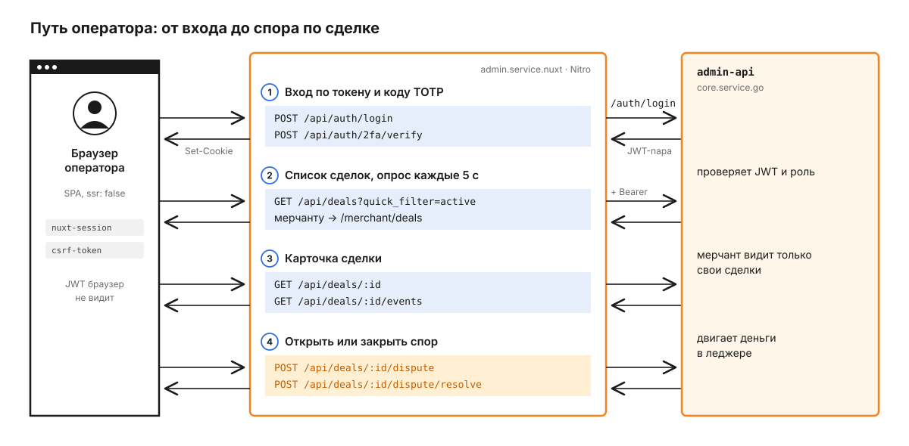

# admin.service.nuxt

Админка - одно приложение на Nuxt 4 для трёх кабинетов: операторов платформы (роли `admin` или `super_admin`, `support`, `analyst`), мерчантов (`merchant`, `merchant_owner`) и провайдеров (`provider_owner`). Страницы рендерятся только в браузере (`ssr: false`), а свой Nitro-сервер работает как BFF: браузер ходит только в `/api/*` этого же origin, JWT живут в зашифрованной серверной сессии, а Nitro пересылает запросы в admin-api ядра. Что такое сделка, спор и группа трафика, описано в [корневом README](../../README.md).

## Путь оператора

Проследим обычный рабочий сценарий: оператор входит, находит сделку, по которой пришла жалоба, и открывает спор.



1. Оператор входит по персональному токену доступа, а не по паролю. Токен выдаётся при создании пользователя и перевыпускается в разделе пользователей. Форма `components/auth/forms/SignIn.vue` отправляет его вместе с отпечатком устройства:

   ```http
   POST /api/auth/login HTTP/1.1
   Content-Type: application/json
   csrf-token: <токен из useCsrf>

   {
     "token": "<токен доступа>",
     "device": { "fingerprint": "...", "user_agent": "Mozilla/5.0 ...", "ip_address": "" }
   }
   ```

   Nitro подставляет в `ip_address` настоящий IP (`CF-Connecting-IP`, затем `X-Forwarded-For`, затем адрес сокета) и пересылает запрос в `POST /auth/login` admin-api. Ответов три: `setup_required` - форма показывает QR-код и шлёт первый код в `POST /api/auth/2fa/confirm`; `challenge_required` - форма спрашивает шестизначный код и шлёт его в `POST /api/auth/2fa/verify`; `ok` с парой JWT. Получив токены, Nitro читает из access-токена роль и `sub` и сохраняет в cookie `nuxt-session` открытую часть `{ user: { id, role } }` и закрытую `secure: { access_token, refresh_token }` (`server/utils/auth-session.ts`). Закрытая часть не уходит в `/api/_auth/session`, поэтому JavaScript в браузере токенов не видит.

2. Глобальный middleware `app/middleware/auth.global.ts` на каждом переходе проверяет, что пользователь вошёл и что роль входит в `meta.roles` страницы, иначе отправляет на `/login` или `/403`. Оператор открывает `/deals`. По умолчанию выбраны вкладки "Активные" и `IN`: быстрые фильтры превращаются в статусы (`active` - `NEW`, `PENDING_REQ`, `PENDING`, `PAID`; `completed` - `COMPLETED`; `cancelled` и `unissued` - `CANCELED` с `issued=true` и `false`; `disputed` - `DISPUTE`). Список постраничный по курсору, общее число сделок запрашивается только для первой страницы. Vue-query перезапрашивает его каждые 5 с (`composables/entities/usePaginatedDeals.ts`). Nitro сам выбирает путь по роли: мерчанту - `/merchant/deals` и только разрешённые фильтры, остальным - `/deals` (`server/api/deals/index.get.ts`).

3. Клик по строке параллельно запрашивает `GET /api/deals/:id` и `GET /api/deals/:id/events`. Если у провайдера в ответе нет имени, карточка дозапрашивает провайдера отдельно. Так же список дозапрашивает имена терминалов, мерчантов и провайдеров, которых нет в строке, и кеширует их на время жизни страницы.

4. Спор открывается из карточки в диалоге `components/deals/dialogs/DealDisputeDialog.vue`. Оператор отправляет `multipart/form-data` с полями `reason`, `correct_amount` и файлами `file` (до 5 файлов по 10 МБ) в `POST /api/deals/:id/dispute`, Nitro пересылает запрос в `/deals/:id/dispute` без изменений. Мерчант открывает спор без вложений: Nitro отправляет в `/merchant/deals/:id/dispute` JSON с `reason` и `correct_amount`. Закрытие - JSON в `POST /api/deals/:id/dispute/resolve`: для входящей сделки с `result` (`RESOLVED`, `AMOUNT_CHANGED`, `REJECTED`), для выплаты с `outcome` (`PAID`, `FAILED`, `CONFIRMED`, `REVERSED`), тогда Nitro пересылает в `/deals/:id/payout-dispute/resolve`. Известные ошибки бэкенда, например `dispute window expired` или `insufficient merchant balance to resolve dispute`, превращаются в понятные тосты (`composables/deals/useDealsPage.ts`).

Вложения спора браузер тоже получает через BFF. `GET /api/deals/:id/attachments` сначала проверяет, что сделка видна пользователю (запрос карточки в admin-api с его токеном), и только потом спрашивает список у files-service с заголовком `X-Service-Token`. `GET /api/deals/:id/attachments/:key` дополнительно сверяет, что файл принадлежит этой сделке, и отвечает `302` на временную ссылку хранилища. Поэтому origin хранилища (`NUXT_FILES_PUBLIC_ORIGIN`) добавляется в CSP `img-src` и `frame-src` (`server/plugins/csp-files-origin.ts`).

## Из чего состоит приложение

Браузерная часть делится на три слоя: страницы, композаблы страниц и композаблы данных. Все запросы из браузера идут через один клиент `useAuthFetch` в server-роуты Nuxt, а те ходят в admin-api через `auth-fetch.ts` и в files-service через `files-service.ts`.


```
app/
  pages/(admin|auth|error|merchant|provider|shared)/   маршруты по кабинетам, скобки в URL не попадают
  middleware/auth.global.ts                            сессия и meta.roles страницы
  composables/<домен>/use*Page.ts                      состояние страницы: фильтры, диалоги, тосты
  composables/<домен>/use<Сущность>.ts                 запросы и мутации через vue-query
  composables/auth/useAuthFetch.ts                     CSRF-заголовок, выход при 401
  components/<домен>/dialogs/                          диалоги отдельными компонентами
  components/                                          364 .vue, ui/ - компоненты shadcn-vue
server/
  api/<домен>/                                         170 обработчиков
  api/auth/                                            login, 2fa/verify, 2fa/confirm, logout
  utils/auth-fetch.ts                                  Bearer из сессии, обновление и один повтор после 401
  utils/api-proxy.ts                                   proxyJson и proxyMultipart поверх fetchWithAuth
  utils/files-service.ts                               запросы в files-service с X-Service-Token
  plugins/require-secrets.ts                           в production не стартует без секретов
shared/                                                типы и утилиты, общие для app и server
i18n/locales/{ru,en}.json                              по 1 737 строк, по умолчанию ru
```

Страница сделок показывает, как устроен слой диалогов: `pages/(shared)/deals/index.vue` держит только разметку, состояние живёт в `useDealsPage`, а карточка, спор и действия с выплатой - три компонента в `components/deals/dialogs/`: `DealDetailsDialog`, `DealDisputeDialog` и `DealPayoutActionDialog`.

Nitro ходит в admin-api через `fetchWithAuth` или обёртки `proxyJson` и `proxyMultipart`. Токен берётся из закрытой части сессии, добавляются `CF-Connecting-IP`, `X-Forwarded-For` и `X-Real-IP`, а на `401` Nitro обновляет токен через `POST /auth/refresh` и повторяет запрос один раз. Одновременные обновления с одним `refresh_token` склеиваются в одно, потому что бэкенд ротирует refresh-токен и второй параллельный вызов получил бы `401` (`server/utils/auth-fetch.ts`).

Браузеру остаётся простая роль. `useAuthFetch` ставит заголовок `csrf-token` на `POST`, `PUT`, `PATCH` и `DELETE` и, если BFF всё же ответил `401`, считает сессию окончательно истёкшей: вызывает `POST /api/auth/logout` и ведёт на `/login`. Выход отзывает сессию в admin-api по refresh-токену, поэтому срабатывает и с протухшим access-токеном.

## Кто что видит

Доступ задают `meta.roles` страниц и меню `app/constants/menus.ts`. Роли `admin` и `super_admin` взаимозаменяемы, `merchant` и `merchant_owner` тоже (`app/constants/access.ts`). Изоляцию данных держит не админка, а admin-api: например, аналитику мерчанта он сужает до его `merchant_id` сам (`core.service.go/internal/delivery/http/admin/v1/analytics/access.go`).

| Роль | Страницы, кроме `/` и `/profile` |
|---|---|
| `admin`, `super_admin` | `/deals`, `/ledger`, `/transfers`, `/traffic-groups`, `/users` и вложенные, `/settings`, `/currencies`, `/methods`, `/rates`, `/banks`, `/analytics`, `/analytics/online`, `/analytics/summary` |
| `analyst` | `/deals`, `/ledger`, `/transfers`, `/traffic-groups`, `/analytics`, `/analytics/online`, `/analytics/summary` |
| `support` | `/deals`, `/transfers`, `/analytics`, `/analytics/online`, `/analytics/summary` |
| `merchant`, `merchant_owner` | `/deals`, `/terminals`, `/analytics/summary` |
| `provider_owner` | `/deals`, `/providers/me`, `/analytics/summary` |

## Чем защищён BFF

Запросы, меняющие состояние, защищает `nuxt-csurf`: cookie с секретом `httpOnly` и `SameSite=Strict`, токен приходит в заголовке `csrf-token`, проверяются `POST`, `PUT`, `PATCH` и `DELETE`. Вход и выход идут через `$csrfFetch`, остальные запросы - через `useAuthFetch`.

CSP разрешает скрипты только со своего origin с nonce и `strict-dynamic`, `connect-src` - только `'self'`, потому что браузер никуда, кроме BFF, не ходит. `frame-ancestors 'none'` и `X-Frame-Options: DENY` не дают встроить админку в чужую страницу. Тело запроса ограничено 2 МБ, загрузка файлов - 8 МБ (`nuxt.config.ts`).

## Конфигурация

Значения по умолчанию рассчитаны на локальную разработку и задаются в `runtimeConfig` в `nuxt.config.ts`. В окружении их переопределяют переменные `NUXT_*` при старте сервера, пересобирать образ не нужно.

| Переменная | По умолчанию | Зачем |
|---|---|---|
| `NUXT_ADMIN_API_BASE_URL` | `http://localhost:8103/api/v1` | адрес admin-api для Nitro |
| `NUXT_SESSION_PASSWORD` | в dev генерируется | ключ шифрования cookie сессии, не короче 32 символов |
| `NUXT_CSURF_ENCRYPT_SECRET` | в dev встроенный | секрет CSRF-токенов, ровно 32 байта |
| `NUXT_FILES_HTTP_BASE_URL` | `http://localhost:8090` | files-service для вложений спора |
| `NUXT_FILES_SERVICE_TOKEN` | пусто | значение `X-Service-Token` для files-service |
| `NUXT_FILES_PUBLIC_ORIGIN` | пусто | origin хранилища, добавляется в CSP `img-src` и `frame-src` |

**В production сервер не стартует без `NUXT_SESSION_PASSWORD` и `NUXT_CSURF_ENCRYPT_SECRET`**: это проверяет `server/plugins/require-secrets.ts`. Обе переменные - секреты, их значения задаются только в окружении.

## Как запустить локально

Здесь только документация и схемы: исходный код, тесты (vitest, 10 файлов в `app/` и `shared/`) и стек запуска остаются в приватном репозитории. Тесты лежат рядом с кодом и проверяют чистую логику: форматирование сумм, доступные действия с выплатой, склейку одновременных вызовов, состояние диалога подтверждения.
