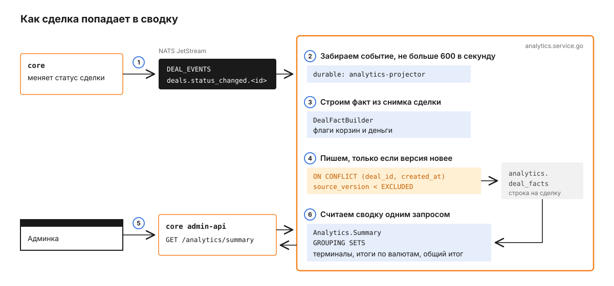
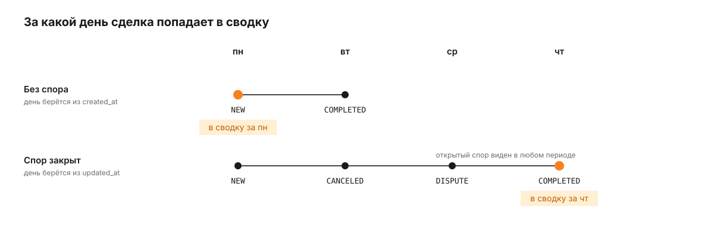

# analytics.service.go

analytics-service считает отчёты по сделкам для админки: сводку по терминалам и провайдерам, KPI дашборда, временные ряды и гистограмму сумм. Он не читает базу `core`: каждое изменение сделки приходит к нему событием, и сервис держит у себя денормализованную копию - таблицу `analytics.deal_facts`, одна строка на сделку. Вызывает его только `core` из admin-api, когда админка открывает раздел `/analytics/*`.

Что такое сделка, её статусы и как считается доход платформы, описано в [корневом README](../../README.md). Здесь - как эти данные превращаются в отчёт.

## Как сделка попадает в сводку

Возьмём сделку из корневого README: входящий платёж на 5 000 RUB, курс 100 RUB за USDT, комиссия провайдера 3%, терминала 5%. Мерчант получил 47,50 USDT, с провайдера списано 48,50, платформе осталось 1,00. Проследим, как эти цифры доходят до админки.



1. `core` при каждом переходе статуса публикует полный снимок сделки в поток `DEAL_EVENTS` на subject `deals.status_changed.<deal_id>` (`publisher.go`). Для нашей сделки в `COMPLETED` событие выглядит так (поля сокращены):

   ```json
   {
     "deal_id": "7c1e...",
     "version": 6,
     "direction": "IN",
     "status": "COMPLETED",
     "fiat_amount": "5000",
     "currency_code": "RUB",
     "requisite_matched_at": "2026-09-21T10:02:11Z",
     "terminal_fee_percent": "5",
     "settlement_snapshot_exists": true,
     "settlement_amount": "48.5",
     "settlement_merchant_net": "47.5",
     "settlement_merchant_asset": "USDT",
     "settlement_provider_fee_percent": "3"
   }
   ```

2. Durable-подписчик `analytics-projector` забирает событие. Перед записью оно проходит через лимитер: не больше `PROJECTOR_RPS` событий в секунду, по умолчанию 600 (`projector.go`). Если запись не удалась, событие сразу доставляется снова; когда кончились `PROJECTOR_MAX_ATTEMPTS` повторов, по умолчанию 5, оно уходит на subject `analytics.dlq.deal_events`.
3. `DealFactBuilder` строит факт: раскладывает сделку по корзинам и считает деньги (`deal_fact_builder.go`). Для нашей сделки: `is_issued` и `is_completed` истинны, `actual_trader_sent` = 48,50, `actual_terminal_received` = 47,50, `actual_commission` = 2,50, `actual_trader_profit` = 1,50, `actual_service_profit` = 1,00.
4. Факт записывается одним upsert по ключу `(deal_id, created_at)` с условием `source_version < EXCLUDED.source_version` (`write.go`). Строка обновляется, только если пришла более новая версия сделки.
5. Оператор открывает раздел аналитики. Админка вызывает `GET /analytics/summary` у admin-api, а тот отправляет в analytics запрос `Analytics.Summary`.
6. Сервис считает сводку одним SQL-запросом с `GROUPING SETS`: строки по каждому терминалу и валюте, итоги по каждой валюте и общий итог (`query.go`). Наша сделка попадает в строку своего терминала в корзины "выдано" и "успешно без спора".

## Из чего состоит сервис

Внутри те же слои, что и у остальных Go-сервисов. Один NATS-контроллер принимает и события сделок, и запросы `Analytics.*`, а CSV-выгрузка живёт на отдельном HTTP-порту. Вся запись и всё чтение идут через `repo/persistent`. События, которые не удалось записать за все повторы, откладываются в поток `ANALYTICS_DLQ`.


`usecase/dashboard` своего SQL не имеет: он дважды вызывает `usecase/summary`, за текущий и за предыдущий период, и сравнивает итоги. `usecase/reconciliation` на схеме не показан - это тонкая обёртка над выборкой фактов по id.

## Почему событие несёт весь снимок, а не изменение

Каждое событие содержит сделку целиком, и `DealFactBuilder` пересчитывает факт с нуля. Поэтому порядок доставки не важен: если событие версии 5 придёт после версии 6, upsert его просто не применит. Повторная доставка того же события тоже безвредна - версия не выросла.

Если в событии нет части полей, сервис восполняет их на лету: пустой `executor_kind` считает `PROVIDER`, без `settlement_merchant_asset` берёт курс провайдера, без `settlement_rate_spread_amount` пересчитывает спред сам.

## Что происходит с событием, которое не удалось записать

Ошибка записи факта возвращается в JetStream отказом (`Nak`), и тот сразу доставляет событие повторно. Если обработчик завис и не ответил за `PROJECTOR_ACK_WAIT`, NATS тоже доставит событие снова. Подписка настроена в `app.go`: первая доставка плюс `PROJECTOR_MAX_ATTEMPTS` повторов, по умолчанию всего 6. После последней неудачи событие публикуется на `NATS_DLQ_SUBJECT`, по умолчанию `analytics.dlq.deal_events`.

Публикация на subject, который не захвачен ни одним потоком, в NATS не проходит. Поэтому при старте сервис проверяет, есть ли поток для этого subject, и если нет - создаёт `ANALYTICS_DLQ`: файловое хранилище, события живут 7 дней (`dlq.go`). Недели хватает, чтобы разобрать событие и опубликовать его заново. Уже существующий поток сервис не меняет, так что его настройки остаются за оператором.

Подписка на `DEAL_EVENTS` не пройдёт, пока самого потока нет. Сервис не падает, а повторяет подготовку DLQ и подписку с паузой от 1 до 30 секунд, каждый раз вдвое дольше. `/readyz` отвечает готовностью только после того, как подписка поднялась.

## Как сделка раскладывается по корзинам

Сводка в админке - это счётчики и суммы по корзинам. Корзина определяется флагами, которые строитель ставит один раз при записи факта, а SQL только суммирует `FILTER (WHERE флаг)`.

| Флаг | Когда истинен |
|---|---|
| `is_issued` | входящей сделке выдан реквизит (`requisite_matched_at` заполнен), выплате назначен провайдер (`provider_id` заполнен) |
| `is_completed` | статус `COMPLETED` |
| `is_cancelled_after_issue` | реквизит выдан, а сделка отменена |
| `is_expired` | `CANCELED` с причиной `EXPIRED`, если это не отмена по итогам спора |
| `is_completed_after_dispute` | `COMPLETED` и у сделки был спор |
| `is_cancelled_after_dispute` | `CANCELED` после спора и реквизит был выдан |

Признак выдачи берётся из `requisite_matched_at`, а не из `requisite_value`. У динамических методов вроде q-ecom номер карты заранее не известен, и `requisite_value` всегда пуст. `requisite_matched_at` ставится при выдаче реквизита и не сбрасывается при отмене.

Отмена по спору считается только в корзине "по спору" и вычитается из корзины своей исходной причины, поэтому "отмена мерчантом + истекло + по спору" равно общему числу отмен без двойного счёта. Этот инвариант проверяет тест на десяти сделках в `deal_fact_builder_test.go`.

Для выплат деньги считаются из отдельного снимка `payout_*`: заморозка мерчанта приводится к активу провайдера по курсу `payout_provider_rate`, иначе фиатная сумма оказалась бы под подписью USDT. Для сделок, отменённых после выдачи, сервис считает `estimated_cancel_*` - сколько платформа заработала бы, если бы сделка прошла.

## В какой день попадает сделка со спором

Фильтр по датам в сводке и временных рядах смотрит на разные колонки для разных сделок. Обычная сделка относится к дню создания (`created_at`). Сделка, у которой спор закрылся, относится к дню закрытия спора (`updated_at`): деньги по ней окончательно определились именно тогда.



Открытый спор (`DISPUTE`) попадает в корзину открытых споров при любом выбранном периоде (`filter.go`). Следствие: сводка за прошлую неделю может измениться сегодня, когда закроется спор по одной из её сделок.

## Что сервис принимает

Все запросы идут через NATS в пространстве `pay` с помощью `golang-cqrs`, кроме CSV-выгрузки. Фильтр у запросов общий: `merchantId`, `terminalId`, `providerId`, `traderId`, `trafficGroupId`, `status`, `direction`, `methodCode`, `currencyFromCode`, `bankCode`, `createdFrom`, `createdTo`, `amountFrom`, `amountTo`, `isNotIssued` (`types.go`).

| Вход | Что делает | Кто вызывает |
|---|---|---|
| `deals.status_changed.*` в `DEAL_EVENTS` | обновляет факт сделки | `core`, JetStream-событие |
| `Analytics.Summary` | сводка: `groupBy` = `terminal` или `provider`, `viewType` = `full` или `compact` добавляет готовые строки с процентами | `core` admin-api |
| `Analytics.Dashboard` | прибыль, объём в USDT, доля успешных и тренд к прошлому периоду: `period` = `today`, `yesterday`, `week`, `month`, границы дней по Москве | `core` admin-api |
| `Analytics.TimeSeries` | временной ряд, шаг `intervalSeconds`, по умолчанию 3600 | `core` admin-api |
| `Analytics.Distribution` | гистограмма сумм, шаг `bucketSize`; без него сервис выбирает "круглый" шаг на ~12 столбцов в пределах 100-10 000 000 | `core` admin-api |
| `Analytics.ListDealFacts` | факты по списку `deal_ids` | - |
| `POST /internal/export/deals` на `:8093` | CSV по фильтру, до 10 000 строк, `reportType` = `merchant` или `full` | - |

При `groupBy` = `provider` в сводку попадают все сделки с назначенным исполнителем, и провайдеры, и трейдеры. У них независимые пространства id, поэтому строка группируется по паре `provider_id` и `executor_kind`, а в ответе у неё есть поле `executorKind` = `PROVIDER` или `TRADER`. Строка без имени исполнителя подписывается `Provider #N` или `Trader #N`. По той же причине фильтр `providerId` выбирает только провайдерские сделки, а `traderId` - только трейдерские (`filter.go`).

Ошибку запрос возвращает с одним из двух кодов. `INVALID_REQUEST` - тело не разбирается или параметр недопустим, например неизвестный `period` у дашборда; текст ошибки идёт в ответ. `INTERNAL` - всё остальное, подробности остаются в логе сервиса (`controller.go`).

CSV-выгрузка принимает JSON с полями `filter`, `reportType` и необязательным `limit`, который не может быть больше 10 000:

```http
POST /internal/export/deals HTTP/1.1
Host: localhost:8093
Content-Type: application/json

{"filter": {"merchantId": 42, "createdFrom": "2026-09-21T00:00:00Z"}, "reportType": "merchant"}
```

```http
HTTP/1.1 200 OK
Content-Type: text/csv; charset=utf-8
Content-Disposition: attachment; filename="deals_export.csv"
X-Export-Truncated: false
```

`X-Export-Truncated: true` означает, что по фильтру есть сделки сверх лимита и в файл вошли только самые новые. Сервис запрашивает на одну строку больше лимита, чтобы отличить полную выгрузку от обрезанной (`export.go`). Даты в файле - по Москве, период выбирается по тому же правилу даты, что и в сводке.

Сам сервис публикует только события, исчерпавшие попытки, в `analytics.dlq.deal_events`.

## Конфигурация

| Переменная | По умолчанию | Что задаёт |
|---|---|---|
| `PG_URL` | обязательна | база `analytics_db` |
| `PG_POOL_MAX` | 20 | размер пула соединений |
| `NATS_URL` | `nats://localhost:4222` | NATS с потоком `DEAL_EVENTS` |
| `CQRS_NAMESPACE` | `pay` | пространство обработчиков `Analytics.*` |
| `NATS_DLQ_SUBJECT` | `analytics.dlq.deal_events` | куда уходят события, исчерпавшие попытки |
| `PROJECTOR_RPS` | 600 | предел событий в секунду |
| `PROJECTOR_MAX_ATTEMPTS` | 5 | повторов после первой доставки, потом DLQ |
| `PROJECTOR_ACK_WAIT` | 120s | сколько NATS ждёт подтверждения, прежде чем доставить снова |
| `PROJECTOR_ROUTER_CLOSE_TIMEOUT` | 30s | сколько при остановке ждать активные обработчики |
| `TIMEOUT_SUMMARY` | 5s | таймаут `Analytics.Summary` |
| `TIMEOUT_DASHBOARD` | 30s | таймаут `Analytics.Dashboard` |
| `TIMEOUT_TIME_SERIES` | 10s | таймаут `Analytics.TimeSeries` |
| `TIMEOUT_DISTRIBUTION` | 30s | таймаут `Analytics.Distribution` |
| `TIMEOUT_RECONCILIATION` | 10s | таймаут `Analytics.ListDealFacts` |
| `TIMEOUT_EXPORT` | 60s | таймаут CSV-выгрузки |
| `HTTP_PORT` | `:8092` | `/healthz` и `/readyz` |
| `HTTP_EXPORT_PORT` | `:8093` | CSV-выгрузка |

Полный список переменных, включая логи и трейсы, - в `config.go` и `.env.example` в приватном репозитории.

Если в рабочей директории есть файл `.env`, конфиг берётся из него, и значения из файла перекрывают одноимённые переменные окружения.

## Как запустить и проверить

Здесь только документация и схемы: исходный код, миграции и стек запуска остаются в приватном репозитории. Юнит-тесты не требуют окружения; интеграционные тесты сами создают отдельную базу, накатывают миграцию и пересоздают схему `analytics` перед прогоном.

## Что стоит знать заранее

Имена обработчиков двухчастные, `Analytics.Summary`, а не `{Service}.{Entity}.{Action}`, как у остальных сервисов.

Событие, которое не удалось записать за все повторы, в `deal_facts` не попадает, пока его не опубликуют заново: сводка по этой сделке останется на предыдущей версии. Поток `ANALYTICS_DLQ` хранит такие события 7 дней.

CSV-выгрузка отдаёт не больше 10 000 строк за запрос. Если `X-Export-Truncated` = `true`, сузьте период или фильтр.
