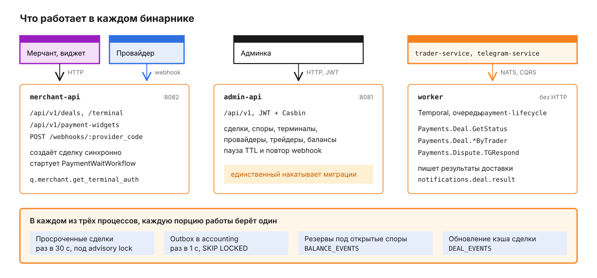

# core.service.go

Ядро платформы: здесь живут сделки и споры, мерчанты и терминалы, провайдеры, трейдеры и роутинг. Один Go-модуль `core-service` собирается в три бинарника: `merchant-api` принимает запросы мерчантов, виджета и webhook провайдеров, `admin-api` обслуживает админку, `worker` исполняет Temporal-процессы и входящие CQRS-команды от trader-service и telegram-service. Что такое сделка, как считаются деньги и как роутинг выбирает исполнителя, рассказано в [корневом README](../../README.md). Здесь - как это устроено внутри ядра.

## Как сделка проходит через core

Проследим ту же входящую сделку на 5 000 RUB, что и в корневом README, но с точки зрения процессов ядра. Главное, что видно на схеме: всё до выдачи реквизита происходит синхронно внутри одного HTTP-запроса в `merchant-api`, а Temporal появляется только тогда, когда нужно ждать.


1. Мерчант отправляет запрос. Middleware по заголовку `X-Identity` находит терминал и его мерчанта, затем сверяет `X-Signature` (`signature.go`):

   ```
   POST /api/v1/deals HTTP/1.1
   Host: merchant-api.example.com
   Content-Type: application/json
   X-Identity: <API-ключ терминала>
   X-Signature: <подпись>

   {"merchantId":"order-1042","direction":"IN","amount":"5000","currency":"RUB","paymentMethod":"SBP","webhookUrl":"https://shop.example/webhooks/payment"}
   ```

   Подпись - HMAC-SHA256 с секретом подписи мерчанта, в Base64. Подписывается строка из метода, полного URL и тела без разделителей, тело входит в неё только для не-GET запросов с `Content-Type: application/json`:

   ```
   POSThttps://merchant-api.example.com/api/v1/deals{"merchantId":"order-1042",...}
   ```

2. Обработчик проверяет тело до всяких команд: обязательные поля, формат `amount`, правило для `webhookUrl` (оно описано в разделе про контракт). Затем `InitializeDealHandler` вызывает три команды подряд. `CreateDeal` сохраняет сделку в `NEW` с `expires_at` = сейчас + TTL терминала и отклоняет сумму, у которой знаков после запятой больше, чем у валюты. `FixRate` фиксирует курс. `RouteAndAcquire` выбирает исполнителя, резервирует его баланс и получает реквизит. Выплата вместо роутинга идёт в `InitializePayout`: резерв баланса мерчанта и заявка у провайдера выплаты. Если шаг падает, сделка сразу отменяется с причиной `RATE_UNAVAILABLE`, `NO_PROVIDER` или `INSUFFICIENT_BALANCE`, и публикуется событие для webhook (`start_payment.go`).
3. Мерчант получает `201`. Внутри сделка уже в `PENDING`, и наружу она видна так же. В отдельной горутине `merchant-api` запускает `PaymentWaitWorkflow`: до 5 попыток с паузой от 200 мс, удваивая её, в общем бюджете 30 с. ID процесса равен ID сделки, очередь - `payment-lifecycle`, предел жизни - TTL сделки плюс 2 минуты, но не меньше 3 минут. Если процесс так и не стартовал, его запустит первый же сигнал оплаты через `SignalWithStart`, а просроченную сделку закроет sweeper. Повторный запрос с тем же `merchantId` процесс не запускает и отвечает `200` с той же сделкой.
4. `worker` держит процесс, пока не придёт сигнал `payment-received`, авторитетная отмена `provider-cancel` или не истечёт TTL. Администратор может остановить отсчёт через `POST /api/v1/deals/:deal_id/pause` в `admin-api` и снять паузу через `/resume`. Пауза живёт в двух местах: сначала в колонке `ttl_paused_at` таблицы `payments.deals`, затем сигналом `pause-timer` в процессе. Если процесс не ответил, отметка в базе снимается. Снятие паузы сдвигает `expires_at` на её длительность и шлёт `resume-timer` (`ttl_pause.go`).
5. Оплату подтверждает исполнитель. Провайдер присылает `POST /webhooks/:provider_code`, где код - slug провайдера. Адаптер проверяет подлинность: у BridgePay заголовок `X-Notification-Token` сверяется с `callback_token` из учётных данных провайдера. Статусы `paid` и `completed` превращаются в `payment-received`. Статусы `canceled` и `failed` уходят сигналом `provider-cancel` с сырым статусом в причине, а такая причина не авторитетна, и процесс ждёт TTL. Трейдер нажимает кнопку в Telegram, и trader-service присылает `Payments.Deal.ConfirmByTrader` - она идёт тем же сигналом `payment-received`.
6. Процесс выполняет `MarkPaid` и `Complete`: сделка проходит `PAID -> COMPLETED`, проводки уходят в accounting-service. Каждая смена статуса публикует `DealEvent` в JetStream, subject `deals.status_changed.<deal_id>`, с заголовком `Nats-Msg-Id` вида `<deal_id>:<version>:<status>`. Stream `DEAL_EVENTS` отбрасывает повтор с тем же ID в окне 2 минуты, поэтому повтор активности не порождает второй webhook.
7. notification-service читает это событие и отправляет мерчанту webhook со статусом `COMPLETED`. Кнопка "Отправить повторно" в админке публикует уведомление заново сразу из admin-api, без участия процесса Temporal.

## Из чего состоит сервис

Код разложен по DDD-слоям: `internal/delivery` принимает запросы, `internal/application` держит команды и запросы, `internal/domain` - агрегаты и правила переходов, `internal/infrastructure` ходит в базы и другие сервисы. В отличие от остальных Go-сервисов платформы, которые собраны по `go-clean-template`, у ядра явный домен: правила переходов сделки и результат авторазрешения спора живут в `aggregate.go`, а не размазаны по usecase. На схеме - компоненты, через которые проходит сделка из примера выше.


`application/payments` - центр: команды сделки (`deal/command`: создание, фиксация курса, оплата, завершение, истечение, отмена, пауза TTL, sweeper) и спора (`dispute/command`), а также адаптеры, которые связывают их с леджером, Temporal и провайдерами (`adapters.go`). `application/routing` отбирает исполнителя по группам трафика, `application/providers` находит интеграцию провайдера и запрашивает реквизит. Сами адаптеры лежат в `infrastructure/services/provider`: `bridgepay` ходит в API провайдера по HTTP, `manual` берёт реквизиты трейдеров через trader-service.

`infrastructure/services/accounting` - CQRS-клиент accounting-service и диспетчер outbox, `infrastructure/services/events` - публикатор `DealEvent` и подписки на JetStream. `infrastructure/storage` держит репозитории на pgx и sqlc, unit of work и advisory lock для sweeper.

На схеме нет `application/merchants`, `application/account` и `application/platform`. Первый хранит мерчантов и терминалы с их настройками комиссий, TTL и споров. Два других в основном проксируют запросы админки в account-service и platform-service.

## Почему создание сделки не в Temporal

Мерчант ждёт ответ с реквизитом, поэтому шаги 1-3 должны уложиться в один запрос с таймаутом записи 15 с. Поход через Temporal добавил бы к нему очередь задач и воркер на другом процессе. Поэтому `merchant-api` вызывает команды напрямую, а Temporal отвечает только за ожидание, где он действительно нужен: таймер на TTL сделки (по умолчанию 30 минут), сигналы от разных процессов, повторы проводок.

Отмена устроена осторожно. Провайдер после нашего же освобождения резерва присылает эхо `canceled`, и если бы процесс верил каждому такому сигналу, сделки закрывались бы раньше времени. Поэтому отменяют только причины, которые приходят от реального инициатора: `BY_MERCHANT`, `PROVIDER_CANCELED` и её уточнения от трейдера - `INVALID_REQUISITE_DATA`, `INVALID_CODE`, `CHARGE_ERROR`. Остальное процесс игнорирует и ждёт TTL (`state.go`, `IsAuthoritativeCancel`).

Выплата подтверждается иначе: webhook провайдера по исходящей сделке сразу ведёт в расчёт через `CompleteDealHandler`, без сигнала в Temporal, потому что у выплаты нет статуса `PAID`. `failed` и `canceled` по выплате в `PENDING` отменяют её сразу (`webhook.go`).

## Что работает в каждом бинарнике

Все три бинарника собраны из одного графа зависимостей на `go.uber.org/fx`, и модуль `payments` подключён в каждый. Поэтому фоновые задачи этого модуля запущены во всех трёх процессах, в каждой реплике, а за то, чтобы одну и ту же работу не сделали дважды, отвечает база или JetStream.



Sweeper просроченных сделок просыпается раз в 30 с и сначала берёт PostgreSQL advisory lock. Кто его не получил, пропускает проход, поэтому выборку закрывает один процесс на весь кластер. Он берёт до 100 сделок в `NEW` или `PENDING` с `expires_at` в прошлом и без паузы TTL и закрывает их через `ExpireDealHandler`: входящую - в `CANCELED` с причиной `EXPIRED`, выплату, по которой уже есть провайдер, - в бессрочный спор (`sweeper.go`). Это страховка на случай, если Temporal-процесс не стартовал или упал.

Outbox нужен решениям по спорам. Команда `ResolveDispute` в одной транзакции со сменой статуса кладёт план проводок в `payments.accounting_outbox` с уникальным ключом. Тот же ключ с тем же планом - повтор, с другим - ошибка `ErrOutboxKeyConflict`. Раз в секунду диспетчер забирает до 50 строк, каждую в своей транзакции через `SELECT ... FOR UPDATE SKIP LOCKED`, так что строку, которую уже проводит соседний процесс, он пропускает. Для строки он вызывает `Accounting.Ledger.Post`, доводит спор до финального статуса и только потом ставит `published_at` (`outbox.go`).

Неудачная строка получает `attempts + 1`, текст ошибки и следующую попытку через 2^attempts секунд, но не позже чем через 5 минут. После 20 попыток, или сразу, если план не разбирается, строка паркуется: у неё появляется `parked_at`, диспетчер её больше не выбирает, а в лог уходит ошибка с `alert=true`. Такую строку разбирают вручную.

Две другие задачи - подписки на JetStream с общей durable-группой, каждое сообщение получает один процесс. `dispute-reserver` слушает `accounting.balance_credited.>` и после любого зачисления добирает резервы под открытые споры владельца. `cache-invalidator` слушает `deals.status_changed.*` и обновляет кэш сделки в Redis.

## Споры и их таймер

Открытие спора из `COMPLETED` или `CANCELED` запускает `DisputeTimerWorkflow` с ID `dispute-timer-<deal_id>`. Срок берётся из настроек споров терминала, по умолчанию 30 минут. Администратор может поставить таймер на паузу и снять её (`/api/v1/deals/:deal_id/dispute/pause` и `/resume`), а ручное решение останавливает таймер сигналом `dispute-resolved`.

Если срок истёк без решения, активность `AutoResolveDispute` закрывает спор. Исход выбирает домен: спор по отменённой входящей сделке - `RESOLVED`, остальные - `REJECTED` (`aggregate.go`, `AutoResolveResult`).

Провайдер отвечает на спор кнопками в Telegram, и telegram-service присылает `Payments.Dispute.TGRespond`. Коды кнопок переводятся в результат: `pe` - `RESOLVED`, `np` и `rj` - `REJECTED`, `ca` - `AMOUNT_CHANGED` с исправленной суммой. Кнопки `op` и `od` по спору о выплате ничего не решают, а отправляют его на ручной разбор (`dispute_tg_respond.go`).

## Контракт merchant API

Публичная документация для мерчантов собрана в docs.service.react. Здесь - полный список входов `merchant-api` и то, что важно знать интегратору:

| Путь | Что делает | Защита |
|---|---|---|
| `POST /api/v1/deals`, `GET /api/v1/deals/:deal_id`, `GET /api/v1/deals/merchant/:merchant_id` | создание и чтение сделки | `X-Identity` + `X-Signature`, лимит запросов на терминал |
| `POST /api/v1/deals/:deal_id/cancel`, `/acquiring-code`, `/disputes` | отмена, код подтверждения, открытие спора | то же |
| `GET /api/v1/terminal/methods`, `/rate`, `/balance` | методы, курс и баланс терминала | то же |
| `/api/v1/payment-widgets/:widget_key` | виджет: чтение, телеметрия, отмена | лимит запросов на IP |
| `GET /api/v1/payment-options/:currency`, `/payment-methods/:currency` | справочники для виджета | лимит запросов на IP |
| `POST /webhooks/:provider_code` | webhook провайдера, подлинность проверяет адаптер | без лимита |
| `/livez`, `/readyz`, `/metrics` | здоровье и метрики Prometheus | `/metrics` - только из частных сетей |

Тело `POST /api/v1/deals`: `merchantId` - ваш ID сделки и ключ идемпотентности, `direction` - `IN` или `OUT`, `amount` - строка с десятичной суммой, `currency` - код ISO 4217, `webhookUrl` - куда слать уведомления. Необязательные поля: `userId`, `paymentMethod`, `paymentOption` (код банка из `/payment-options`), `webhookSecret` (придёт мерчанту в заголовке `X-Webhook-Token`), `requisites` с `value` и `holder` - обязательны для `OUT`, `userCard` - карта плательщика для метода Q-Ecom.

`webhookUrl` проходит проверку до создания сделки. Адрес должен быть абсолютным URL без логина и пароля. Вне `APP_ENV=development` к этому добавляются ещё два правила: схема только `https`, а хост не может быть `localhost`, именем в зонах `.localhost`, `.local`, `.internal` или IP-адресом из loopback, частных, link-local, multicast диапазонов и 100.64.0.0/10. Имя проверяется как написано, его разрешение в адрес проверяет уже отправитель webhook.

Ответ - сделка целиком. Сокращённо:

```json
{
  "id": "6da7951e-c205-4f9e-bb33-9175da0e7f07",
  "merchantId": "order-1042",
  "status": "PENDING",
  "direction": "IN",
  "paymentMethod": "SBP",
  "amount": {"amount": "5000", "currency": "RUB", "decimals": 2},
  "requisites": {"value": "+79990000000", "holder": "Иван И.", "type": "PHONE"},
  "createdAt": "2026-03-15T12:00:00Z",
  "expiresAt": "2026-03-15T12:30:00Z",
  "paymentLink": "http://localhost:3001/<ключ виджета>"
}
```

`paymentLink` есть, только если у терминала включён виджет. Там же бывают `paidAmount`, `settlement`, `completedAt` (только у `COMPLETED`), `cancelReason` (только у `CANCELED`), `webhookStatus` и `dispute`.

Мерчант видит четыре статуса, хотя внутри их семь. Промежуточные шаги ядра наружу не выходят (`merchant_payload.go`, `PublicStatus`); то же отображение действует и в webhook:

| Внутренний статус | Что видит мерчант |
|---|---|
| `NEW`, `PENDING_REQ`, `PENDING`, `PAID` | `PENDING` |
| `COMPLETED` | `COMPLETED` |
| `CANCELED` | `CANCELED` |
| `DISPUTE` | `DISPUTE` |

`cancelReason` тоже сведён к короткому списку: `BY_MERCHANT`, `EXPIRED`, `FRAUD`, `INSUFFICIENT_BALANCE`, `BY_PLATFORM` для любой отмены со стороны провайдера, трейдера или администратора. Остальные причины, например `NO_PROVIDER`, мерчант видит как `EXPIRED`, если реквизит успели выдать, и как `TEMPORARILY_UNAVAILABLE`, если нет.

## Коды ошибок

Ошибка приходит в одном формате: `{"code", "message", "reason", "request_id", "fields"}`, где `reason` и `fields` есть не всегда. Лимит запросов - исключение: на `429` тело `{"error": "too_many_requests", "message"}`.

| `code` | HTTP | Когда |
|---|---|---|
| `validation_failed` | 400 | тело не по схеме, неподдерживаемый метод или неверная сумма; в `fields` - поле и причина |
| `unauthorized` | 401 | нет `X-Identity` или `X-Signature`, ключ неизвестен или подпись не сошлась |
| `terminal_inactive`, `pay_in_disabled`, `pay_out_disabled` | 400 | терминал выключен или направление для него закрыто |
| `currency_not_supported` | 400 | валюта не подходит терминалу |
| `amount_below_minimum`, `amount_above_maximum` | 400 | сумма вне лимитов терминала |
| `no_requisites_available` | 400 | сейчас нет исполнителя, курса или метода; `reason` = `TEMPORARILY_UNAVAILABLE` |
| `insufficient_balance` | 400 | баланса мерчанта не хватает на выплату |
| `deal_not_found` | 404 | сделки нет или она чужого терминала |
| `deal_invalid_state` | 400 | сделку нельзя отменить в текущем статусе |
| `dispute_already_open`, `dispute_invalid_state`, `dispute_window_expired` | 409 или 400 | спор уже открыт, статус сделки не позволяет его открыть или окно споров закрыто |
| `forbidden` | 403 | действие не разрешено для этого терминала, например открытие спора через API |
| `conflict` | 409 | сделку одновременно изменил другой запрос, повторите |
| `not_found` | 404 | для валюты нет курса, методов или банков |
| `service_unavailable`, `internal_error` | 503 или 500 | зависимость недоступна или внутренняя ошибка |

Значения `fields`, которые стоит обрабатывать: `amount` - `invalid_format` или `precision_exceeded` (знаков после запятой больше, чем у валюты), `webhookUrl` - `invalid_url`, `https_required`, `internal_address_not_allowed`, `direction` - `invalid_value`, `requisites` - `required_for_out`, `paymentOption` - `not_found`.

## Что ядро принимает и отправляет по NATS

`admin-api` отдаёт всё остальное под `/api/v1`: вход и профиль, балансы и леджер, терминалы, мерчанты, сделки и споры, провайдеры, трейдеры и их реквизиты, группы трафика, справочники, пользователи и роли, выводы и переводы, аналитика. Все маршруты, кроме `/auth`, требуют JWT, а бизнес-маршруты ещё и проверку прав через Casbin. На вход и подтверждение 2FA действует более строгий лимит запросов с IP, на остальное - лимит на пользователя (`router.go`).

Через NATS ядро принимает и публикует:

| Имя | Направление | Что значит |
|---|---|---|
| `Payments.Deal.GetStatus` | запрос в `worker` | `{"deal_id"}` -> `{"status"}` |
| `Payments.Deal.ConfirmByTrader`, `CancelByTrader` | команда в `worker` от trader-service | сигнал `payment-received` или `provider-cancel`; сделка должна быть трейдерской, у неё `provider_deal_id` равен ID сделки |
| `Payments.Dispute.TGRespond` | команда в `worker` от telegram-service | ответ провайдера по спору |
| `q.merchant.get_terminal_auth` | запрос в `merchant-api`, очередь `backend-merchant-auth` | API-ключ терминала -> идентичность |
| `notifications.deal.result` | подписка `worker` | результат доставки webhook, пишется в события сделки |
| `deals.status_changed.<deal_id>` | публикация, stream `DEAL_EVENTS`, 7 дней, дедупликация 2 минуты | `DealEvent` для notification-service и analytics-service |
| `deals.attachments.<deal_id>` | публикация, stream `ATTACHMENT_EVENTS`, 7 дней | к спору приложили файл |
| `Payments.Deal.Disputed`, `Providers.TGBot.Bound` | события для telegram-service | открыт спор, изменилась привязка чата |
| `Audit.Event` | событие для account-service | запись аудита |

Исходящие вызовы идут в account-service (вход, пользователи, сессии, TOTP, аудит, владельцы мерчантов), accounting-service (`Accounting.Ledger.*`, `Accounting.Balance.*`, переводы и заявки на вывод), rate-service (`Rate.GetDealRate`, статичные курсы), platform-service (банки, валюты, методы, настройки), trader-service (трейдеры и их реквизиты), analytics-service и files-service. Каждый клиент ищет получателя по имени приложения, например `accounting-service`. Файлы вложений к спору загружаются в files-service по HTTP, `POST /v1/upload`, с заголовком `X-Service-Token`, остальные операции с файлами идут через NATS (`Files.List`, `Files.Confirm`, `Files.Cleanup`, `Files.GetURL`).

## Данные

PostgreSQL, схема `payments`: `deals`, `deal_events`, `disputes`, `widget_telemetry`, `accounting_outbox`. В `public` ядро владеет `merchants`, `terminals`, `currencies`, `providers`, `provider_code_mappings`, `traffic_groups` и таблицами связей групп с провайдерами, терминалами и трейдерами. Доступ - pgx и sqlc, запросы лежат в `internal/infrastructure/storage/*/queries`, после их правки нужен `sqlc generate`.

Справочники банков, валют и методов ядро читает и меняет через platform-service по NATS. Пользователи, сессии и аудит живут в account-service. Владельца мерчанта ядро тоже не хранит: при чтении мерчанта или страницы списка оно спрашивает account-service через `Users.List` по `owner_id`, до 8 запросов параллельно, и берёт пользователя с ролью `merchant_owner`, а если такого нет - с ролью `merchant` (`merchant_owners.go`).

Redis - кэш, а не источник истины: сделки, терминалы и их ключи, провайдеры, валюты, методы, балансы, роутинг. Нужен он с самого старта: каждый бинарник при запуске делает `PING` и без ответа не поднимается. Там же лежит ключ идемпотентности `(терминал, merchantId) -> ID сделки` на 24 часа, после промаха ищем в `deals`.

Источник истины для идемпотентности - база. Уникальный индекс `idx_deals_idempotency` на `(terminal_id, internal_id)` для всех сделок, кроме отменённых, не даёт двум параллельным запросам с одним `merchantId` создать две живые сделки: проигравший получает нарушение уникальности, и обработчик возвращает ему сделку победителя как обычный повтор.

Идемпотентность прощает одну ситуацию. Если прошлая сделка с тем же `merchantId` отменилась до того, как появился исполнитель и реквизит, по временной причине (`NO_PROVIDER`, `RATE_UNAVAILABLE`, `INSUFFICIENT_BALANCE`, отмена исполнителем), повторный запрос создаёт новую сделку вместо возврата старой (`create.go`, `shouldBypassIdempotency`).

## Конфигурация

Все переменные и их значения по умолчанию - в `internal/config/config.go` и `.env.example` в приватном репозитории. Значимые:

| Переменная | По умолчанию | Зачем |
|---|---|---|
| `APP_ENV` | `development` | вне `development` сервис не стартует с dev-секретами или секретами короче 32 символов, а `webhookUrl` принимается только `https` и только на внешний адрес |
| `APP_NAME` | `payment-service` | имя в CQRS-дискавери: под ним `worker` регистрирует входящие команды |
| `AUTH_JWT_SECRET`, `AUTH_CRYPTO_KEY` | dev-значения | проверка JWT и шифрование; вне `development` обязательны |
| `AUTH_JWT_ACCESS_TTL`, `AUTH_JWT_REFRESH_TTL` | `15m`, `168h` | жизнь токенов админки |
| `AUTH_CASBIN_ENABLED` | `true` | проверка прав в админке |
| `HTTP_MERCHANT_ADDR`, `HTTP_ADMIN_ADDR` | `:8082`, `:8081` | порты API |
| `HTTP_MERCHANT_WRITE_TIMEOUT`, `HTTP_ADMIN_WRITE_TIMEOUT` | `15s`, `15s` | таймаут записи ответа; такие же `*_READ_TIMEOUT` |
| `HTTP_ADMIN_ALLOWED_ORIGINS` | `*` | CORS админки, через запятую |
| `HTTP_MERCHANT_PUBLIC_URL`, `HTTP_MERCHANT_WEBHOOK_PUBLIC_URL` | пусто | адрес, из которого строится `<адрес>/webhooks/<slug провайдера>` для провайдера; второй приоритетнее |
| `PG_URL` | `postgres://...@localhost:5433/payment_service` | основная база |
| `PG_REPLICA_URL` | пусто | реплика для чтения; пусто - основная база |
| `PG_MAX_OPEN_CONNS`, `PG_MIN_CONNS` | `40`, `0` | пул; `0` для PgBouncer |
| `CACHE_HOST`, `CACHE_PORT`, `CACHE_DB` | `localhost`, `6379`, `0` | Redis |
| `NATS_URL`, `NATS_CQRS_NAMESPACE`, `NATS_CQRS_WORKERS_POOL` | `nats://localhost:4222`, `pay`, `5` | транспорт CQRS |
| `TEMPORAL_HOST_PORT`, `TEMPORAL_NAMESPACE` | `localhost:7233`, `payments-core` | Temporal |
| `TEMPORAL_ENSURE_NAMESPACE`, `TEMPORAL_RETENTION` | `true`, `72h` | создать namespace при старте и срок хранения истории |
| `OBSERVABILITY_ENABLED`, `OBSERVABILITY_HOST`, `OBSERVABILITY_PORT` | `true`, `localhost`, `4317` | экспорт трейсов по OTLP |
| `SVC_PAYMENT_WIDGET_URL` | `http://localhost:3001` | база ссылки `paymentLink` |
| `SVC_FILES_HTTP_URL`, `SVC_FILES_PUBLIC_BASE_URL` | `http://files-service:8090`, пусто | загрузка вложений споров и публичная база ссылок на них |
| `SVC_FILES_SERVICE_TOKEN` | пусто | значение `X-Service-Token` при загрузке в files-service; пусто - заголовок не отправляется |

Если в рабочей директории есть `.env`, конфиг читается из него, и значения из файла перекрывают одноимённые переменные окружения.

## Как запустить и проверить

Здесь только документация и схемы: исходный код трёх бинарников, миграции, `cmd/mock-bridgepay` (заглушка BridgePay для проверки сделки без настоящего провайдера) и стек запуска остаются в приватном репозитории. `fx.ValidateApp` в `wiring_test.go` проверяет, что граф зависимостей каждого бинарника собирается; сага проверяется отдельно от CQRS-обработчиков и outbox на настоящей базе.

## Что стоит знать заранее

Имя приложения - часть контракта. Входящие команды `worker` регистрирует под `APP_NAME`, и trader-service с telegram-service должны звать ровно его: у них это `BACKEND_APP_NAME` и `CQRS_PAYMENTS_APP`. Процессы без входящих обработчиков, `admin-api` и `merchant-api`, добавляют к имени суффикс `-client`, чтобы не попасть в пул получателей.

Отмена входящей сделки провайдером через webhook не закрывает её досрочно: сделка остаётся в `PENDING` до TTL и закрывается как `EXPIRED`. Досрочно её закрывают только мерчант через `POST /api/v1/deals/:deal_id/cancel` или трейдер кнопкой в Telegram.
