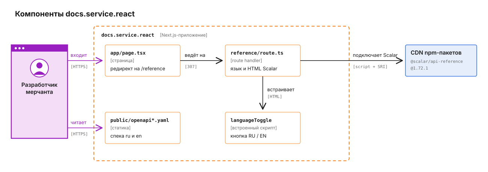

# docs.service.react

Сайт документации Merchant API для разработчиков мерчанта. Next.js отдаёт одну страницу Scalar API Reference по спецификации из `public/openapi.yaml` (русская) или `public/openapi.en.yaml` (английская). Бэкенда у сайта нет, к платформе он не обращается. Как устроен сам API, описано в [корневом README](../../README.md).

## Что происходит, когда разработчик открывает документацию

1. `/` сразу перенаправляет на `/reference` (`app/page.tsx`).
2. `/reference` обслуживает route handler `app/reference/[[...path]]/route.ts`. Он выбирает язык: `?lang=ru` или `?lang=en`, иначе русский, если `Accept-Language` начинается с `ru`, иначе английский. Затем собирает HTML через `ApiReference()` из `@scalar/nextjs-api-reference` с адресом нужной спецификации.
3. В готовый HTML route handler дописывает тегу скрипта Scalar атрибуты `integrity` и `crossorigin="anonymous"`. Браузер загружает `@scalar/api-reference@1.72.1` с публичного CDN npm-пакетов и исполняет его, только если хеш SHA-384 файла совпал с `SCALAR_SCRIPT_INTEGRITY`. Потом Scalar запрашивает `/openapi.yaml` или `/openapi.en.yaml` и рисует боковое меню и описание.
4. Перед инициализацией Scalar route handler вставляет скрипт переключателя языка. Кнопка RU / EN перезагружает страницу с другим `?lang=`.

Версия Scalar закреплена в `SCALAR_SCRIPT_URL`, поэтому новый релиз не попадает на сайт сам. **Вместе с версией обновляется и хеш**, иначе браузер откажется исполнять скрипт и страница останется пустой. Команда для пересчёта записана рядом с константой:

```bash
curl -sL "$SCALAR_SCRIPT_URL" | openssl dgst -sha384 -binary | openssl base64 -A
```

Если пакет `@scalar/nextjs-api-reference` поменяет разметку тега скрипта и route handler не найдёт его в HTML, запрос `/reference` завершится ошибкой, а не отдаст страницу со скриптом без проверки целостности.

В конфигурации отключены отправка тестовых запросов, кнопка выбора клиента, поиск и инструменты разработчика. CSS дополнительно прячет кнопки MCP, футер и ссылки на сайт Scalar.

## Из чего состоит приложение

Своего кода - три файла в `app/`, остальное делает Scalar.



`app/layout.tsx` подключает `app/globals.css` и применяется только к `app/page.tsx`. Страница `/reference` - это готовый HTML из route handler, layout Next.js к ней не применяется, а Scalar использует системный моноширинный шрифт из `customCss` (`withDefaultFonts: false`).

## Что описано в спецификации

Спецификация покрывает 12 путей: создание и чтение сделки (`/api/v1/deals`, `/api/v1/deals/{id}`, `/api/v1/deals/merchant/{merchantId}`), отмену, спор и код эквайринга, методы, курс и баланс терминала (`/api/v1/terminal/methods`, `/api/v1/terminal/rate`, `/api/v1/terminal/balance`), публичные `/api/v1/payment-methods/{currency}` и `/api/v1/payment-options/{currency}`, а также webhook, который платформа шлёт на сервер мерчанта (`/webhooks/payment`). Во вступлении - подпись запроса `X-Identity` и `X-Signature` с примером на Go.

Обе спецификации правятся вручную, из кода они не генерируются, и набор путей в них одинаковый.

## Как запустить локально

Здесь только документация и схемы: исходный код и стек сборки остаются в приватном репозитории. В Kubernetes сервис ставится отдельным Helm-чартом, переменных окружения не читает. Браузеру читателя нужен доступ к публичному CDN npm-пакетов: сам Scalar сайт не хранит.
