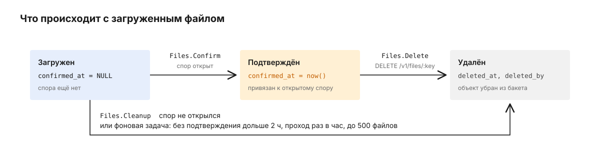

# files.service.go

files-service хранит вложения к сделкам. Сейчас это доказательства, которые мерчант или оператор прикладывает к спору: скриншот оплаты, выписка, чек. Байты лежат в S3-совместимом хранилище (локально RustFS), метаданные - в таблице `payments.attachments` в PostgreSQL. Файлы загружает `core` по HTTP, а список, ссылки и подтверждения запрашивают `core`, telegram-service и сервер админки.

Как устроены споры и сама сделка, описано в [корневом README](../../README.md). Здесь - что происходит с файлом.

## Путь файла к спору

Мерчант не согласен с отменой сделки и открывает спор: `POST /api/v1/deals/:deal_id/disputes` в merchant-api, к запросу приложен скриншот оплаты. Проследим этот скриншот.


1. `core` пересылает каждый файл из формы отдельным запросом (`client.go`). Все маршруты `/v1` требуют заголовок `X-Service-Token` со значением `HTTP_SERVICE_TOKEN`, иначе отвечают `401 unauthorized`. Токен сравнивается за постоянное время.

   ```http
   POST /v1/upload HTTP/1.1
   Host: files:8090
   X-Service-Token: <HTTP_SERVICE_TOKEN>
   Content-Type: multipart/form-data; boundary=x

   --x
   Content-Disposition: form-data; name="deal_id"

   7c1e...
   --x
   Content-Disposition: form-data; name="uploaded_by_id"

   merchant:42
   --x
   Content-Disposition: form-data; name="file"; filename="payment.png"
   Content-Type: image/png

   <байты файла>
   --x--
   ```

   Ещё можно передать `uploader_name`, `uploader_role`, `merchant_id` и `currency`, они сохраняются как есть.
2. Сервис проверяет размер (до `MAX_FILE_SIZE`, 10 МиБ, иначе `413 file_too_large`) и определяет тип по первым 512 байтам содержимого, а не по имени файла и не по заголовку. Разрешены PDF, PNG, JPEG и WebP, остальное получает `415 content_not_allowed`. Если в форме нет файла, `deal_id`, `uploaded_by_id` или имени файла, ответ - `400 bad_request` с причиной в `message`, и в хранилище ничего не попадает (`attachment.go`). Заодно считается SHA-256, а для картинки строится превью 384x216 в виде `data:image/png;base64,...`: JPEG, PNG и WebP декодируются одинаково, у PDF превью пустое (`preview.go`).
3. Объект кладётся в бакет `S3_BUCKET` под ключом-UUID. Имя файла от клиента в ключ не попадает.
4. Метаданные записываются в одной транзакции: `pg_advisory_xact_lock` по сделке, `COUNT` неудалённых файлов, `INSERT` (`attachment.sql`, `attachment.go`). Блокировка выстраивает параллельные загрузки одной сделки в очередь, поэтому две одновременные загрузки не превысят лимит. Если у сделки уже 5 файлов (`MAX_FILES_PER_DEAL`), клиент получит `422 max_files_exceeded`, а объект из шага 3 удаляется из бакета. Иначе - `201`:

   ```json
   {"file_key":"0b6f...","file_name":"payment.png","content_type":"image/png","size":48213,"preview":"data:image/png;base64,..."}
   ```

5. `core` открывает спор с этими ключами. Если спор открылся, он вызывает `Files.Confirm`, и у файлов появляется `confirmed_at`. Если нет - `Files.Cleanup`, чтобы удалить загруженное.
6. telegram-service отправляет спор провайдеру и за каждым файлом приходит в `Files.GetURL`. Сервис отвечает подписанной ссылкой на `GetObject`, которая живёт `PRESIGN_URL_TTL`, 15 минут (`presign.go`). Сервер админки получает те же ссылки вместе с превью через `GET /v1/files?deal_id=`.

## Из чего состоит сервис

Загрузка есть только в REST: файл приходит multipart-формой. Сервер админки тоже работает через REST, а остальные вызовы `core` и telegram-service идут через NATS. Оба контроллера и фоновая задача вызывают один пакет `usecase/attachment`.


`controller/restapi/v1` держит пять маршрутов `/v1` за проверкой токена и две пробы вне её. `controller/nats_rpc/v1` - три команды и три запроса. Блокировка и счётчик лимита живут в `repo/persistent`, а `usecase/attachment` только решает, что делать с объектом в бакете, если строка не записалась.

## Почему файл сначала загружается, а потом подтверждается

Спору нужны ключи файлов в момент открытия, поэтому файлы загружаются раньше, чем появляется спор. Между шагами 4 и 5 `core` может упасть или получить ошибку, и файл останется ни к чему не привязанным.



Поэтому у файла два состояния до удаления. Неподтверждённый живёт не дольше `ORPHAN_TTL`, 2 часа: раз в `ORPHAN_CLEANUP_INTERVAL`, то есть раз в час, фоновая задача находит до 500 таких файлов и удаляет их с `deleted_by = system:orphan_cleanup` (`orphan_cleanup.go`). Первый проход случается через час после старта, не сразу. Подтверждённый файл удаляется только явно.

Удаление мягкое. Сначала строке ставится `deleted_at`, потом объект удаляется из бакета. База - источник истины: если S3 не ответил, строка всё равно считается удалённой, а объект остаётся в бакете и пишется в лог как осиротевший (`delete.go`). Удалить один файл через `DELETE /v1/files/:key` или `Files.Delete` можно только вместе с правильным `deal_id`: REST иначе отвечает `403`, NATS - ошибкой.

## Что сервис принимает

REST отвечает в snake_case, NATS - в camelCase. Сам сервис ничего не публикует и других сервисов не вызывает.

| Вход | Что делает | Кто вызывает |
|---|---|---|
| `POST /v1/upload` | загрузка, см. шаги 1-4 | `core` merchant-api и admin-api при открытии спора |
| `GET /v1/files?deal_id=` | файлы сделки со ссылками и превью | сервер админки |
| `GET /v1/files/:key/url` | подписанная ссылка на один файл | сервер админки |
| `DELETE /v1/files/:key?deal_id=` | удаление с проверкой сделки, автор из `X-Actor-ID` | - |
| `POST /v1/files/cleanup` | удаление до 100 ключей | - |
| `Files.List` | файлы сделки без ссылок и превью | `core` |
| `Files.GetURL` | подписанная ссылка | `core`, telegram-service |
| `Files.GetByKey` | метаданные файла | - |
| `Files.Confirm` | подтверждение до 500 ключей | `core` |
| `Files.Cleanup` | удаление до 100 ключей | `core` |
| `Files.Delete` | удаление с проверкой `dealId` | - |
| `GET /healthz`, `GET /readyz` | пробы, без токена | оркестратор |

Ошибки проверки входа REST отдаёт как `400 bad_request`: пустой `deal_id` в query, пустой или слишком длинный список `keys`, неполная форма загрузки. NATS в тех же случаях отвечает `VALIDATION_ERROR`, а на нечитаемый JSON - `INVALID_REQUEST`. Для удалённого файла `GetURL`, `GetByKey` и список его не видят и отвечают как для несуществующего.

`/readyz` за одну секунду опрашивает PostgreSQL (`Ping`) и бакет S3 (`HeadBucket`). Если все ответили, проба возвращает `200`, иначе `503` с именами упавших зависимостей без текста ошибок:

```json
{"failed":["s3"]}
```

`/healthz` отвечает `200`, пока процесс жив.

## Конфигурация

| Переменная | По умолчанию | Что задаёт |
|---|---|---|
| `PG_URL` | обязательна | база с `payments.attachments` |
| `PG_POOL_MAX` | 5 | соединений с PostgreSQL |
| `S3_BUCKET`, `S3_ACCESS_KEY`, `S3_SECRET_KEY` | обязательны | бакет и ключи |
| `S3_ENDPOINT` | пусто, то есть AWS | адрес S3-совместимого хранилища, запросы идут в path-style |
| `S3_REGION` | `us-east-1` | регион для подписи запросов |
| `PRESIGN_URL_TTL` | 15m | срок жизни ссылки |
| `HTTP_SERVICE_TOKEN` | пусто | токен для `X-Service-Token`; пустой отключает проверку |
| `MAX_FILE_SIZE` | 10485760 | предел файла в байтах |
| `MAX_FILES_PER_DEAL` | 5 | файлов на сделку |
| `ORPHAN_TTL` | 2h | сколько живёт неподтверждённый файл |
| `ORPHAN_CLEANUP_INTERVAL` | 1h | как часто его ищут |
| `HTTP_PORT` | `:8090` | REST, `/healthz` и `/readyz` |
| `NATS_URL` | `nats://localhost:4222` | транспорт CQRS |
| `CQRS_NAMESPACE`, `CQRS_WORKERS_POOL_SIZE` | `pay`, 5 | пространство имён CQRS и число воркеров |
| `LOG_LEVEL` | `info` | уровень логов |

Пустой `HTTP_SERVICE_TOKEN` отключает проверку заголовка, и сервис пишет об этом предупреждение при старте. В общем стеке один и тот же токен получают files, `core`, telegram-service и сервер админки.

Тело HTTP-запроса ограничено `MAX_FILE_SIZE` плюс 1 МиБ на поля формы. Если в рабочем каталоге есть `.env`, его значения перекрывают одноимённые переменные окружения.

## Как запустить и проверить

Здесь только документация и схемы: исходный код, миграции и стек запуска (docker-compose с RustFS в роли S3) остаются в приватном репозитории. Контроллеры, usecase, превью и S3-клиент проверяются юнит-тестами без внешних зависимостей; репозиторий - интеграционным тестом на настоящем PostgreSQL с временной базой.

## Что стоит знать заранее

Ссылка из `Files.GetURL` живёт 15 минут. Тот, кто её сохраняет или пересылает, например в Telegram, должен понимать, что потом она перестанет открываться.

Лимит в 5 файлов считает только неудалённые файлы. Если удалить файл сделки, на его место можно загрузить новый.
