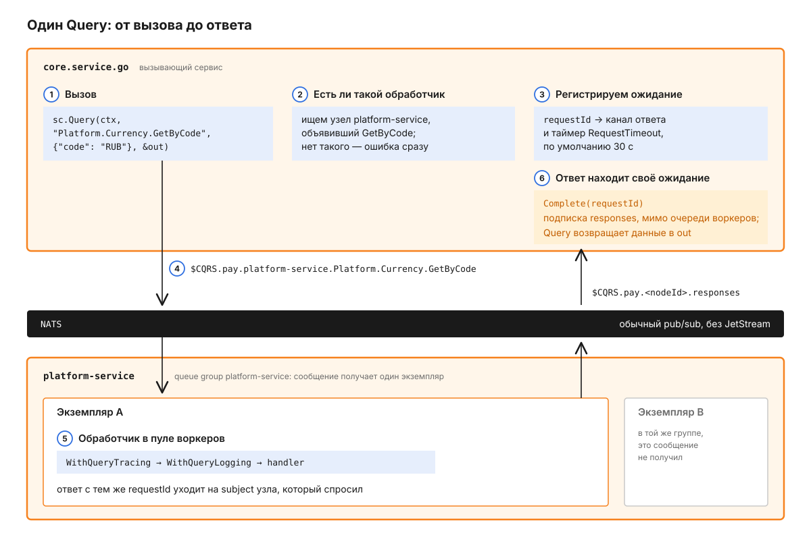
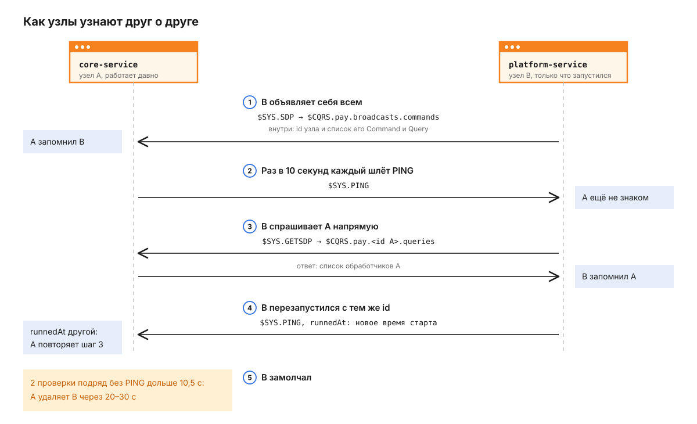
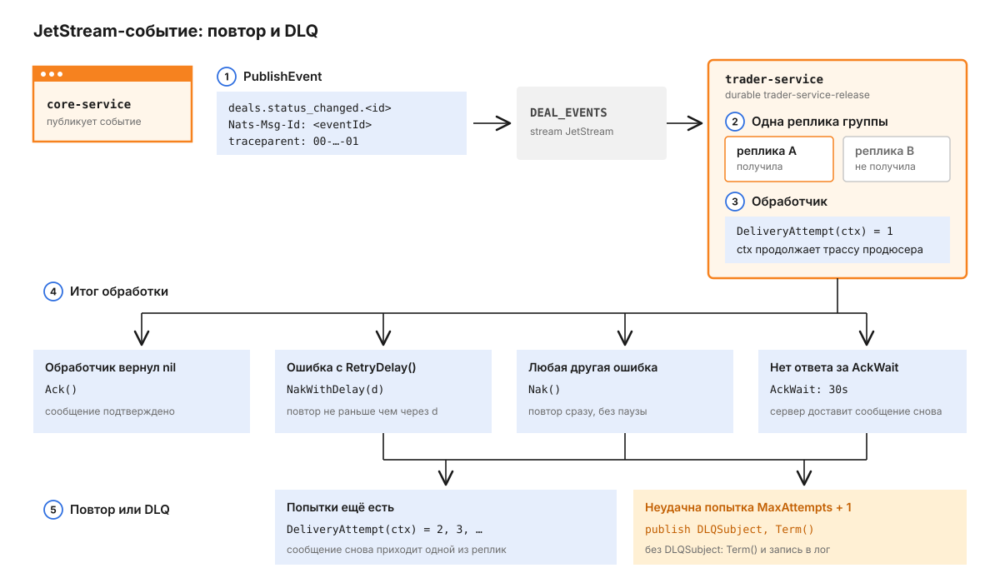

# golang-cqrs

Библиотека, через которую Go-сервисы платформы вызывают друг друга по NATS. Сервис регистрирует обработчики с именами вида `Platform.Currency.GetByCode`, а другие сервисы вызывают их по имени: библиотека сама находит узел, который умеет обработать сообщение, доставляет его и сопоставляет ответ с запросом. Это не отдельный процесс, а Go-модуль: его подключают десять сервисов, от `core` до `trader`. Общая картина платформы - в [корневом README](../../README.md).

## Путь одного запроса

Проще всего разобрать библиотеку на одном вызове. Монолиту `core` нужна валюта RUB, и он спрашивает её у `platform-service`.



1. `core` вызывает запрос через `ServiceClient`, который уже знает имя целевого приложения:

   ```go
   sc := cqrs.NewServiceClient(client, "platform-service")

   var out CurrencyDTO
   err := sc.Query(ctx, "Platform.Currency.GetByCode", map[string]string{"code": "RUB"}, &out)
   ```

2. Библиотека смотрит в свою таблицу узлов (discovery) и ищет узел `platform-service`, который объявил у себя query `Platform.Currency.GetByCode`. Если такого нет, вызов сразу возвращает ошибку `Error query [...] not registered in app [...]` и в сеть ничего не уходит (`client.go`).
3. В хранилище ожиданий (`response-storage`) появляется запись: `requestId` запроса и канал, в который придёт ответ. Для записи заводится таймер на `RequestTimeout`, по умолчанию 30 секунд. Если у `ctx` дедлайн раньше, берётся он.
4. Сообщение уходит в NATS на subject `$CQRS.pay.platform-service.Platform.Currency.GetByCode`. Все экземпляры `platform-service` подписаны на него в одной queue group с именем приложения, поэтому сообщение получает ровно один из них.
5. Экземпляр кладёт сообщение в пул воркеров (`WorkersPoolSize`, по умолчанию 10) и вызывает обработчик. Ответ с тем же `requestId` публикуется на `$CQRS.pay.<nodeId>.responses` - личный subject узла, который спросил.
6. Узел `core` получает ответ на своей подписке `responses` и сразу отдаёт его в канал ожидания, не ставя в очередь воркеров. Поэтому обработчик, который сам делает вложенный `Query`, получит ответ, даже если все воркеры узла заняты. Если ответ не пришёл до таймера, `Query` вернёт ошибку `Request timeout`, а опоздавший ответ будет молча отброшен.

Всё это идёт через обычный pub/sub NATS, без JetStream: сообщение, которое никто не успел принять, теряется. Долговечная доставка есть только у событий JetStream, о них ниже.

## Из чего состоит библиотека

Сервис работает только с публичным API корневого пакета `cqrs` и с `middleware`. Всё, что касается NATS, спрятано в `internal/services`.


`client.go` - центр библиотеки: он получает маршруты из `Router`, держит пул воркеров и цикл `Listen`. `discovery` хранит таблицу соседей, `response-storage` - ожидания ответов по `requestId`. В пакете `broker` два транспорта: `broker.go` знает про subjects и подписки обычного NATS и передаёт ответы прямо в `response-storage`, а `jetstream_broker.go` и `jetstream_context.go` создают durable consumer, решают судьбу сообщения после обработчика и переносят `traceparent` через заголовки. `jetstream_publisher.go` работает мимо клиента: ему нужно только соединение NATS, `Listen` для публикации не требуется.

## Три вида сообщений

У вызова по NATS три формы, и различаются они тем, что получает вызывающая сторона.

| Вид | Регистрация и вызов | Что получает вызывающий |
|---|---|---|
| Query | `router.AddQuery` / `client.Query` | данные или ошибку обработчика |
| Command | `router.AddCommand` / `client.Call` | только ошибку или `nil`, но ждёт окончания обработчика |
| Event | `router.AddEvent` / `client.Emit` | ничего: подтверждения нет |

Команда устроена так же, как запрос: она проходит шаги 1-6 и ждёт ответа до таймаута. Разница в том, что обработчик команды возвращает только `*BaseErrorException`, данных в ответе нет. Поэтому сервисы, которым нужно вернуть результат изменения, регистрируют его как query: так сделан, например, `Platform.Settings.Update`.

У `Call` есть два дополнительных режима. `Receiver` отправляет команду конкретному узлу по его id, а не в queue group; если discovery этот узел не знает, вызов сразу вернёт ошибку, а `Optimistic: true` отправляет без проверки. `Broadcast` рассылает команду всем узлам namespace, кроме отправителя. Такой `Call` возвращается, как только сообщение вернулось к отправителю через NATS: он подтверждает, что рассылка ушла, но не ждёт обработчиков и не получает их ошибок.

`Emit` выбирает маршрут по `EventRequestOptions`, первое подходящее поле выигрывает:

| Поле | Куда уходит событие | Кто обрабатывает |
|---|---|---|
| `Persistent: true` | JetStream, subject равен имени события | durable consumer, см. ниже |
| `Broadcast: true` | `$CQRS.{ns}.events.{name}` | каждый узел с обработчиком, кроме отправителя |
| `App: "account-service"` | `$CQRS.{ns}.{app}.events.{name}` | одна реплика сервиса из queue group |

Если не задано ни одно поле, `Emit` вернёт ошибку `Event requires either Broadcast=true or App to be specified`. С `App` библиотека сначала проверяет, что discovery знает хотя бы один узел этого сервиса, и иначе возвращает `Node not found for app: ...`, а не теряет событие молча. На платформе события идут через `Broadcast`: так `platform-service` и `core` отправляют `Audit.Event` в `account-service`.

## Как узлы узнают друг о друге

Шаг 2 работает только потому, что каждый узел держит в памяти список соседей и их обработчиков. Центрального реестра нет: узлы договариваются через служебные команды `$SYS.*`.



1. При старте узел рассылает всем `$SYS.SDP` со своим id и списком Command и Query. Кто уже работает, добавляет его к себе.
2. Раз в `HeartbeatInMs`, по умолчанию 10 секунд, каждый узел рассылает `$SYS.PING`. Для знакомого отправителя это просто отметка "жив".
3. Если PING пришёл от незнакомого узла, получатель спрашивает у него `$SYS.GETSDP` напрямую и добавляет его ответ в таблицу. Так новый узел узнаёт о старых: не сразу, а с первым их PING, то есть в течение 10 секунд.
4. Контейнер может перезапуститься с тем же hostname и pid 1, то есть с тем же id узла, но с другим набором обработчиков. Поэтому в PING есть `runnedAt` - время старта с точностью до наносекунд. Если оно не совпало с записью, получатель считает узел новым и повторяет шаг 3; `$SYS.SDP` с новым `runnedAt` тоже заменяет запись целиком.
5. На каждом тике узел проверяет соседей. Если от соседа не было PING дольше `HeartbeatInMs + MaxLostLag` (10,5 с), счётчик пропусков растёт; на `MaxHeartbeatExpires` (2) сосед удаляется. На практике это 20-30 секунд после последнего PING.

Из шага 3 следует главное правило подключения: сразу после старта клиент ещё не знает соседей, и вызов в первые секунды вернёт "not registered". Если сервису нужны соседи на старте, вызовите `client.WaitReady(ctx, []string{"platform-service"})`: он проверяет таблицу раз в секунду (или раз в `HeartbeatInMs`, если он короче) и возвращается, когда все перечисленные приложения найдены или отменён `ctx`. Что именно нашлось, покажет `client.GetDiscoveredNodes()`.

Id узла собирается как `host-appName-pid` (`node/service.go`). Имя приложения в id нужно для процессов с несколькими клиентами: `core` держит отдельный исходящий клиент на каждый внешний сервис, например `...-platform-client`, и без `appName` они бы схлопнулись в одну запись.

## Куда уходят сообщения

Все subjects начинаются с `$CQRS.{namespace}`, поэтому сервисы с разным `Namespace` в одном NATS друг друга не видят. На платформе namespace - `pay`.

| Subject | Кто подписан | Что туда идёт |
|---|---|---|
| `$CQRS.{ns}.{app}.{name}` | все экземпляры `app` в queue group `app` | Command и Query по имени |
| `$CQRS.{ns}.{nodeId}.commands`, `.queries` | один узел | вызовы с `Receiver`, `$SYS.GETSDP` |
| `$CQRS.{ns}.{nodeId}.responses` | один узел | ответы на его запросы и команды |
| `$CQRS.{ns}.broadcasts.commands` | все узлы | `$SYS.SDP`, `$SYS.PING`, `Call` с `Broadcast` |
| `$CQRS.{ns}.events.{name}` | все узлы с обработчиком события | `Emit` с `Broadcast: true` |
| `$CQRS.{ns}.{app}.events.{name}` | экземпляры `app` в queue group `app` | `Emit` с `App` |

Имена обработчиков на платформе строятся по схеме `{Service}.{Entity}.{Action}`: `Platform.Bank.List`, `Accounting.Ledger.Reserve`. Библиотека эту схему не проверяет, это договорённость.

## События, которые нельзя потерять

Для доменных событий, которые подписчик обязан обработать даже после рестарта, в библиотеке есть второй путь - JetStream. Им пользуются `core` (события сделок), `accounting`, `rate` и `notification` на стороне публикации и `analytics`, `trader`, `notification` на стороне подписки.

Проследим одно событие: `core` меняет статус сделки, а `trader-service` должен освободить реквизит.



1. `core` публикует событие через `JetStreamPublisher.PublishEvent`. Метод проверяет `EventEnvelope` (`eventId` и `correlationId` - UUID, `schemaVersion` и `aggregateVersion` >= 1, `data` - валидный JSON), кладёт `eventId` в заголовок `Nats-Msg-Id` для дедупликации в JetStream и ждёт подтверждения от сервера. В заголовок `traceparent` попадает текущий span из `ctx`, а если он задан в конверте - значение из конверта.
2. Сообщение лежит в stream `DEAL_EVENTS`. Все реплики `trader-service` подключены к одному durable consumer `trader-service-release` в одной deliver group, поэтому каждое сообщение получает одна реплика, а поток делится между ними.
3. Библиотека вызывает обработчик. В его `ctx` лежит номер доставки, начиная с 1, и родительский span продюсера, так что `tracer.Start(ctx, ...)` продолжит ту же трассу:

   ```go
   attempt, _ := cqrs.DeliveryAttempt(ctx)
   ```

4. Итог обработчика решает судьбу сообщения. `nil` - `Ack`. Ошибка с методом `RetryDelay() time.Duration` - `NakWithDelay`: сообщение вернётся не раньше чем через эту паузу. Любая другая ошибка - `Nak`, повтор сразу. Если обработчик не уложился в `AckWait`, сервер доставит сообщение снова сам.
5. Каждая неудача увеличивает номер доставки. Когда неудачной оказалась попытка номер `MaxAttempts + 1`, библиотека публикует то же тело в `DLQSubject` с `traceparent` и делает `Term`. Без `DLQSubject` сообщение получает `Term`, а в лог уходит ошибка.

Подписка регистрируется в роутере до `Listen`, так её объявляет `trader-service`:

```go
router.AddJetStreamEvent("deals.status_changed.*", cqrs.TypedJetStreamEvent(h.Handle), cqrs.JetStreamEventConfig{
    Stream:      "DEAL_EVENTS",
    Durable:     "trader-service-release",
    DLQSubject:  dlqSubject,
    MaxAttempts: 3,
    AckWait:     30 * time.Second,
})
```

Отложенный повтор задаётся типом ошибки, отдельной настройки для него нет. Так `notification-service` откладывает повтор вебхука по экспоненте:

```go
type retryLaterError struct {
    reason string
    delay  time.Duration
}

func (e *retryLaterError) Error() string             { return "retry later: " + e.reason }
func (e *retryLaterError) RetryDelay() time.Duration { return e.delay }
```

Ошибка находится через `errors.As`, поэтому её можно обернуть в `fmt.Errorf("...: %w", err)`. `TypedJetStreamEvent` на невалидный JSON тоже возвращает ошибку: такое сообщение пройдёт все попытки и окажется в DLQ.

Consumer живёт на сервере NATS, а не в процессе. Библиотека создаёт его при первом `Listen`, если его ещё нет, и привязывается к нему через `Bind`, поэтому остановка реплики только отписывает её: consumer и позиция чтения остаются, а остальные реплики продолжают получать сообщения. При каждом старте библиотека сверяет `AckWait` и `MaxDeliver` с конфигурацией и обновляет consumer, если они изменились. Новый consumer читает только сообщения, пришедшие после его создания (`DeliverNew`). Stream библиотека не создаёт, это делает публикующая сторона через `EnsureStream`.

Имя consumer, если его не задать, собирается из имени приложения и subject: точки становятся дефисами, `*` и `>` отбрасываются. `notification-service` и `deals.status_changed.*` дают `notification-service-deals-status_changed`.

Публиковать в JetStream можно тремя способами, и все кладут `traceparent` из `ctx`:

| Способ | Что нужно | Особенность |
|---|---|---|
| `JetStreamPublisher.PublishEvent` | соединение NATS | проверка конверта, `Nats-Msg-Id`, ожидание `PubAck` |
| `JetStreamPublisher.Publish`, `PublishRaw` | соединение NATS | любой JSON без конверта |
| `client.EmitJetStream`, `Emit` с `Persistent` | запущенный `Listen` | до `Listen` возвращают ошибку |

## Как подключить к сервису

Библиотека живёт в монорепо рядом с сервисами и не публикуется отдельно. Каждый сервис подключает её через `replace`:

```
require golang-cqrs v0.1.1

replace golang-cqrs => ../golang-cqrs
```

В Docker-сборке путь `../golang-cqrs` должен существовать внутри образа. Для этого в `docker-compose.yml` сервису передаётся дополнительный контекст `cqrs: ../../services/golang-cqrs`, а Dockerfile копирует его в `/golang-cqrs` рядом с `/app`.

Минимальный сервис регистрирует обработчики, создаёт клиент и запускает `Listen` в отдельной горутине. `Listen` блокируется до отмены `ctx`, а готовность сообщает через канал `IsStarted`:

```go
router := cqrs.NewRouter()
router.AddQuery("Platform.Currency.GetByCode",
    middleware.WithQueryTracing(tracer, "Platform.Currency.GetByCode",
        middleware.WithQueryLogging(log, "Platform.Currency.GetByCode", h.getByCode)),
    "app")

client := cqrs.New(ctx, cqrs.NewConfig(cqrs.Config{
    Transport: "nats://localhost:4222",
    AppName:   "platform-service",
    Namespace: "pay",
}), router, log)

go client.Listen(ctx)
<-client.IsStarted
```

`TypedQuery`, `TypedCommand` и `TypedJetStreamEvent` снимают ручной `json.Unmarshal`: обработчик принимает готовую структуру, а на невалидный JSON библиотека сама вернёт `INVALID_REQUEST` (для JetStream - ошибку, которая ведёт к повтору). Логгер - любой тип с методами `Debug`, `Info`, `Warn`, `Error`, `Fatal` в стиле `slog`; для zap и zerolog есть адаптеры `middleware.NewZapLogger` и `middleware.NewZerologLogger`.

Ошибку обработчик возвращает как `common.NewError(common.ErrCodeNotFound, "currency not found")`. На вызывающей стороне `ServiceClient` превращает её в обычный Go-`error` типа `*cqrs.ServiceError` и приводит код к нижнему регистру: `NOT_FOUND` становится `not_found`. По этим кодам клиенты в `core` сопоставляют ответ с доменными ошибками.

Middleware `WithQueryTracing` и `WithCommandTracing` продолжают трассу из `traceparent`, который `ServiceClient` кладёт в метаданные запроса. `WithCommandLogging`, `WithQueryLogging` и `WithEventLogging` пишут одну строку на вызов с `request_id`, `user_id`, `merchant_id` и `duration_ms`. `WithPanicRecovery` и `WithQueryPanicRecovery` превращают панику в ошибку `INTERNAL` и пишут стек в лог. Для JetStream-обработчиков middleware нет: трасса уже лежит в `ctx`.

## Конфигурация

Переменных окружения у библиотеки нет: всё задаётся полями `cqrs.Config`, а сервис уже сам решает, из каких переменных их читать. `NewConfig` подставляет значения по умолчанию для пустых полей (`config.go`).

| Поле | По умолчанию | Что меняет |
|---|---|---|
| `Transport` | нет | адрес NATS, например `nats://nats:4222` |
| `AppName` | нет | имя приложения: queue group и адрес для вызова |
| `Namespace` | нет | префикс всех subjects, на платформе `pay` |
| `WorkersPoolSize` | 10 | сколько обработчиков выполняется одновременно |
| `RequestTimeout` | 30 с | сколько `Query` и `Call` ждут ответа |
| `Discovery.HeartbeatInMs` | 10 000 мс | период PING и проверки соседей |
| `Discovery.MaxLostLag` | 500 мс | допуск к опозданию PING |
| `Discovery.MaxHeartbeatExpires` | 2 | сколько пропусков до удаления соседа |

Подписка на JetStream настраивается отдельно, полями `cqrs.JetStreamEventConfig` (`jetstream.go`):

| Поле | По умолчанию | Что меняет |
|---|---|---|
| `Stream` | нет | stream, к которому привязан consumer |
| `Durable` | `{AppName}-{subject}` | имя consumer, общее для всех реплик |
| `DLQSubject` | нет | куда переложить сообщение после последней попытки |
| `MaxAttempts` | 0, без ограничения | повторов после первой доставки; `MaxDeliver = MaxAttempts + 1` |
| `AckWait` | 30 с | сколько сервер ждёт подтверждения до повтора |

К NATS клиент подключается с бесконечными повторами раз в секунду. После переподключения узел заново рассылает `$SYS.SDP`, чтобы соседи, перезапущенные вместе с NATS, снова его увидели.

## Как запустить тесты

Здесь только документация и схемы: сама библиотека и её тесты остаются в приватном репозитории. Модульные тесты покрывают проверку `EventEnvelope`, генерацию subjects, хранилище ожиданий, таблицу узлов и распознавание рестарта; пакет `tests/` поднимает настоящие NATS-клиенты и проверяет Query, Command и Event через broadcast и через `App`; тесты `internal/services/broker` работают с настоящим JetStream - общий consumer у двух реплик, DLQ после последней попытки, `NakWithDelay`, переживание рестарта.

## Что стоит знать заранее

События без JetStream доставляются не больше одного раза. Если подписчик в этот момент не запущен, событие потеряно. Событие с `Broadcast` обработает каждый экземпляр подписчика, с `App` - один из них.

JetStream-события доставляются не меньше одного раза: после рестарта реплики или истечения `AckWait` обработчик может увидеть то же сообщение повторно, поэтому он должен быть идемпотентным. Обработчик JetStream-события выполняется вне пула воркеров, по одному сообщению за раз на подписку в реплике.

`DLQSubject` должен входить в какой-нибудь stream, иначе публикация в него не удастся. В этом случае сообщение остаётся неподтверждённым в исходном stream, больше не доставляется, а в лог уходит ошибка `dlq publish failed`. С `MaxAttempts: 0` попытки не кончаются, и DLQ не используется.

Consumer получает сообщения на служебный subject `_CQRS_DELIVER.{stream}.{durable}`. Stream с широким шаблоном subjects, например `>`, не должен его захватывать, иначе доставки начнут сохраняться в stream.

Если на сервере уже есть consumer с тем же именем, но без deliver group, библиотека пересоздаёт его с первого неподтверждённого сообщения. Пока к такому consumer подключена реплика, `Listen` вернёт ошибку и сервис нужно перезапустить после её остановки.

Таймеры ожидания работают на колесе с шагом в 1 секунду, поэтому `RequestTimeout` и дедлайны `ctx` срабатывают с точностью до секунды.

Паника в обработчике не убивает воркер: клиент сам ловит её и отвечает ошибкой `Handler panicked` (`client.go`); `middleware.WithPanicRecovery` добавляет к этому стек в логе и код `INTERNAL`.
