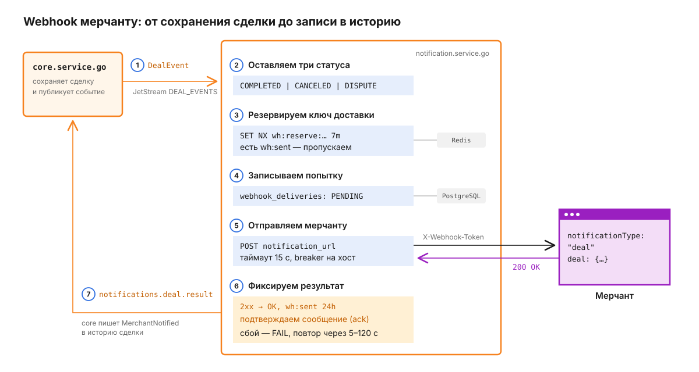
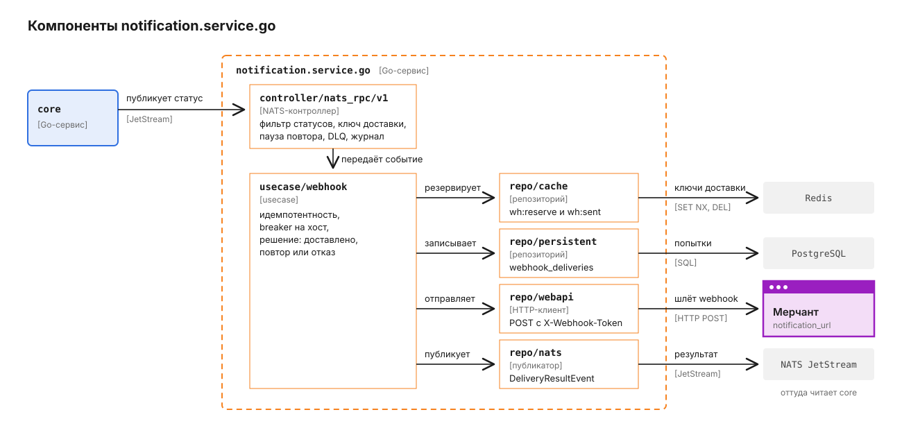

# notification.service.go

Сервис отправляет мерчанту webhook, когда сделка доходит до `COMPLETED`, `CANCELED` или `DISPUTE`. Сам он сделки не читает: core публикует каждое сохранение сделки в JetStream, notification забирает событие, делает POST на `webhookUrl` мерчанта, пишет каждую попытку в PostgreSQL и возвращает результат в core отдельным событием. Что мерчант получает - в [корневом README](../../README.md), здесь - как устроена доставка изнутри.

Цвета на схемах те же, что в корневом README: оранжевый - наши сервисы, фиолетовый - мерчант, серые плашки - хранилища. На схеме компонентов, по правилам C4, соседние сервисы синие.

## Путь одного webhook

Возьмём сделку на 5 000 RUB, которая только что перешла в `COMPLETED`.



1. core сохраняет сделку и публикует `DealEvent` в stream `DEAL_EVENTS` на subject `deals.status_changed.<deal_id>`. Событие "толстое": в нём уже лежат адрес мерчанта, токен и готовое тело webhook, поэтому notification не ходит в core за данными.

   ```json
   {
     "event_id": "5b0c...",
     "deal_id": "8d1f...",
     "status": "COMPLETED",
     "version": 7,
     "notification_url": "https://shop.example/hooks/payment",
     "callback_token": "<webhookSecret сделки>",
     "webhook_payload": { "...": "сделка в формате merchant API" },
     "trace_parent": "00-4bf9...-01"
   }
   ```

2. Durable-консьюмер `notif-webhook` получает событие. Статусы, кроме трёх перечисленных, подтверждаются без отправки (`deal_status_changed.go`). Контекст трассировки сервис берёт из поля `trace_parent`, поэтому попытка доставки видна в том же трейсе, что и сохранение сделки.
3. Сервис строит ключ доставки `merchant:<deal_id>:<status>:<version>:<хеш адреса>` и проверяет Redis: если есть `wh:sent:<ключ>`, webhook уже доставлен, если `SET NX wh:reserve:<ключ>` не удался - его прямо сейчас отправляет другой обработчик. Хеш - первые 16 байт SHA-256 от `notification_url` в hex.
4. В `webhook_deliveries` появляется строка со статусом `PENDING`.
5. Запрос уходит через circuit breaker, заведённый на хост мерчанта. Таймаут 15 секунд, из ответа читаются первые 4 КБ.

   ```http
   POST /hooks/payment HTTP/1.1
   Host: shop.example
   Content-Type: application/json
   X-Webhook-Token: <webhookSecret сделки>

   {"notificationType":"deal","notificationDate":"2026-09-26T10:15:00Z","deal":{...}}
   ```

6. На ответ `2xx` строка становится `OK`, а в Redis одной транзакцией ставится `wh:sent` на 24 часа и снимается резерв. Сообщение подтверждается в JetStream.
7. В stream `notifications` уходит событие `notifications.deal.result` с `delivered: true` и HTTP-кодом. core ловит его и дописывает в историю сделки событие `MerchantNotified` (`core.service.go/internal/infrastructure/services/notifications/subscriber.go`).

В логах сервиса адрес мерчанта пишется без query-части, логина и фрагмента (`RedactURL` в `usecase/webhook/redact.go`): в query мерчанты часто кладут собственные токены.

## Из чего состоит сервис

Слои те же, что у остальных Go-сервисов: контроллер принимает сообщения, usecase решает, репозитории ходят наружу. Логика одной попытки собрана в пакете `usecase/webhook`, а когда повторять, решает контроллер.



Контроллер `controller/nats_rpc/v1` держит три входа: консьюмер `deals.status_changed.*`, консьюмер `notifications.dlq` и запрос `Notification.GetDeliveryLogs`, который читает `repo/persistent` напрямую, минуя usecase. Там же живёт `RetryPolicy` (`retry.go`) - она считает паузу перед повтором. Breaker лежит в `usecase/webhook` (`breaker.go`): это реестр `gobreaker` по хосту в памяти процесса, поэтому у каждой реплики свой счётчик неудач. Исходящий HTTP-клиент с прокси и трассировкой собирается в `pkg/outboundhttp`.

## Почему ключ доставки не равен event_id

core публикует одно и то же сохранение сделки из нескольких мест - команда, saga, таймер спора, - и каждый раз с новым `event_id`. Если дедуплицировать по нему, мерчант получит два одинаковых `COMPLETED`. Поэтому сервис заменяет `event_id` на семантический ключ из сделки, статуса, версии строки и хеша адреса (`deal_status_changed.go`). Сам адрес в ключ не входит: ключ попадает в логи, трейсы и Redis.

Версия в ключе нужна для честных повторов: если сделку вернули из спора в `COMPLETED` с новой суммой, у неё новая версия, и мерчант узнает об изменении.

У защиты от дублей есть границы. Если Redis недоступен, сервис всё равно отправляет webhook: мы предпочли возможный дубль потерянному уведомлению. Ключ `wh:sent` живёт 24 часа, и событие, пришедшее позже, уйдёт мерчанту повторно.

## Что происходит, когда мерчант отвечает ошибкой

Сервис делит ответы на временные и окончательные (`webhook.go`):

| Ответ мерчанта | Что делает сервис | Что увидит core |
|---|---|---|
| `2xx` | `OK`, `wh:sent`, ack | `delivered: true` |
| `408`, `425`, `429`, `5xx`, таймаут, ошибка сети, открытый breaker | `FAIL`, резерв снят, повтор с паузой | ничего до исхода |
| Остальные `4xx`, например `400` или `404` | `FAIL`, ack без повторов | `delivered: false` |

Повтор не держит воркер. Обработчик возвращает ошибку с паузой, и golang-cqrs отвечает JetStream `NakWithDelay`: сообщение вернётся к любой реплике не раньше назначенного времени. Паузу считает политика `RetryPolicy` из `retry.go` по параметрам `WEBHOOK_RETRY_*`: базовая пауза `WEBHOOK_RETRY_INITIAL` (5 с), потолок `WEBHOOK_RETRY_MAX` (120 с).

Две ситуации удлиняют паузу. Если мерчант ответил `429` с `Retry-After` в секундах, пауза не короче этого значения. Если breaker открыт, пауза не короче `WEBHOOK_CB_OPEN_TIMEOUT` (60 с), чтобы повтор не пришёл в ещё закрытый хост. В обоих случаях потолок тот же - 120 секунд: мерчант не может отложить доставку на часы.

Повторов пять, то есть всего шесть доставок: golang-cqrs ставит консьюмеру `MaxDeliver = WEBHOOK_MAX_ATTEMPTS + 1`. После шестой неудачи golang-cqrs перекладывает исходное событие в `notifications.dlq`, а консьюмер `notif-webhook-dlq-result` публикует для него `delivered: false` под тем же ключом доставки.

**Любой окончательный провал заканчивается событием `delivered: false`.** Таких путей три: постоянный `4xx`, исчерпанные повторы и событие с пустым `webhook_payload`, которое сервис не отправляет вовсе. core узнаёт об исходе в каждом из них.

Breaker считает неудачи по хосту, а не по сделке. Неудача для него - ошибка сети, таймаут или временный код; постоянный `4xx` значит, что хост жив, и счётчик не растёт. После пяти неудач подряд (`WEBHOOK_CB_FAILURES`) breaker открывается на 60 секунд, и все доставки на этот хост в это время заканчиваются мгновенно с `circuit_open`. Затем он пропускает один пробный запрос.

Реестр breaker'ов по хосту построен поверх `sony/gobreaker`, конфигурация - обычная обёртка над его `Settings`:

```go
func (r *Registry) breakerFor(host string) *gobreaker.CircuitBreaker {
    return r.perHost.LoadOrStore(host, func() *gobreaker.CircuitBreaker {
        return gobreaker.NewCircuitBreaker(gobreaker.Settings{
            Name:        host,
            MaxRequests: 1,
            Timeout:     r.cfg.OpenTimeout,
            ReadyToTrip: func(c gobreaker.Counts) bool {
                return c.ConsecutiveFailures >= r.cfg.FailureThreshold
            },
        })
    })
}
```

## Что сервис принимает и публикует

| Канал | Направление | Что внутри |
|---|---|---|
| `deals.status_changed.*`, stream `DEAL_EVENTS` | вход, durable `notif-webhook` | `DealEvent` от core (`entity/event.go`) |
| POST на `notification_url` | выход | `{notificationType, notificationDate, deal}`, заголовок `X-Webhook-Token` |
| `notifications.deal.result`, stream `notifications` | выход | `event_id`, `deal_id`, `notification_url`, `deal_status`, `delivered`, `attempt`, `http_code`, `occurred_at` |
| `Notification.GetDeliveryLogs` | CQRS-запрос | `{"dealId": "..."}` -> `{"logs": [...]}` из `webhook_deliveries` |
| `notifications.dlq`, stream `notifications` | вход, durable `notif-webhook-dlq-result` | публикует `delivered: false` |

Stream `notifications` с subject результата и DLQ сервис создаёт при старте, только если его ещё нет: файловое хранилище, срок жизни сообщений 7 дней. Существующий stream сервис не трогает, чтобы не сузить subjects, в которые пишет кто-то ещё.

HTTP-сервер на `HTTP_PORT` отдаёт только `GET /healthz` и `GET /readyz`. Готовность включается, когда golang-cqrs подписался на все subject.

История попыток лежит в таблице `webhook_deliveries`. Каждая доставка - отдельная строка: `PENDING` при старте, затем `OK` или `FAIL` с кодом, текстом ошибки и длительностью. Из тела ответа в `error_text` попадают первые 128 символов, а HTML-страницы ошибок прокси заменяются на `[html response]`.

## Конфигурация

Обязательна только `PG_URL`. Остальное - с дефолтами из `config/config.go`:

| Переменная | По умолчанию | Что задаёт |
|---|---|---|
| `PG_POOL_MAX` | `5` | соединений с PostgreSQL |
| `REDIS_URL` | `redis://localhost:6379` | ключи `wh:reserve:*` и `wh:sent:*` |
| `NATS_URL` | `nats://localhost:4222` | JetStream и CQRS |
| `NATS_PAYMENTS_STREAM`, `NATS_DURABLE_NAME` | `DEAL_EVENTS`, `notif-webhook` | откуда читать события |
| `NATS_DEAL_STATUS_CHANGED_SUBJECT` | `deals.status_changed.*` | фильтр консьюмера |
| `NATS_NOTIFICATIONS_STREAM` | `notifications` | куда писать результаты и DLQ |
| `NATS_RESULT_SUBJECT`, `NATS_DLQ_SUBJECT` | `notifications.deal.result`, `notifications.dlq` | subject результата и DLQ |
| `NATS_NAMESPACE`, `NATS_WORKERS_POOL_SIZE` | `pay`, `4` | пространство имён CQRS и число воркеров |
| `WEBHOOK_TIMEOUT` | `15s` | таймаут одного POST |
| `WEBHOOK_MAX_ATTEMPTS` | `5` | число повторов, доставок на одну больше |
| `WEBHOOK_RETRY_INITIAL` | `5s` | первая пауза перед повтором |
| `WEBHOOK_RETRY_MULTIPLIER` | `3.0` | во сколько раз растёт пауза |
| `WEBHOOK_RETRY_MAX` | `120s` | потолок паузы, в том числе для `Retry-After` |
| `WEBHOOK_CB_FAILURES` | `5` | неудач подряд до открытия breaker |
| `WEBHOOK_CB_OPEN_TIMEOUT` | `60s` | сколько breaker открыт |
| `WEBHOOK_RESERVE_TTL`, `WEBHOOK_SENT_TTL` | `7m`, `24h` | жизнь резерва и отметки о доставке |
| `WEBHOOK_ACK_WAIT` | `600s` | через сколько JetStream переотправит неподтверждённое сообщение |
| `OUTBOUND_PROXY_URL`, `OUTBOUND_NO_PROXY` | пусто | прокси для исходящих запросов; без них - стандартные `HTTPS_PROXY` и `NO_PROXY` |
| `HTTP_PORT` | `:8080` | health-сервер |
| `LOG_LEVEL`, `APP_ENV` | `info`, пусто | уровень логов; `production` включает JSON-формат |
| `OTEL_ENABLED`, `OTEL_ENDPOINT` | `false`, `localhost:4317` | экспорт трейсов |

`WEBHOOK_RESERVE_TTL` и `WEBHOOK_ACK_WAIT` должны быть больше `WEBHOOK_TIMEOUT`: они страхуют одну попытку, и если воркер упал посреди запроса, доставку подхватят только после их истечения. Если в рабочем каталоге есть `.env`, его значения перекрывают одноимённые переменные окружения.

## Как запустить и проверить

Здесь только документация и схемы: исходный код, миграции и стек запуска остаются в приватном репозитории. Юнит-тесты без внешних зависимостей покрывают обработчик события (фильтр статусов, ключ доставки, ветки исхода, DLQ, расчёт паузы), breaker, `RedactURL` и выбор прокси; тесты `repo/cache` и `repo/persistent` идут против настоящих Redis и PostgreSQL.
