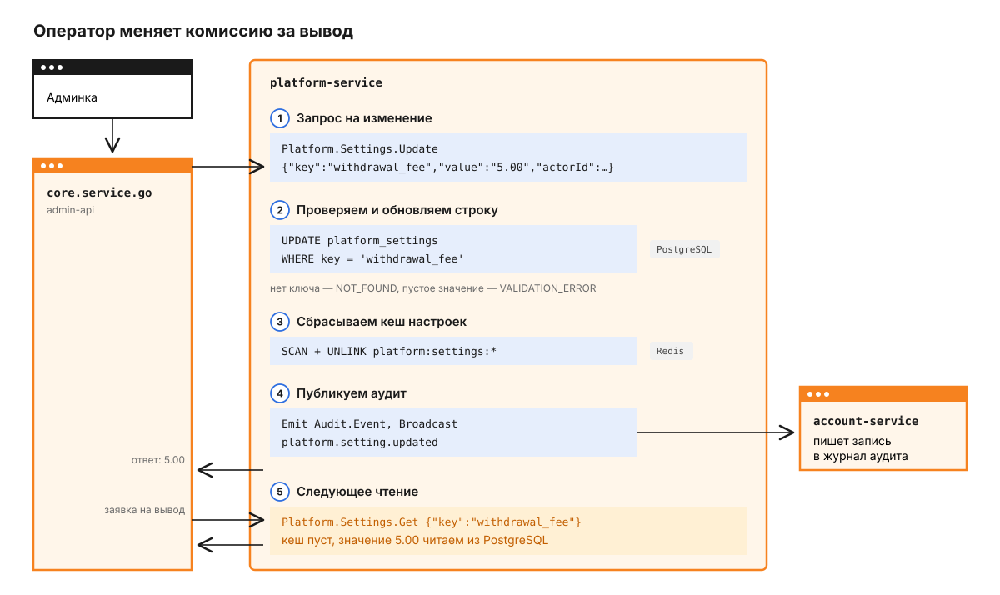
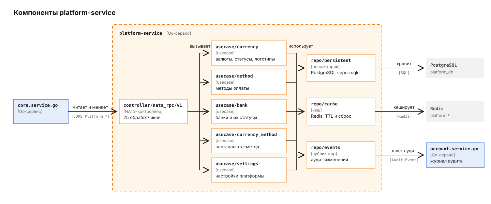

# platform.service.go

Сервис хранит справочники, на которые опирается остальная платформа: валюты, методы оплаты, банки, пары "валюта - метод" и глобальные настройки вроде комиссии за вывод. Вызывает его только `core.service.go` - и когда оператор меняет справочник в админке, и когда сделке нужно узнать, какие методы доступны для RUB. Своего HTTP API у сервиса нет, всё идёт через NATS; общая картина платформы - в [корневом README](../../README.md).

## Путь одного изменения

Проще всего понять сервис на одной настройке. Оператор снижает фиксированную комиссию за вывод USDT с 6.00 до 5.00. Эту настройку `core` читает, когда оформляет заявку на вывод.



1. Админка отправляет изменение в `admin-api`, и `core` вызывает обработчик сервиса:

   ```json
   Platform.Settings.Update
   {"key": "withdrawal_fee", "value": "5.00", "actorId": "<uuid оператора>", "actorName": "..."}
   ```

   Изменение зарегистрировано как query, а не как command (`router.go`): в [golang-cqrs](../golang-cqrs/README.md) команда не может вернуть данные, а `core` ждёт в ответ обновлённую настройку.
2. Сервис обрезает пробелы и проверяет, что ключ и значение не пустые, иначе отвечает `VALIDATION_ERROR`. Затем обновляет существующую строку `platform_settings`: `updated_by` получает `actorId`, `updated_at` - текущее время (`update.go`). Если такого ключа нет, сервис отвечает `NOT_FOUND` и ничего не создаёт: новые настройки заводятся только миграцией, поэтому опечатка в ключе не превратится в лишнюю запись.
3. Кеш настроек в Redis сбрасывается целиком: `SCAN` по шаблону `platform:settings:*` и `UNLINK` найденных ключей. Если Redis недоступен, изменение не откатывается, в лог пишется предупреждение.
4. Сервис рассылает событие `Audit.Event` с действием `platform.setting.updated` и новым значением в `details`. Его принимает `account.service.go` и пишет в журнал аудита. После этого `core` получает ответ со значением 5.00.
5. Следующий `Platform.Settings.Get` с ключом `withdrawal_fee` не находит список настроек в кеше и читает строку из PostgreSQL. Сам `Get` кеш не заполняет: его заполнит первый `Platform.Settings.List`, на 5 минут плюс до 30 секунд.

Остальные справочники меняются по той же схеме: запись в PostgreSQL, сброс своего кеша, событие аудита.

## Из чего состоит сервис

Слои устроены по `go-clean-template`, как во всех Go-сервисах платформы: контроллер разбирает сообщение, usecase держит правила, репозитории ходят в хранилища.



Контроллер `controller/nats_rpc/v1` регистрирует 25 обработчиков, оборачивает каждый в трассировку и логирование и отводит ему 10 секунд (`bank.go`). Он же переводит доменные ошибки в коды ответа: `NOT_FOUND`, `CONFLICT`, `VALIDATION_ERROR`, всё остальное - `INTERNAL`; нечитаемый JSON получает `INVALID_REQUEST` ещё до вызова usecase (`controller.go`). Порт публикации аудита `entity.AuditPublisher` объявлен в `entity`, реализация - `repo/events.AuditEventPublisher`; клиент CQRS подставляется в неё уже после создания (`SetClient`), потому что сам клиент строится из роутера с этими же usecase.

## Почему кеш сбрасывается целиком

Справочники читают часто, а меняют редко: за день оператор правит их несколько раз, зато список методов для валюты запрашивается на каждую сделку. Поэтому все чтения, кроме `Platform.Bank.Get` и `Platform.Currency.GetByID`, сначала идут в Redis.

Точечная инвалидация здесь сложнее, чем выглядит: один метод оплаты лежит в кеше по id, по коду и в каждом варианте списка с фильтрами. Сервис не пытается вычислить, какие ключи затронуты, и удаляет все ключи своего справочника по префиксу. На объёме справочников - единицы валют и десятки методов - это дешевле, чем ошибиться.

| Что читают | Ключи в Redis | Сколько живут |
|---|---|---|
| валюта по коду, списки валют | `platform:currency:*` | 30 мин по коду, 5 мин + до 30 с для списков |
| метод по id и коду, списки методов | `platform:method:*` | 10 мин + до 30 с, списки 5 мин + до 30 с |
| методы валюты (`CurrencyMethod.List`) | `platform:currency_method:currency:{код}` | 5 мин + до 30 с |
| список банков без фильтров | `platform:bank:all` | 5 мин + до 30 с |
| все настройки | `platform:settings:all` | 5 мин + до 30 с |

Случайная добавка до 30 секунд разводит истечение ключей во времени, чтобы после массового сброса они не протухали одновременно. `Platform.Method.GetByCurrency` дополнительно склеивает одновременные промахи в один запрос к базе через `singleflight`. Список банков кешируется только без фильтров: сервис один раз загружает до 10 000 банков и режет страницы в памяти.

## Что сервис принимает и публикует

Все обработчики слушают namespace `pay` и приложение `platform-service`. Удаления нет ни у одного справочника: валюту, метод или банк можно только деактивировать.

| Обработчик | Вид | Что делает |
|---|---|---|
| `Platform.Currency.Create`, `Update`, `ChangeStatus`, `SetLogo` | command | создаёт и меняет валюту; `SetLogo` - тот же обработчик, что `Update` |
| `Platform.Currency.GetByCode`, `GetByID`, `List` | query | читает валюты, `List` с фильтрами `kind`, `status` |
| `Platform.Method.Create`, `Update`, `ChangeStatus` | command | создаёт и меняет метод оплаты |
| `Platform.Method.GetByCode`, `GetByID`, `List`, `GetByCurrency` | query | читает методы, в том числе привязанные к валюте |
| `Platform.Bank.Create`, `Update`, `ChangeStatus` | command | создаёт и меняет банк |
| `Platform.Bank.Get`, `List` | query | читает банк по коду и списки с фильтрами |
| `Platform.CurrencyMethod.Link`, `Unlink` | command | привязывает метод к валюте и отвязывает |
| `Platform.CurrencyMethod.List` | query | методы, разрешённые для валюты |
| `Platform.Settings.List`, `Get`, `Update` | query | читает и меняет настройки |

`ChangeStatus` принимает `action: "activate"` или `"deactivate"`. Логотип валюты или банка передаётся data-URI: только PNG, WebP или JPEG, не больше 64 КБ после декодирования. SVG не принимается намеренно, потому что его нельзя надёжно очистить от скриптов (`logo.go`).

Сервис публикует одно событие - `Audit.Event` с полями `userId`, `action`, `performedBy`, `entityId`, `entityName`, `details`. Рассылка идёт broadcast, без JetStream. Событие отправляется только когда в запросе есть `actorId` (`publisher.go`), а ошибка отправки не отменяет изменение.

## Данные

База `platform_db` создаётся одной baseline-миграцией, которая сразу заполняет справочники: валюты RUB, USDT и BTC; методы `SBP`, `TO_CARD` и `MOBILE_PAYMENT`, все три привязаны к RUB; 240 банков и платёжных сервисов РФ в рублях; настройки `withdrawal_fee` = 6.00 и `withdrawal_fee_btc` = 0.00015. Миграции применяются при старте бинарника, собранного с тегом `migrate`, их версия хранится в отдельной таблице `schema_migrations_platform`, чтобы не смешиваться с версиями других сервисов в той же базе (`migrate.go`).

Таблиц пять: `currencies`, `payment_methods`, `currency_methods`, `banks`, `platform_settings`. Привязки в `currency_methods` ссылаются на коды валют и методов внешними ключами, логотипы лежат data-URI в колонке `logo` у `currencies` и `banks`.

## Конфигурация

Если в рабочем каталоге есть файл `.env`, значения берутся из него и перекрывают одноимённые переменные окружения; без файла работают только переменные окружения (`config.go`).

| Переменная | По умолчанию | Что задаёт |
|---|---|---|
| `PG_URL` | обязательна | строка подключения к PostgreSQL |
| `PG_POOL_MAX` | 10 | размер пула соединений |
| `REDIS_URL` | `redis://localhost:6379` | Redis для кеша |
| `NATS_URL` | `nats://localhost:4222` | адрес NATS |
| `CQRS_NAMESPACE` | `pay` | namespace golang-cqrs |
| `CQRS_WORKERS_POOL_SIZE` | 5 | сколько обработчиков выполняется одновременно |
| `APP_NAME` | `platform-service` | имя, по которому сервис находят другие |
| `APP_VERSION` | `1.0.0` | версия в логах и трассах |
| `HTTP_PORT` | `:8995` | порт `/healthz`, `/livez`, `/readyz` |
| `OTEL_ENABLED`, `OTEL_ENDPOINT` | `false`, `localhost:4317` | экспорт трасс |

Логгер берёт `LOG_LEVEL` (по умолчанию `info`) и `APP_ENV` прямо из окружения процесса: при `APP_ENV=production` логи пишутся JSON, иначе - читаемой консолью.

`/readyz` отвечает успехом, только когда клиент CQRS подключился к NATS. `APP_NAME` менять не стоит: `core` ищет сервис именно как `platform-service`.

## Как запустить и проверить

Здесь только документация и схемы: исходный код, миграции и стек запуска остаются в приватном репозитории. Юнит-тесты покрывают usecase, контроллер, валидацию и кеш (на `miniredis`) и ничего внешнего не требуют; интеграционные - black-box тесты через запущенный сервис: CRUD справочников, граничные случаи валидации, нагрузочный сценарий.

## Что стоит знать заранее

Параметры подключения, включая `sslmode`, берутся из `PG_URL` как есть: миграция добавляет к строке только имя таблицы версий. Для локального PostgreSQL без TLS указывайте `?sslmode=disable`, как в `.env.example`.

Команды на создание не возвращают id: у command в golang-cqrs нет данных ответа. Кто создал валюту, должен перечитать её через `Platform.Currency.GetByCode`.

`Platform.Settings.Update` меняет только существующие настройки: неизвестный ключ вернёт `NOT_FOUND`. Чтобы завести новую настройку, нужна миграция.
