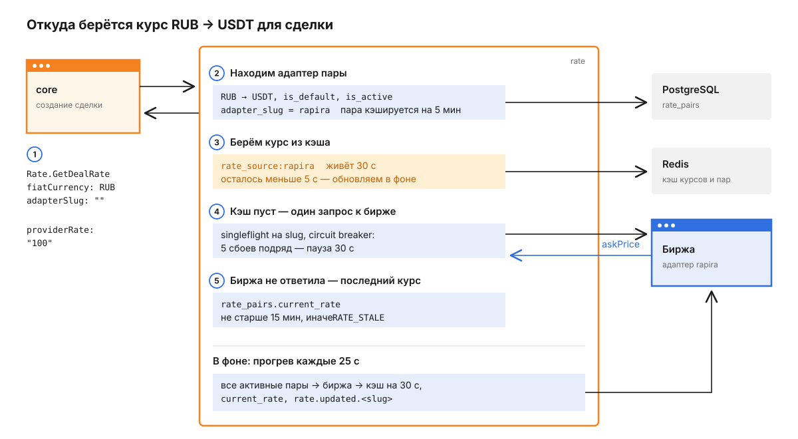
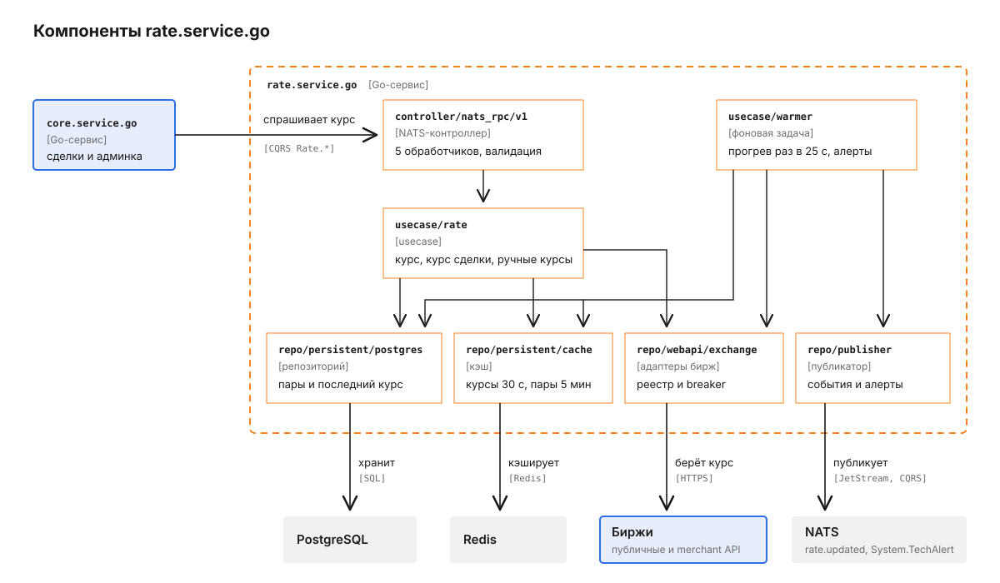
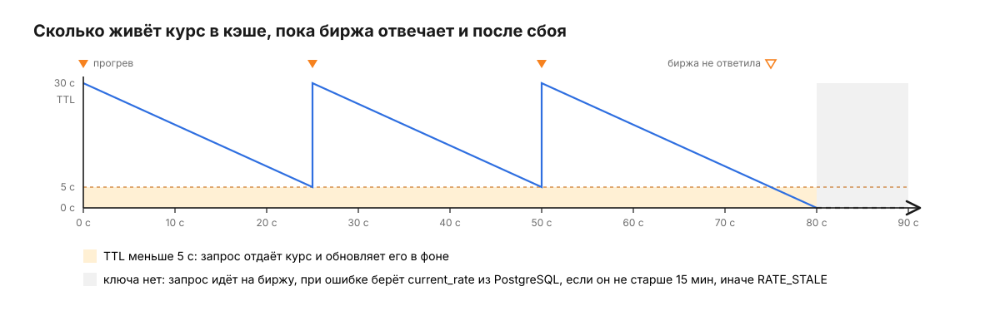

# rate.service.go

Rate отвечает на один вопрос: сколько стоит одна валюта в другой прямо сейчас. Для каждой активной пары в таблице `rate_pairs` задан один источник - адаптер биржи или ручной курс, - и сервис держит его значение тёплым в Redis. Спрашивает `core.service.go`: при создании сделки он фиксирует курс через `Rate.GetDealRate`, а админка через него же заводит ручные курсы.

Зачем сделке курс и как он входит в расчёт комиссии, рассказано в [корневом README](../../README.md). Здесь - откуда берётся само число.

Курс всегда читается как "сколько единиц `from` за одну единицу `to`". Пара RUB -> USDT со значением 100 означает 100 RUB за 1 USDT, пара USDT -> BTC со значением 60 000 - 60 000 USDT за 1 BTC.

## Путь одного запроса курса

Мерчант создаёт сделку на 5 000 RUB, `core` фиксирует в ней курс RUB -> USDT. В терминале адаптер не задан, поэтому сервис сам выбирает источник по паре.



Обычно запрос заканчивается на третьем шаге: курс уже лежит в Redis, его положил фоновый прогрев.

1. `core` отправляет по NATS запрос `Rate.GetDealRate`.

   ```json
   {
     "fiatCurrency": "RUB",
     "settlementAsset": "",
     "adapterSlug": ""
   }
   ```

2. Сервис ищет пару RUB -> USDT с флагами `is_default` и `is_active` и получает её адаптер, `rapira`. Найденная пара кэшируется в Redis под ключами `rate_pair:RUB/USDT` и `rate_pair:slug:rapira` на 5 мин (`pair_cache.go`). Если такой пары нет, ответ `RATE_PAIR_NOT_FOUND`. Обратную пару USDT -> RUB сервис не ищет: направление запроса - забота вызывающей стороны (`rate.go`).
3. Курс берётся из ключа `rate_source:rapira`, который живёт 30 с (`WARM_CACHE_TTL`). Если до истечения осталось меньше 5 с, сервис отдаёт курс сразу и параллельно запускает обновление в фоне с таймаутом 6 с.
4. Если ключа нет, сервис идёт на биржу. Параллельные запросы по одному адаптеру склеиваются в один вызов (singleflight), а каждый адаптер обёрнут в circuit breaker: после 5 сбоев подряд он 30 с не ходит на биржу вовсе (`circuitbreaker.go`). Отмена и таймаут вызывающей стороны сбоем биржи не считаются. Нулевой или отрицательный курс считается сбоем и в кэш не попадает.
5. Если биржа не ответила, сервис берёт последний курс из `rate_pairs.current_rate`, но только если прогрев получил его не раньше чем `RATE_FALLBACK_MAX_AGE` назад, по умолчанию 15 мин. Курс старше или курс, который ни разу не был получен, даёт `RATE_STALE`: сделка не должна фиксироваться по цене, от которой рынок уже ушёл. Если в строке нет курса вовсе, ответ `RATE_UNAVAILABLE`.

Ответ - строка с десятичным числом: `{"providerRate": "100"}`. Если в запросе указан `settlementAsset`, отличный от USDT, сервис параллельно запрашивает вторую пару USDT -> `settlementAsset` тем же путём, всегда через её адаптер по умолчанию, и возвращает курс в `settlementRate`. Ошибка любой из двух пар - ошибка всего запроса.

Если `adapterSlug` передан, пара по умолчанию не ищется: сервис находит строку этого слага и проверяет, что он обслуживает именно запрошенную пару. Слаг чужой пары даёт `RATE_ADAPTER_PAIR_MISMATCH`, неизвестный слаг - `RATE_PAIR_NOT_FOUND`. Дальше курс берётся с шага 3.

## Из чего состоит сервис

Запросы и фоновый прогрев - два независимых входа в сервис, которые сходятся на одних и тех же репозиториях.



Прогрев не ходит через `usecase/rate`: у него свой путь к тем же репозиториям.

`controller/nats_rpc/v1` разбирает запрос, проверяет обязательные поля и переводит доменные ошибки в коды ответа. `usecase/rate` выбирает адаптер, работает с кэшем и откатывается на последний курс. `usecase/warmer` раз в `WARM_INTERVAL` обходит все активные пары, пишет курс в кэш и в `rate_pairs.current_rate` вместе с `last_fetched_at` и публикует событие. `repo/webapi/exchange` - реестр адаптеров, каждый обёрнут в circuit breaker. `repo/persistent/postgres` и `repo/persistent/cache` хранят пары и курсы, `repo/publisher` публикует `rate.updated` и тех-алерты.

## Почему запрос почти никогда не ждёт биржу

Прогрев запускается сразу при старте и потом каждые 25 с (`WARM_INTERVAL`). Он опрашивает все активные пары, кроме ручных, до 20 одновременно, и кладёт каждый курс в Redis на 30 с (`WARM_CACHE_TTL`). Ключ перезаписывается раньше, чем истекает, поэтому запрос из `core` находит курс в кэше.



Пока прогрев работает, TTL не опускается ниже 5 с. Когда биржа замолкает, у сервиса остаётся 5 с фонового обновления, затем фолбэк на последний курс, а через 15 мин после последнего удачного прогрева - `RATE_STALE`, пока биржа не ответит снова.

Singleflight и circuit breaker живут в памяти процесса. Если запущено несколько реплик, каждая прогревает все пары сама, и биржа получает по запросу от каждой реплики раз в 25 с.

После успешного опроса прогрев публикует в JetStream событие `rate.updated.<slug>`. Сбои прогрева уходят тех-алертами `System.TechAlert`, их доставляет в Telegram `telegram.service.go`: алерт о сбое шлётся один раз при переходе из рабочего состояния в сбой, второй - когда адаптер восстановился, третий - если адаптер не обновлялся дольше трёх интервалов, в том числе если он ни разу не ответил с момента запуска. Ответ биржи "такой пары нет" - это конфигурация, а не простой: breaker его не считает сбоем, и алертов по нему нет.

## Одна пара - один адаптер

Адаптер знает ровно один биржевой символ и не смотрит на валюты пары: `rapira` всегда отдаёт RUB/USDT, `binance` всегда BTCUSDT. Какой паре принадлежит курс, решает строка в `rate_pairs`, где `adapter_slug` уникален.

| Адаптер | Адрес API | Что берёт |
|---|---|---|
| `rapira`, `rapira_bid`, `rapira_10` | `RAPIRA_BASE_URL`, `/open/market/rates` | RUB/USDT: ask, bid, ask + 10% |
| `binance` | `BINANCE_BASE_URL`, `/api/v3/avgPrice` | средняя цена BTCUSDT |
| `bybit`, `bybit_bid` | `BYBIT_BASE_URL`, `/v5/market/tickers` | BTCUSDT: ask, bid |
| `bridgepay_kzt` | `BRIDGEPAY_BASE_URL`, `/api/merchant/currency-rates/current` | курс стороны `in`, запрос подписан `BRIDGEPAY_API_KEY` и `BRIDGEPAY_SECRET` |
| `static_test`, `static_test_2` | нет | тестовые, всегда 100 и 102 |

Тестовые адаптеры регистрируются только при `APP_ENV=development`. По умолчанию `APP_ENV` равен `production`, и в таком окружении их слаги свободны под обычные ручные курсы (`register.go`).

Миграция заводит пять пар: RUB -> USDT через `rapira` (по умолчанию) и `rapira_10`, USDT -> BTC через `binance` (по умолчанию) и `bybit`, KZT -> USDT через `bridgepay_kzt` (`00001_init.up.sql`). У пары может быть только одна строка по умолчанию, это держит уникальный индекс `rate_pairs_one_default_per_pair`. Новый адаптер добавляется строкой в `ProductionAdapters()` в `register.go`.

## Ручные курсы

Когда биржевого источника нет, админ заводит курс руками через `Rate.Set`.

```json
{
  "currencyFrom": "RUB",
  "currencyTo": "USDT",
  "slug": "manual_rub",
  "rate": "98.5",
  "create": true
}
```

Такая строка получает флаг `is_static`, прогрев её пропускает, а курс кладётся в Redis на 24 ч; после этого его отдаёт фолбэк из `current_rate`. Ручной курс задан человеком и не стареет, поэтому проверка `RATE_FALLBACK_MAX_AGE` к нему не применяется.

Сервис не даст занять ручным курсом слаг зарегистрированного адаптера (`SLUG_RESERVED`), принять курс не больше нуля (`INVALID_RATE`, то же правило держит ограничение `rate_pairs_static_positive_rate` в базе) и при `create: true` создать курс со слагом, который уже есть (`SLUG_TAKEN`). Без `create` существующая строка слага обновляется, в том числе её валюты. Если так переносится строка по умолчанию на пару, у которой строка по умолчанию уже есть, ответ `RATE_DEFAULT_CONFLICT`.

Новый ручной курс создаётся с `is_default = false`, поэтому по одной паре валют его не найти: он работает только там, где терминал явно передаёт его слаг в `adapterSlug`. `Rate.Delete` удаляет только ручные строки, для остальных отвечает `RATE_NOT_FOUND`. При старте сервис помечает ручными все активные строки, у которых слаг не совпадает ни с одним адаптером (`reconcile.go`).

## Что сервис принимает и публикует

Обработчики зарегистрированы в `router.go`, сервис виден в discovery под именем `APP_NAME` (`rate-service`).

| Обработчик | Тип | Что делает |
|---|---|---|
| `Rate.GetRate` | query | курс пары: `from`, `to`, необязательный `adapterSlug`; ответ `{"rate": "..."}` |
| `Rate.GetDealRate` | query | курс фиата к USDT и, при необходимости, USDT к активу расчёта |
| `Rate.ListPairs` | query | активные пары с текущим курсом, оставшимся TTL и флагом `isStatic` |
| `Rate.Set` | command | создать или изменить ручной курс |
| `Rate.Delete` | command | удалить ручной курс: `currencyFrom`, `currencyTo`, `slug` |

Коды бизнес-ошибок - контракт с `core` и админкой, клиенты сравнивают их по строке (`errors.go`).

| Код | Когда |
|---|---|
| `RATE_PAIR_NOT_FOUND` | нет активной пары по умолчанию или строки с таким слагом |
| `RATE_ADAPTER_PAIR_MISMATCH` | `adapterSlug` обслуживает другую пару |
| `RATE_UNAVAILABLE` | биржа не ответила, а сохранённого курса нет |
| `RATE_STALE` | биржа не ответила, а сохранённый курс старше `RATE_FALLBACK_MAX_AGE` |
| `RATE_DEFAULT_CONFLICT` | `Rate.Set` дал бы паре вторую строку по умолчанию |
| `INVALID_RATE`, `SLUG_RESERVED`, `SLUG_TAKEN` | `Rate.Set` отклонён, см. раздел о ручных курсах |
| `RATE_NOT_FOUND` | `Rate.Delete` не нашёл ручной строки |

Ошибки запроса приходят кодами `INVALID_REQUEST` (тело не разбирается) и `INVALID_ARGUMENT` (нет обязательного поля или курс не число), всё остальное - `INTERNAL` без подробностей.

| Что | Куда | Когда |
|---|---|---|
| `rate.updated.<slug>` | JetStream, stream `RATE_EVENTS`, хранение 1 ч | после каждого успешного опроса прогревом |
| `System.TechAlert` | broadcast-событие CQRS | сбой, восстановление или простой адаптера |

## Конфигурация

Полный список - в `config.go` и `.env.example` в приватном репозитории. Если в рабочей директории лежит `.env`, сервис читает его, и значения из файла перекрывают одноимённые переменные окружения.

| Переменная | По умолчанию | Зачем |
|---|---|---|
| `APP_NAME`, `APP_ENV` | `rate-service`, `production` | имя в discovery; `development` включает тестовые адаптеры |
| `PG_URL`, `PG_POOL_MAX` | обязательна, `5` | пары и последний курс |
| `REDIS_URL` | `redis://localhost:6379` | кэш курсов и пар |
| `NATS_URL`, `NATS_NAMESPACE` | `nats://localhost:4222`, `pay` | транспорт `golang-cqrs` |
| `NATS_WORKERS_POOL_SIZE` | `10` | параллельные обработчики запросов |
| `WARM_INTERVAL` | `25s` | период прогрева |
| `WARM_CACHE_TTL` | `30s` | TTL живого курса в Redis; держите его больше `WARM_INTERVAL`, иначе ключи будут истекать между прогревами |
| `RATE_FALLBACK_MAX_AGE` | `15m` | предельная давность сохранённого курса, который отдаётся при недоступной бирже |
| `BINANCE_BASE_URL`, `BYBIT_BASE_URL`, `RAPIRA_BASE_URL` | публичные API бирж | переопределяются для прокси или стенда |
| `BRIDGEPAY_API_KEY`, `BRIDGEPAY_SECRET` | пусто | без них `bridgepay_kzt` отвечает ошибкой на каждый запрос |
| `BRIDGEPAY_BASE_URL` | `https://api.bridgepay.example` | адрес merchant API для `bridgepay_kzt` |
| `HTTP_PORT` | `:8090` | `/healthz`, `/livez`, `/readyz`; в docker-compose - `:8081` |
| `LOG_LEVEL`, `OTEL_ENABLED`, `OTEL_ENDPOINT` | `info`, `false`, `localhost:4317` | логи и трейсы |

## Как запустить и проверить

Здесь только документация и схемы: исходный код, миграции и стек запуска остаются в приватном репозитории. Юнит-тесты покрывают `usecase/rate` (кэш, singleflight, фолбэки, свежесть сохранённого курса, ручные курсы) и `usecase/warmer` с его алертами; интеграционные ходят в живой сервис через NATS с `APP_ENV=development`.
