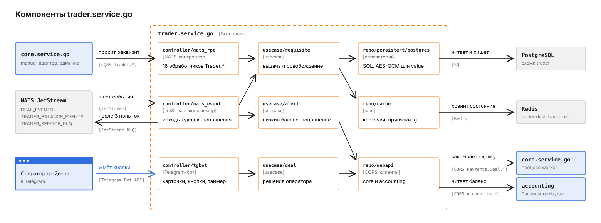
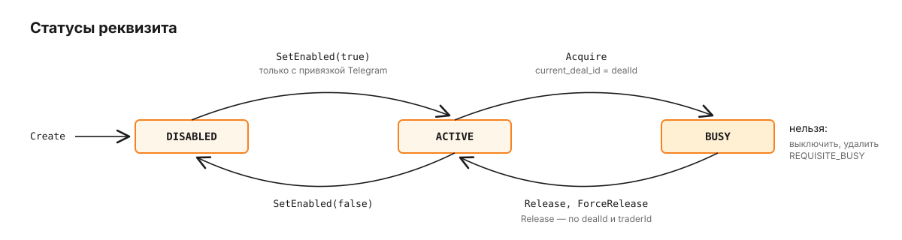

# trader.service.go

Сервис хранит реквизиты трейдеров, выдаёт свободный реквизит под входящую сделку и ведёт Telegram-кабинет, в котором оператор трейдера подтверждает или отменяет оплату. Вызывает его `core.service.go`: manual-адаптер провайдера просит реквизит во время роутинга, админка управляет трейдерами и реквизитами. Как сделка проходит через платформу целиком, описано в [корневом README](../../README.md), здесь - только то, что происходит внутри трейдерского контура.

Трейдер в core хранится как провайдер с credentials `{"mode":"manual","trader_id":N}`, а здесь живёт его операционная проекция: имя, статус, страховой лимит, Telegram-группа для алертов и реквизиты. Сделки направления `OUT` через трейдеров не идут: адаптер их отклоняет (`adapter.go`).

## Путь одной сделки через трейдера

Возьмём тот же платёж на 5 000 RUB, что и в корневом README, но исполнителем роутинг выбрал трейдера с `id = 7`. На схеме серым показан core, оранжевым - trader-service, синим - оператор трейдера, розовым - плательщик.


1. Manual-адаптер core вызывает `Trader.Requisite.Acquire`. Бюджет на ответ задаёт core через дедлайн контекста попытки роутинга.

   ```json
   {
     "traderId": 7,
     "dealId": "9f1c2e4a-6b1d-4c1e-9a53-0e2f7c8d4b11",
     "terminalId": 12,
     "methodCode": "SBP",
     "currency": "RUB",
     "amount": "5000",
     "dealExpiresAt": "2026-09-26T12:30:00Z",
     "userCard": "<base64 JSON карты плательщика, если мерчант её передал>"
   }
   ```

2. Сервис открывает транзакцию, берёт `pg_advisory_xact_lock` по паре `dealId` и `traderId` и одним `UPDATE` занимает реквизит: `ACTIVE`, того же активного трейдера, с совпадающими методом и валютой, сумма в пределах `min_amount`-`max_amount`. Метод сравнивается без учёта регистра, `-` и `_` (`QECOM`, `q-ecom` и `Q_ECOM` - один метод), валюта - без учёта регистра и пробелов по краям, а ноль в `min_amount` или `max_amount` означает, что эта граница не задана. Из подходящих берётся тот, что дольше всех простаивал (`ORDER BY last_used_at ASC NULLS FIRST`), строки, заблокированные параллельными сделками, пропускаются (`FOR UPDATE SKIP LOCKED`). Реквизит становится `BUSY`, в `current_deal_id` записывается сделка. Core получает `value`, `holder`, `name`, `bankCode`, `rate`, `methodConfig` (`requisites.sql`, `requisite_repo.go`).
3. В фоне бот отправляет оператору реквизита карточку заявки: сумма, метод, терминал, курс реквизита, таймер до `dealExpiresAt` и, если есть, карта плательщика целиком. Отправка идёт в отдельной горутине с таймаутом 10 с, поэтому медленный Telegram не задерживает ответ на шаге 2. Уведомления одной сделки уходят строго по очереди: сначала карточка, затем OTP-код, если он пришёл, и последним - исход сделки. Код не может обогнать карточку, к которой относится (`async_notifier.go`).
4. Плательщик переводит деньги на реквизит.
5. Оператор нажимает "Оплачено", затем "Подтвердить". Второй экран нужен от случайного нажатия. Сервис проверяет, что кнопка относится к текущей сделке его реквизита, иначе клик по старой карточке закрыл бы новую сделку, и вызывает у core `Payments.Deal.ConfirmByTrader` (`deal.go`). Эти команды обслуживает процесс `worker` из core, поэтому сервис адресует их приложению `BACKEND_APP_NAME`. Дальше core ведёт сделку тем же путём, что и после webhook провайдера.
6. Core публикует `deals.status_changed.<id>` со статусом `COMPLETED`. Консьюмер освобождает реквизиты сделки у всех трейдеров (`BUSY -> ACTIVE`, `current_deal_id = NULL`) и правит карточку на месте (`deal_status.go`).

Отмена устроена так же. Кнопка "Отмена" открывает выбор причины (`invalid_data`, `canceled_by_trader`, для OTP-шага - `invalid_code`, `charge_error`), и сервис вызывает `Payments.Deal.CancelByTrader`. Если сделку закрыл не оператор, а TTL, админ или мерчант, об исходе он узнаёт только из того же события на шаге 6: в нём приходит `reason`, и карточка показывает его.

## Из чего состоит сервис



Слои те же, что у всех Go-сервисов платформы. Три входа: `controller/nats_rpc` принимает 16 CQRS-обработчиков `Trader.*`, `controller/nats_event` читает два потока JetStream, `controller/tgbot` обслуживает бота. Бизнес-логика - в `usecase/requisite` (выдача, освобождение, CRUD), `usecase/deal` (решения оператора), `usecase/alert` (низкий баланс и пополнения) и `usecase/trader` (синхронизация трейдеров из core, на схеме не показан). Уведомления бота usecase-слой шлёт через интерфейс `Notifier`: без токена бота это заглушка, и сервис работает без кабинета. Сборкой занимается `internal/app`: на старте он применяет миграции и создаёт поток `TRADER_SERVICE_DLQ`, куда консьюмеры `controller/nats_event` перекладывают необработанные события.

## Почему выдача реквизита идемпотентна

Core может спросить реквизит под одну и ту же сделку дважды: повтор после таймаута, параллельные попытки роутинга. Кроме того, роутинг гоняет одну сделку параллельно по нескольким трейдерам, и каждый держит под неё свой реквизит. Наивный `SELECT ... FOR UPDATE SKIP LOCKED` на двух одновременных запросах одного трейдера выдал бы два разных реквизита под одну сделку.

Поэтому запросы одной пары `dealId` и `traderId` сериализует advisory-блокировка: второй ждёт, пока первый закоммитит. Если свободного реквизита не нашлось или сработал уникальный индекс `idx_requisites_busy_deal_trader` (одна пара `current_deal_id`, `trader_id` - один реквизит), сервис перечитывает реквизит этого трейдера по сделке и возвращает уже выданный. Разные сделки и разные трейдеры одной сделки друг друга не ждут. На счастливом пути это три обращения к базе: блокировка, `UPDATE`, коммит.

Освобождение тоже идемпотентно: `ReleaseByDeal` меняет только строки с `current_deal_id = dealId` и `status = 'BUSY'`, повтор или чужой `dealId` ничего не делает. Путей освобождения два. Синхронный `Trader.Requisite.Release` core вызывает при отмене сделки и снятии проигравших трейдеров. С `traderId` он освобождает только реквизит этого трейдера и не задевает реквизит победителя, без `traderId` - все реквизиты сделки. Карточку он не трогает, потому что не знает исхода. Событие `deals.status_changed.*` освобождает реквизиты сделки у всех трейдеров: это страховка на случай потерянного синхронного вызова и единственный источник исхода для карточки.

## Статусы реквизита

Новый реквизит создаётся выключенным, и включить его можно только после привязки Telegram-аккаунта оператора: иначе сделку, выданную на реквизит, некому было бы обработать (`requisite.go`).



`ForceRelease` - ручная разблокировка зависшего `BUSY` из админки. `Delete` удаляет реквизит физически и отказывает для `BUSY` с кодом `REQUISITE_BUSY`. `Update` меняет атрибуты (лимиты, курс, `methodConfig`) с оптимистичной блокировкой по `version` и не трогает статус.

## Как бот выбирает сценарий

Сценарий карточки зависит от метода реквизита, и ядро бота о методах ничего не знает: каждый сценарий - запись в реестре `flowSpecs` с текстом, кнопками и причинами отмены (`flow.go`). Сейчас их два:

| Сценарий | Кнопки | Когда выбирается |
|---|---|---|
| `confirm` | "Оплачено", "Отмена" | по умолчанию |
| `otp` | "Отмена", после кода - "Успех", "Отмена" | `method_code` = `QECOM` (регистр и `-`/`_` не важны), `"flow":"otp"` в `method_config` или `type = other` |

В OTP-сценарии мерчант присылает код плательщика через core, core вызывает `Trader.Deal.SubmitOtp`, и бот показывает код оператору отдельным сообщением. Код нигде не сохраняется.

Таймер на карточке перерисовывается раз в `TRADER_COUNTDOWN_INTERVAL`. Telegram разрешает около 30 правок в секунду на бота, поэтому сервис держит не больше 25 и растягивает шаг, когда активных карточек много (`countdown.go`). Состояние карточек лежит в Redis под префиксом `trader:deal` с TTL "дедлайн сделки + 2 мин" и переживает рестарт.

Кроме карточек, бот отвечает на `/start` (непривязанному пользователю - его Telegram ID для администратора, привязанному - статус реквизита с балансом), `/balance` и `/toggle`. Баланс бот читает из accounting через `Accounting.Balance.ListByActor`. Раз в `TRADER_LOW_BALANCE_CHECK_INTERVAL` фоновая задача сверяет сумму USDT трейдера с порогом 100 USDT и один раз шлёт предупреждение, а при пополнении приходит пуш из события `accounting.trader_balance_credited.*`. Оба алерта уходят в Telegram-группу трейдера (`tgGroupId` из `Trader.Create` или `Trader.Update`). Когда бота добавляют в группу, он пишет в неё ID чата, чтобы администратор вписал его трейдеру, а после привязки новой группы присылает туда подтверждение.

## Что принимает и публикует сервис

Все обработчики живут в пространстве имён `pay` под именем приложения `trader-service` (`controller.go`).

| Сообщение | Тип | Что делает |
|---|---|---|
| `Trader.Requisite.Acquire` | запрос | занимает реквизит под сделку, меняет состояние, но возвращает данные |
| `Trader.Requisite.Release` | команда | освобождает реквизит по `dealId` и `traderId`, без `traderId` - все реквизиты сделки |
| `Trader.Requisite.LastUsedByTraders` | запрос | время последней выдачи по трейдерам для честного роутинга |
| `Trader.Deal.SubmitOtp` | команда | передаёт OTP-код оператору |
| `Trader.Requisite.Create`, `Update`, `SetEnabled`, `BindTelegram`, `ForceRelease`, `Delete` | команды | управление реквизитами из админки |
| `Trader.Requisite.Get`, `List` | запросы | реквизиты для админки, `value` только маской |
| `Trader.Create`, `Update` | команды | синхронизация трейдера из core |
| `Trader.Get`, `List` | запросы | трейдеры для админки и роутинга |
| `deals.status_changed.*` | событие JetStream | поток `DEAL_EVENTS`, durable `trader-service-release` |
| `accounting.trader_balance_credited.*` | событие JetStream | поток `TRADER_BALANCE_EVENTS`, durable `trader-service-topup-alert` |

Оба консьюмера делают до 3 попыток с `AckWait` 30 с, после чего перекладывают сообщение в `NATS_DLQ_SUBJECT` (`trader-service.dlq`). Под этот subject сервис на старте создаёт поток `TRADER_SERVICE_DLQ` с хранением 7 дней, если subject ещё не захвачен другим потоком; существующий поток он не меняет (`dlq.go`). Неделя - запас, чтобы разобрать сообщение и переотправить его. Событие с нечитаемым `deal_id`, `trader_id` или суммой не повторяется: повтор его не исправит.

Сам сервис вызывает `Payments.Deal.ConfirmByTrader` и `Payments.Deal.CancelByTrader` у процесса `worker` из core и `Accounting.Balance.ListByActor` у accounting. Событий он не публикует.

Ошибки приходят кодами `NO_FREE_REQUISITE`, `TRADER_NOT_FOUND`, `TRADER_EXISTS`, `REQUISITE_NOT_FOUND`, `DEAL_NOT_FOUND`, `REQUISITE_BUSY`, `TELEGRAM_TAKEN`, `REQUISITE_NOT_BOUND` и общими кодами `golang-cqrs`.

## Где лежат данные

PostgreSQL, схема `trader`, две таблицы: `traders` и `requisites`. Поле `requisites.value` хранится зашифрованным (`value_enc`), ключ - `REQUISITE_ENC_KEY`. Миграций две: `00001_init` создаёт схему, `00002_requisite_deal_per_trader` делает уникальной пару `current_deal_id`, `trader_id` и строит индекс выдачи `idx_requisites_acquire` по нормализованным методу и валюте. Сервис применяет их сам при каждом старте из каталога `./migrations` (`migrate.go`).

В Redis два префикса. `trader:deal` - карточки сделок, карта плательщика в них зашифрована тем же ключом. `trader:req` - кэш "Telegram-аккаунт -> реквизит" для бота с TTL 5 мин, без `value`, `holder` и `bankCode`, сбрасывается при каждом изменении реквизита.

## Конфигурация

| Переменная | По умолчанию | Зачем |
|---|---|---|
| `PG_URL` | обязательна | база со схемой `trader` |
| `NATS_URL` | обязательна | шина CQRS и JetStream |
| `NATS_DLQ_SUBJECT` | `trader-service.dlq` | куда консьюмеры перекладывают сообщения после 3 попыток |
| `REDIS_URL` | обязательна | без неё сервис не стартует (`app.go`) |
| `REQUISITE_ENC_KEY` | обязательна | секретный ключ шифрования, задаётся при деплое |
| `TELEGRAM_BOT_TOKEN` | пусто | пусто - бот, таймер и проверка низкого баланса выключены |
| `BACKEND_APP_NAME` | `backend` | имя процесса `worker` из core в discovery: в docker-compose - `worker`, в Helm - `payments-core` |
| `ACCOUNTING_APP_NAME` | `accounting-service` | имя приложения accounting |
| `TRADER_COUNTDOWN_INTERVAL` | `1s` | шаг таймера на карточке, `0` выключает таймер |
| `TRADER_DEAL_FALLBACK_TTL` | `30m` | TTL карточки, если core не передал `dealExpiresAt` |
| `TRADER_LOW_BALANCE_CHECK_INTERVAL` | `5m` | период проверки низкого баланса |
| `HTTP_PORT` | `8080` | порт `/healthz`, `/livez`, `/readyz`, принимается и `8080`, и `:8080` |

Остальное - `APP_NAME` (`trader-service`), `PG_POOL_MAX` (10), `CQRS_NAMESPACE` (`pay`), `CQRS_WORKERS_POOL_SIZE` (10), `OTEL_ENABLED`, `OTEL_ENDPOINT`. Если в рабочей директории есть `.env`, конфиг читается из него, и значения из файла перекрывают одноимённые переменные окружения. Без `.env` читается `config/config.yaml`, и тогда переменные окружения перекрывают его.

## Как запустить и проверить

Здесь только документация и схемы: исходный код, миграции и стек запуска остаются в приватном репозитории. Интеграционные тесты бьют в настоящие PostgreSQL и Redis и проверяют гонку за реквизит, advisory-блокировку, повторные `Acquire` и параллельную выдачу одной сделки разным трейдерам; тест сам пересоздаёт себе базу.

## Что стоит знать заранее

Бот работает через long polling, а активные карточки и таймер держатся в памяти процесса. Второй экземпляр получит от Telegram конфликт `getUpdates`, поэтому в Helm стоит `replicas: 1`.
