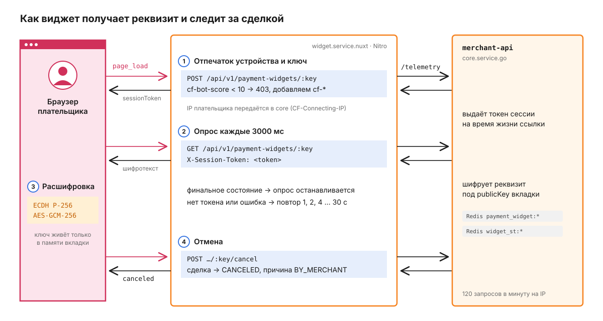
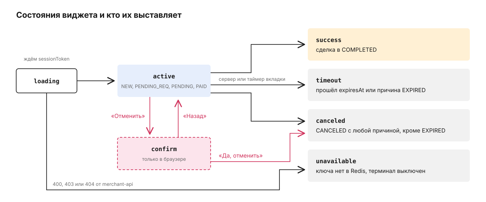

# widget.service.nuxt

Виджет - страница, которую плательщик открывает по ссылке `paymentLink` из ответа на создание сделки: на ней реквизит карты, сумма, таймер и кнопка отмены. Своего состояния у сервиса нет. Nitro-сервер пересылает запросы браузера в merchant-api ядра и ничего не хранит, а сделка и её срок живут в core. Как сделка создаётся и что с ней происходит после оплаты, описано в [корневом README](../../README.md).

## Путь плательщика

Ссылка выглядит как `https://widget.example.com/<widget_key>`. Адрес виджета core берёт из `PAYMENT_WIDGET_URL` (по умолчанию `http://localhost:3001`), ключ - 32 случайных байта в base64url, ровно 43 символа. Ссылку core выдаёт не всегда: только для входящей сделки с оплатой картой на терминале, где виджет включён (`core.service.go/.../payments/payment_widget.go`). По ключу в Redis лежит проекция сделки `payment_widget:<sha256 ключа>`, TTL - до `expiresAt` сделки.

Дальше страница `app/pages/[key].vue` делает четыре вещи.



1. Отправляет телеметрию `page_load`: отпечаток устройства (canvas, WebGL, audio, признаки headless-браузера), поведенческие сигналы и публичный ключ ECDH P-256, созданный во вкладке.

   ```http
   POST /api/v1/payment-widgets/<widget_key> HTTP/1.1
   Content-Type: application/json

   {
     "sessionId": "0d6f1c7e-...",
     "visitorId": null,
     "event": "page_load",
     "occurredAt": "2026-09-26T10:00:00.000Z",
     "fingerprint": { "canvasHash": "...", "screenWidth": 1440, "hardwareConcurrency": 8,
                      "userAgent": "Mozilla/5.0 ...", "timezone": "Europe/Moscow", ... },
     "behavioral": { "copyDelayMs": null, "mouseMoveCount": 12, ... },
     "publicKey": "BJq..."
   }
   ```

   Nitro проверяет тело (события `page_load`, `copy`, `cancel_attempt`, `cancel_confirm`, `back`, обязательные поля отпечатка), отвечает `403`, если CDN перед виджетом оценил запрос как бота (`cf-bot-score` ниже 10), добавляет к телу IP, страну, `cf-ray`, `cf-ja3-fp` и признак "часовой пояс не совпадает со страной" и пересылает всё в `POST /api/v1/payment-widgets/:key/telemetry`. merchant-api возвращает `visitorId`, который браузер кладёт в `localStorage`, и `sessionToken`, живущий до `expiresAt` ссылки. Остальные события браузер отправляет через `navigator.sendBeacon` и ответа не ждёт.

   IP плательщика передаётся в core: во все три запроса к merchant-api Nitro ставит заголовок `CF-Connecting-IP` со значением из входящего `CF-Connecting-IP`, а без него - из первого адреса `X-Forwarded-For` (`server/utils/client-ip.ts`). По этому адресу merchant-api считает лимит запросов и пишет IP в телеметрию.

2. Запрашивает состояние сделки: `GET /api/v1/payment-widgets/:key` с заголовком `X-Session-Token`. Без токена запрос не уходит: merchant-api ответил бы `403 SESSION_REQUIRED`. Если ответ на `page_load` не пришёл за 4 с или пришёл без токена, клиент повторяет `page_load` (`app/composables/usePaymentWidget.ts`). Интервал опроса задаёт сервер в `polling.intervalMs` - 3000 мс (`payment_widget.go`), клиент не опускает его ниже 1000 мс. Опрос прекращается на финальных состояниях `success`, `canceled`, `timeout` и `unavailable`. Если запрос упал или токена всё ещё нет, клиент повторяет попытку с паузой 1, 2, 4 ... до 30 с.

3. Расшифровывает реквизит. Когда вкладка прислала `publicKey`, сервер отдаёт вместо открытого реквизита `requisites.data` (12 байт IV и шифротекст AES-GCM-256) и `requisites.serverKey` - свой одноразовый публичный ключ. Браузер выводит общий ключ ECDH и расшифровывает (`app/utils/widget-crypto.ts`). Приватный ключ создаётся неэкспортируемым и живёт только в памяти вкладки, поэтому реквизит не виден в прокси, логах и расширениях, которые читают сетевой трафик.

   После расшифровки у реквизита есть `type` (`CARD`, `PHONE`, `CRYPTO`, `OTHER`), `primary` и необязательный `secondary`. Подписей полей сервер не присылает, их выбирает `requisiteLabel` в `app/utils/payment.ts` по `type`: у `primary` с `type` = `CARD` подпись "Карта", при любом другом типе - "Реквизит", у `secondary` всегда "Получатель".

4. Отменяет сделку, если плательщик передумал. Кнопка "Отменить" переводит страницу в `confirm`, "Да, отменить" сразу рисует `canceled` и отправляет `POST /api/v1/payment-widgets/:key/cancel`. merchant-api отменяет сделку с причиной `BY_MERCHANT`, только если она ещё активна, сигналит процессу в Temporal и хранит итоговую проекцию в Redis ещё 10 мин.

## Из чего состоит приложение

В браузере работают страница, два композабла и два модуля без Vue: рендер в DOM и криптография. На сервере Nuxt - только тонкий слой роутов и клиент merchant-api, который передаёт в core IP плательщика.

![Плательщик открывает страницу pages/[key].vue, она вызывает useWidgetTelemetry и usePaymentWidget и рисует данные через utils/payment.ts; композаблы ходят в server-роуты Nuxt, а те через payment-widget-api в merchant-api](docs/diagrams/c4-components.svg)

```
app/
  pages/[key].vue                    единственный маршрут, связывает телеметрию, опрос и отмену
  composables/usePaymentWidget.ts    опрос, паузы после ошибок, расшифровка, локальный timeout
  composables/useWidgetTelemetry.ts  отпечаток, поведение, sessionToken
  components/widgets/default/        разметка и стили визуала default
  utils/payment*.ts                  рендер в DOM, подписи реквизита, таймер, тосты, словари RU / EN / AZ
  utils/widget-crypto.ts             ECDH P-256 и AES-GCM-256
  utils/fingerprint.ts               canvas, WebGL, audio, признаки headless
  error.vue                          экран "ссылка недоступна" для ошибок Nuxt
server/
  api/v1/payment-widgets/            GET и POST по ключу, POST cancel
  middleware/sec-fetch.ts            пропускает в /api/* только same-origin
  utils/payment-widget-api.ts        клиент merchant-api, таймаут 5 с, без повторов
  utils/client-ip.ts                 IP плательщика для CF-Connecting-IP
  utils/payment-widget-key.ts        проверка формата ключа
shared/types/                        контракты ответа и телеметрии
```

Vue здесь только монтирует страницу. Состояние и данные в DOM переносит функция `window.paymentTemplate.update` из `app/utils/payment.ts`, её вызывает компонент визуала на каждый новый ответ. Визуал выбирается полем `visual` ответа. Сейчас есть только `default`, новый визуал - это отдельная папка в `components/widgets/` и строка в `knownWidgetComponents` (`pages/[key].vue`).

Заголовки и подписи сервер не присылает, они берутся из словаря `app/utils/payment.i18n.ts`, а подпись реквизита зависит от его `type` (шаг 3). Язык переключается кнопкой по кругу RU -> EN -> AZ, подписи реквизита перерисовываются на новом языке.

## Какие состояния бывают и кто их выставляет

Состояние в ответе вычисляет merchant-api по статусу сделки (`payment_widget.go`). Сначала проверяется срок: если `expiresAt` прошёл, это `timeout` при любом статусе. Сделка `CANCELED` с причиной `EXPIRED` - тоже `timeout`, с любой другой причиной - `canceled`.



Сервер присылает пять состояний: `active`, `success`, `canceled`, `timeout` и `unavailable`. Ещё два есть только на клиенте. `loading` - пока нет первого ответа. `confirm` объявлен в общих типах (`shared/types/payment-widget.ts`), но сервер его не шлёт: это экран подтверждения отмены, который браузер включает сам (`app/utils/payment.ts`). Пока он открыт, ответы опроса с `active` его не закрывают.

`timeout` браузер тоже умеет поставить без сервера: таймер на странице дошёл до нуля (`app/utils/payment.ts`) или в ответе `active`, а `expiresAt` уже в прошлом (`usePaymentWidget.ts`). `unavailable` приходит, когда ключа нет в Redis или терминал выключен. Nitro подменяет на `unavailable` и ответы `400`, `403` и `404` от merchant-api (`server/utils/payment-widget-api.ts`), в том числе `403 SESSION_REQUIRED`.

## Чем виджет защищён

Сервис не отдаёт CORS-заголовков, вместо этого `server/middleware/sec-fetch.ts` отвечает `403` на любой запрос к `/api/*`, у которого `Sec-Fetch-Site` не `same-origin` и не `none`. Ключ проверяется до обращения к merchant-api: в production ровно 43 символа `[A-Za-z0-9_-]`, в dev - от 4 до 128.

CSP запрещает всё, кроме своего origin, а `frame-ancestors 'none'` и `X-Frame-Options: DENY` (`nuxt.config.ts`) не дают встроить виджет в iframe на сайте мерчанта. Плательщик открывает его только отдельной страницей или вкладкой. Ответы с реквизитом идут с `Cache-Control: no-store` и `Referrer-Policy: no-referrer`.

## Конфигурация

`NUXT_MERCHANT_API_BASE_URL` - адрес merchant-api, по умолчанию `http://localhost:8082` (`runtimeConfig` в `nuxt.config.ts`). `NODE_ENV=production` включает строгий формат ключа и разрешает в CSP скрипт веб-аналитики CDN. Dockerfile и docker-compose выставляют `production` сами. Других переменных сервис не читает, секретов у него нет.

Внутри контейнера сервер слушает порт 3000 (`PORT` в Dockerfile), снаружи виджет публикуется на порту 3001: так его ждёт core, у которого `PAYMENT_WIDGET_URL` по умолчанию `http://localhost:3001`.

## Как запустить локально

Здесь только документация и схемы: исходный код, тесты (vitest, 5 файлов в `test/utils/`) и стек запуска остаются в приватном репозитории. Тесты проверяют чистые модули без DOM и сети: подписи реквизита, словари, состояния, таймер и расшифровку.

## Что стоит знать заранее

Сессия привязана к вкладке. Перезагрузка страницы создаёт новый ключ ECDH, новый `sessionId` и новый `sessionToken`, а старая сессия доживает до `expiresAt`.

Nitro ограничивает число запросов с одного IP (`nuxt.config.ts`), merchant-api дополнительно ограничивает группу `/payment-widgets` по IP.
